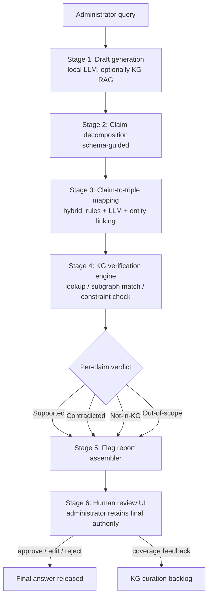
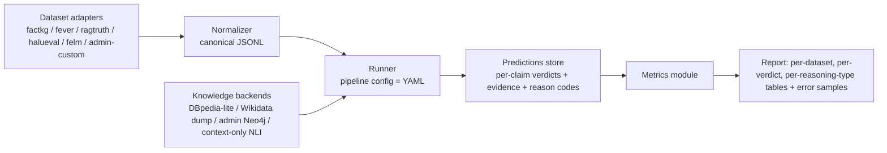

# Design Draft: A Schema-Guided, Tri-State, Claim-Level Verification Framework for Locally Deployed LLMs in University Administration

**Status:** Working draft v2 for thesis (methodology + ontology + evaluation chapters)
**Companion documents:** Literature review (Gaps 1–7 referenced throughout) · Comparative analysis (Families A–D)
**Changelog v2:** added Part V (portable benchmark harness for external + custom datasets) and Part VI (dataset inventory); Part III revised to route all measurements through the harness.

---

## Part 0 — Contribution Statement (what this framework claims as novel)

> **C1 — Methodological.** The first schema-guided, tri-state, claim-level post-hoc verification method for locally deployed small LLMs. Three components are individually novel: (i) claim decomposition constrained by a domain relation inventory with extraction-level self-consistency (D2); (ii) hybrid deterministic + LLM claim-to-triple mapping that removes the LLM from the most error-prone claim types; (iii) verdict logic dispatched by *declared per-relation completeness*, which turns the Contradicted / Not-in-KG distinction from a heuristic into a principled inference (no prior framework does this — KGValidator names the CWA/OWA problem but does not solve it; only one prior method has any third verdict at all). → addresses Gaps 1, 2, 4.

> **C2 — Design / ontological.** Design principles P1–P4 and a reference schema for *verification-oriented* administrative knowledge graphs: mandatory completeness declarations, mandatory temporal scoping by catalogue year, mandatory provenance, and an explicit machine-checkable/human-only verifiability boundary. Existing educational KGs are retrieval-oriented and possess none of these layers; existing verification frameworks assume open-domain KGs where these questions never arise. → addresses Gaps 2, 4, 5.

> **C3 — Resource.** The first administrative-domain hallucination benchmark: authentic + seeded queries, atomic claims with tri-state(+Out-of-scope) gold labels *and* evidence pointers, dual-annotated with reported agreement, plus the portable harness (Part V) and annotation guidelines — released so others can replicate the protocol even where instance data stays private. No public dataset pairs LLM responses with a curated domain KG and tri-state labels. → addresses Gap 3.

> **C4 — Empirical.** Three results no prior work reports: (i) whether KG post-hoc verification holds up when *every* component is a small quantized local model, with per-stage error attribution (generator vs extractor vs mapper vs KG) and the marginal value of verification *on top of* KG-RAG (A1/A2 × verifier on/off); (ii) the verification-coverage vs KG-curation-cost curve measured from a live curation backlog; (iii) a human-subjects study of claim-level flags vs global confidence vs no flags on administrator error-detection, false approvals, and trust calibration — the field's HITL evidence base for KG verification is currently empty. → addresses Gaps 1, 5, 6 (and 7 via the fully-local audit).

**Paper mapping.** C1+C4(i) → NLP/systems venue (*ACL/EMNLP findings, or applied track*); C2+C3 → resource/ontology venue (*LREC-COLING, ISWC resource track, or JoWS*); C4(iii) → HCI venue (*CHI/CSCW/IUI*). The thesis binds all four; each paper leads with one.

**Explicitly not claimed as contributions** (to keep reviews clean): using Neo4j/Ollama/LangGraph (engineering choices); applying RAG to a university chatbot (done — JayBot, REBot); the general idea of KG-based verification (done — KGR, GraphEval); the FActScore-style decompose-then-verify pattern (adapted, credited).

**Minimal defensible core.** If time forces cuts: C1 + C3 + C4(i) on E1+E5 is a complete, publishable paper; C2 strengthens it; C4(iii) is a second paper. Do not cut the tri-state verdict or the custom dataset — every novelty claim routes through at least one of them.

---

### 1. Design goals

The pipeline is shaped by four requirements that jointly distinguish it from prior work:

- **G1 (Post-hoc, claim-level):** verify the *generated draft*, not the retrieval context. The unit of verification is the atomic claim, so the reviewer sees exactly which statements are unsupported (interpretability requirement; cf. GraphEval, FActScore).
- **G2 (Tri-state verdicts):** distinguish *Contradicted* (definite hallucination) from *Not-in-KG* (coverage gap). "Unverifiable" is a first-class outcome routed to the human, not an error state (EU AI Act Art. 14 alignment).
- **G3 (Fully local):** every component — generator, extractor, verifier, KG store — runs on-device. No claim text, query, or student data leaves the institution (FERPA/GDPR requirement; Gap 7).
- **G4 (Small-model robustness):** the pipeline must tolerate errors made by its *own* small quantized models, especially during claim extraction. Deterministic/schema-guided components double-check LLM components wherever possible (Gap 1).

### 2. Stage-by-stage architecture



#### Stage 1 — Draft generation
A local open-weight instruction model (candidate baselines: Qwen2.5-7B-Instruct, Llama-3.1-8B-Instruct, Phi-3.5-mini; all at Q4_K_M via llama.cpp/Ollama) drafts an answer to the administrator's query. Two generation conditions should be kept as experimental arms:

- **A1 — vanilla:** query → draft (tests verifier value when generator is weakest);
- **A2 — KG-RAG:** query → KG subgraph retrieval → grounded draft (tests whether post-hoc verification still adds value *on top of* retrieval grounding — an ablation no prior higher-ed study reports).

*Design decision D1:* generation and verification use **separate model instances/prompts** (or different checkpoints) to avoid the self-verification correlation problem documented in the self-checking literature.

#### Stage 2 — Schema-guided claim decomposition
The draft is decomposed into atomic claims, but unlike FActScore/FacTool open-domain decomposition, the extractor is **constrained by the ontology's relation inventory** (Part II §6). The prompt enumerates the legal claim types (prerequisite, credit-value, offering-term, fee, deadline, eligibility, staffing, …) and instructs the model to emit claims as typed JSON objects, e.g.:

```json
{"claim_type": "prerequisite",
 "text_span": "CS201 requires CS101 and MA110",
 "subject": "CS201", "relation": "requiresPrerequisite",
 "objects": ["CS101", "MA110"],
 "temporal_scope": "AY2026/27 (implicit: current)"}
```

Claims that fit no schema type are emitted with `claim_type: "unclassified"` and flow to the *Out-of-scope* verdict automatically. This closes the extractor's escape hatch: it never has to force-fit a claim, and unclassifiable content is surfaced rather than dropped.

*Design decision D2 (small-model robustness, G4):* decomposition runs twice with different few-shot orderings; claims are kept only if both runs agree on `(subject, relation, objects)` after normalization (self-consistency at the *extraction* level, adapting the SelfCheckGPT intuition to a structured target). Disagreements demote the claim to *Out-of-scope → human*.

#### Stage 3 — Claim-to-triple mapping
Three sub-components, in order of preference:

1. **Deterministic mappers** for structured claim types. Course codes, credit values, dates, and fee amounts follow institutional surface conventions (regex + lookup against the KG's entity label index). No LLM involved — immune to extractor hallucination for these types.
2. **Entity linker:** fuzzy matching of course/programme names to KG IRIs (embedding similarity over a locally computed label index; threshold τ_link tuned on a dev set). Links below threshold → *Not-in-KG* verdict with "entity unresolved" as the stated reason.
3. **LLM fallback mapper** only for claim types with free-text objects (e.g., regulation paraphrases), always producing candidate triples that Stage 4 then checks — the LLM proposes, the KG disposes.

#### Stage 4 — Verification engine
For each mapped triple, the engine executes one of three procedures depending on the relation's semantics (declared in the ontology, Part II §7):

| Relation class | Procedure | Verdict logic |
|---|---|---|
| **Closed-world, complete** (e.g., `requiresPrerequisite` within a published catalogue year) | Exact lookup | present → Supported; absent → **Contradicted** |
| **Open-world** (e.g., `taughtBy`, contact info) | Exact lookup | present → Supported; absent → **Not-in-KG** |
| **Constraint-typed** (e.g., credit-total rules) | SHACL shape / rule evaluation over the relevant subgraph | satisfiable & entailed → Supported; violated → Contradicted; not expressible → Out-of-scope |

Functional relations (e.g., `hasCreditValue` — exactly one value per course per catalogue year) get a stronger check: a claimed value that *differs* from the stored value is **Contradicted with counter-evidence** (the stored triple is attached to the flag), which is the most useful flag type for a reviewer.

Temporal resolution precedes lookup: every query is resolved to a catalogue-year subgraph (default: current academic year unless the query or claim names another; ambiguity → flag).

#### Stage 5 — Flag report assembly
Output is a structured report, one row per claim:

| Field | Content |
|---|---|
| verdict | Supported / Contradicted / Not-in-KG / Out-of-scope |
| claim text span | highlighted in the draft |
| evidence | supporting or contradicting triple(s) **with provenance link** to the source document/clause |
| reason code | e.g., `ENTITY_UNRESOLVED`, `VALUE_MISMATCH`, `RELATION_ABSENT_CLOSED_WORLD`, `TEMPORAL_AMBIGUOUS` |
| suggested action | approve / verify manually / correct from evidence |

*Design decision D3:* the report **never auto-corrects** the draft. Correction is the administrator's act (authority requirement), though the UI may offer the counter-evidence value as a one-click replacement. This keeps the human causally in the loop rather than rubber-stamping machine corrections — the automation-bias literature suggests auto-corrected text would be approved unread.

#### Stage 6 — Human review + feedback loop
The administrator sees the draft with per-claim highlighting (green/red/amber/grey for the four verdicts), approves/edits/rejects, and optionally marks *Not-in-KG* flags as "should be in the KG" — feeding a curation backlog. This loop is what makes coverage-vs-curation-cost (Gap 5) empirically measurable: the backlog is a direct log of coverage gaps encountered in real workload.

### 3. What is methodologically new here (claim-by-claim)

1. **Schema-guided decomposition** (Stage 2): claim extraction constrained by a domain relation inventory, with typed-JSON output and extraction-level self-consistency — not published in any verification pipeline.
2. **Hybrid deterministic + LLM mapping** (Stage 3): exploiting closed-domain surface conventions to bypass the LLM for the most error-prone claim types.
3. **Semantics-dispatched verification** (Stage 4): verdict logic parameterized by per-relation completeness declarations in the ontology — this is the piece that makes the *tri-state* logic principled rather than heuristic.
4. **Reviewer-facing evidence with provenance** (Stage 5): every flag carries the institutional source, connecting verification to the HITL trust study.

---

## Part II — Verification-Oriented Ontology / Reference Schema

### 4. Scope and framing

Framed as **design principles + reference schema** (not a formal OWL ontology release), per the defensibility argument in the review. Serialization target: RDF/Turtle in a local triple store, or property graph in Neo4j — the schema below is written store-neutrally; §9 gives the Neo4j mapping.

### 5. Core classes

```
adm:Programme          a degree programme (BSc CS, MSc Data Science)
adm:ProgrammeVersion   programme as defined in one catalogue year  ◄ temporal anchor
adm:Course             a course/module identity (CS201)
adm:CourseOffering     a course as offered in one term of one catalogue year
adm:CatalogueYear      e.g. AY2026/27  ◄ every fact-bearing node scoped here
adm:Requirement        a structured rule (credit totals, level minima, GPA thresholds)
adm:Regulation         a clause of institutional policy, linked to source text
adm:Deadline           dated administrative event (application, add/drop, appeal)
adm:Fee                monetary amount with applicability conditions
adm:StaffRole          role occupancy (programme director of X), not the person record*
adm:SourceDocument     catalogue page, regulation PDF, senate minute  ◄ provenance root
```

\* *Privacy note:* the KG stores role–programme relations, not personal student/staff records; personal data stays in the SIS. This keeps the KG itself low-risk under GDPR data-minimization.

### 6. Core relations (the claim-type inventory that drives Stage 2)

| Relation | Domain → Range | Functional? | Completeness (§7) |
|---|---|---|---|
| `requiresPrerequisite` | CourseOffering → Course | no | **closed** per catalogue year |
| `requiresCorequisite` | CourseOffering → Course | no | closed |
| `excludes` (anti-requisite) | CourseOffering → Course | no | closed |
| `hasCreditValue` | CourseOffering → xsd:decimal | **yes** | closed |
| `offeredInTerm` | CourseOffering → Term | no | closed |
| `partOfProgramme` | CourseOffering → ProgrammeVersion (core/elective flag) | no | closed |
| `hasRequirement` | ProgrammeVersion → Requirement | no | closed |
| `hasDeadline` | ProgrammeVersion \| CatalogueYear → Deadline | no | closed |
| `hasFee` | ProgrammeVersion → Fee | no | closed |
| `directedBy` / `taughtBy` | Programme/Offering → StaffRole | no | **open** |
| `governedBy` | ProgrammeVersion → Regulation | no | open |
| `assessedBy` | CourseOffering → AssessmentComponent | no | closed |

### 7. The four annotation layers (the ontological contribution)

**Layer 1 — Completeness declarations (closed- vs open-world).** Each relation×class pair carries a machine-readable assertion of whether the KG is *authoritatively complete* for it:

```turtle
adm:requiresPrerequisite  admMeta:completenessStatus  admMeta:CompleteWithinCatalogueYear .
adm:taughtBy              admMeta:completenessStatus  admMeta:OpenWorld .
```

This is what licenses the Stage-4 verdict dispatch: absence under a `Complete…` declaration ⇒ *Contradicted*; absence under `OpenWorld` ⇒ *Not-in-KG*. Existing educational ontologies have no such layer because retrieval never needs to reason about absence. **Design principle P1: no relation enters the schema without a completeness declaration signed off by the data owner.**

**Layer 2 — Temporal scoping.** Every fact-bearing edge is reified or property-annotated with `admMeta:validInYear → adm:CatalogueYear` (and `validFrom`/`validTo` for intra-year changes such as deadline extensions). Verification always resolves a claim to exactly one year-scoped subgraph before lookup. **P2: a triple without a temporal scope is invalid at ingest** — this converts the "stale catalogue" hallucination source into a schema violation caught at curation time.

**Layer 3 — Provenance.** Every edge carries `prov:wasDerivedFrom → adm:SourceDocument` (+ page/clause locator). Rationale: flags shown to a reviewer must carry checkable institutional evidence — this is the schema feature that the Gap-6 human study depends on. **P3: provenance is mandatory, and the source document identifier is part of the ingest pipeline, not an afterthought.**

**Layer 4 — Constraint representation.** Requirements that are rules, not facts, are stored as `adm:Requirement` nodes with (a) a structured form where feasible — SHACL shape or a small typed expression (`{scope: level-3 credits, op: ≥, value: 24}`) — and (b) always a `prov:` link plus verbatim clause reference. Where a rule resists structuring, it is stored **text-only and marked `admMeta:verifiability admMeta:HumanOnly`**, so claims mapping to it deterministically route to *Out-of-scope → human*. **P4: the schema explicitly represents its own verification boundary** — this operationalizes Gap 4 (characterizing what KG verification cannot cover) as a designed feature.

### 8. Competency questions (for schema validation)

CQ1 What are the prerequisites of course X in year Y? · CQ2 Is claim "X requires Z" true in year Y? (must be answerable as *false*, not merely *unknown*, for closed relations) · CQ3 How many credits is X worth in year Y, and what is the source? · CQ4 Which requirement clauses govern programme P version Y, and which are machine-checkable? · CQ5 For a given flag, what document and clause justify it? · CQ6 Which claims in the last N drafts were Not-in-KG, grouped by relation type? (curation backlog query)

### 9. Neo4j property-graph mapping (implementation profile)

Nodes = classes above; year-scoping via a `(:Offering)-[:IN_YEAR]->(:CatalogueYear)` edge and offering-per-year node granularity (avoiding edge reification); completeness metadata held in a `SchemaRelation` metadata node set queried by the verification engine at startup; provenance as edge properties `{src_doc, locator}`. Verification queries are parameterized Cypher templates per relation class — one template per row of the §6 table, generated once, reviewed by hand (keeping the LLM out of query construction entirely, unlike NL-to-Cypher systems such as the Nile University study, and thereby removing that hallucination surface).

---

## Part III — Evaluation hooks (what the design lets you measure)

All rows below are executed through the **benchmark harness (Part V)**, which runs identically over external public datasets and the custom administrative dataset — external datasets establish comparability with prior work; the custom dataset establishes domain validity.

| Question | Measured by |
|---|---|
| Verifier quality | claim-level precision/recall per verdict class, against a hand-labelled admin benchmark (Gap 3) with seeded hallucinations of each reason-code type, plus external-dataset runs (Part VI) for cross-method comparability |
| Value of verification beyond RAG | A1 vs A2 arms × verifier on/off |
| Small-model robustness | extraction agreement rate (D2), deterministic-mapper coverage share, end-to-end error attribution (generator vs extractor vs mapper vs KG) |
| Coverage vs curation cost | flags/claims resolved as Not-in-KG over time vs curation hours logged via the Stage-6 backlog (Gap 5) |
| Reviewer effect | seeded-error detection rate, false-approval rate, time-per-review, override rate: claim-level flags vs global-confidence baseline vs no-flag baseline (Gap 6) |
| Privacy posture | audit that no network egress occurs in any stage; latency/RAM budget on target hardware |

---

## Part IV — Implementation sketch (local stack)

- **Runtime:** llama.cpp / Ollama, Q4_K_M checkpoints; 16–32 GB RAM workstation target.
- **Orchestration:** the pipeline is a stateful conditional workflow with loops and a human-approval step — implement as a LangGraph `StateGraph` (state = {query, draft, claims[], triples[], verdicts[], report}; nodes = Stages 1–5; conditional edges on verdict dispatch; interrupt-before the Stage-6 human node). This pattern gives you checkpointing and a clean experiment harness for the ablation arms.
- **KG store:** Neo4j Community (local) or Oxigraph/Jena for an RDF profile; label/embedding index built offline for the entity linker.
- **Determinism first:** Stage-3 rule mappers and Stage-4 Cypher templates are plain code — unit-testable, no model variance — which is also the right story for the thesis's reliability argument.

---

## Part V — Portable Fact-Verification Benchmark Harness

### 10. Purpose and design principle

The verification engine (Stages 2–4) must be evaluable in two regimes: (a) on **external public datasets**, so results are comparable to published baselines (GraphEval, KG-GPT, FActScore-style verifiers), and (b) on the **custom administrative dataset**, which carries the thesis's domain claims. A single harness serves both by pushing all dataset-specific logic behind two thin interfaces — a **dataset adapter** and a **knowledge backend** — while the pipeline under test and the metric computation stay identical. This is the standard "one runner, many adapters" pattern; it also prevents a subtle methodological error: accidentally evaluating a *different* pipeline configuration per dataset and then comparing numbers.

### 11. Canonical data model

Every dataset, external or custom, is normalized into one record shape (JSONL):

```json
{"id": "factkg-01234",
 "dataset": "factkg",
 "input_type": "claim | response",
 "context": "optional grounding text or subgraph reference",
 "text": "CS201 requires CS101 and MA110.",
 "gold": {"label": "Supported | Contradicted | Not-in-KG | Out-of-scope",
          "spans": [[0, 31]],
          "claim_level": [{"claim": "...", "label": "..."}]},
 "kg_scope": {"backend": "dbpedia-lite | admin-neo4j | none",
              "temporal": "AY2026/27"},
 "meta": {"reasoning_type": "conjunction", "source_model": "gpt-3.5"}}
```

Two `input_type` values reflect the Family A/B distinction: `claim` records exercise Stages 3–4 only (Family-B mode — the engine in isolation); `response` records exercise Stages 2–4 end-to-end (Family-A mode — including decomposition). Reporting both modes separately is what lets you attribute error to the extractor vs the verifier.

**Label mapping is declared per adapter, never improvised.** External datasets use binary or task-specific labels; each adapter ships an explicit, documented mapping into the tri-state (+Out-of-scope) space, e.g. FactKG `Refuted → Contradicted`; RAGTruth hallucinated-span → `Contradicted` (context-grounded), unsupported-but-not-contradicted span → `Not-in-KG`; FEVER `NotEnoughInfo → Not-in-KG`. Where a dataset cannot express a state (FactKG has no Not-in-KG by construction), the harness reports that cell as *structurally absent*, not as zero — this preserves honesty in cross-dataset tables.

### 12. Harness architecture



Components:

- **Dataset adapters** (`adapters/*.py`): download/load, normalize, declare label mapping and which pipeline mode (`claim`/`response`) applies. Adding a new dataset — including future custom sets from another institution — means writing one adapter, nothing else.
- **Knowledge backends** behind a common query interface (`lookup(triple, scope)`, `neighbors(entity)`, `check_constraint(shape)`): the admin Neo4j store, a local DBpedia subset for FactKG (the FactKG release ships a light DBpedia pickle for exactly this), and a context-only NLI backend so text-grounded datasets (RAGTruth, HaluEval, FELM) can be run without pretending they have a KG. The backend used is recorded in every prediction row.
- **Runner**: executes a pipeline configuration (declared in YAML: which stages, which models, which thresholds — arms A1/A2, verifier on/off, extraction single- vs double-run) over a normalized dataset. Configs are hashed into the run ID so every number in the thesis is reproducible from `(config_hash, dataset, seed)`.
- **Metrics module** (shared, dataset-agnostic): per-verdict precision/recall/F1, macro-F1, balanced accuracy (the GraphEval-comparable metric), abstention-aware metrics (coverage, risk–coverage curve for the Not-in-KG/Out-of-scope routing — the selective-prediction view), span-level F1 where gold spans exist (RAGTruth), per-reasoning-type breakdown (FactKG's five types → mapped to admin claim types), and latency/RAM per stage (the G3 budget).
- **Report generator**: one table per dataset plus a cross-dataset summary, with sampled error cases per cell for qualitative analysis chapters.

### 13. Custom administrative dataset construction protocol

The custom set (Gap 3 contribution) is built to be *harness-native* from day one:

1. **Query sampling:** collect authentic administrative queries (advising inboxes, FAQ logs, help-desk tickets), stratified over the §6 relation inventory; target ≥8 relation types × ≥25 queries.
2. **Draft generation:** produce responses with the local models under both arms (A1/A2) — the dataset must contain *naturally occurring* hallucinations, not only synthetic ones.
3. **Seeded perturbation:** additionally inject controlled errors per reason-code type (value mismatch, wrong prerequisite, stale year, fabricated course, out-of-scope rule paraphrase) so every verdict class has known positives — this is what makes per-class recall measurable.
4. **Annotation:** two annotators label each atomic claim with the tri-state(+Out-of-scope) label *and* the evidence triple or clause; report inter-annotator agreement (Cohen's κ) — reviewers will ask.
5. **Splits & release:** dev/test split by *query*, not by claim (no leakage); publish schema + annotation guidelines even if instance data must stay private for institutional reasons — the guidelines are themselves a reusable contribution.

### 14. Benchmark experiment matrix (minimum publishable set)

| Run | Dataset | Mode | Backend | What it shows |
|---|---|---|---|---|
| E1 | FactKG (test) | claim | DBpedia-lite | engine vs published KG-verification baselines (KG-GPT et al.), per reasoning type |
| E2 | FEVER (subset) | claim | Wikipedia/Wikidata-lite | NEI handling → Not-in-KG mapping sanity |
| E3 | RAGTruth (QA subset) | response | context-NLI | end-to-end decomposition + detection vs span-annotated gold; comparability with RAG-hallucination detectors |
| E4 | HaluEval (QA) / FELM-WK | response | context-NLI | broad-coverage sanity + segment-level comparison |
| E5 | **Admin-custom** | both | admin Neo4j | the headline domain result: per-verdict, per-relation-type, both arms |
| E6 | Admin-custom, ported subset | both | second institution / department KG | the reusability claim (Open question 4) |

E1 and E5 are the two runs the thesis cannot omit; E2–E4 are comparability anchors that cost little once the harness exists.

---

## Part VI — Available datasets: inventory and fit

| Dataset | Size / granularity | Knowledge source | Labels | Fit for this thesis | Access |
|---|---|---|---|---|---|
| **FactKG** (Kim et al., ACL 2023) | 108K claims; claim-level; 5 reasoning types | DBpedia (light dump provided) | Supported / Refuted | **Primary external benchmark** for the Stage-4 engine; reasoning types map onto admin claim types; no Not-in-KG by construction | GitHub `jiho283/FactKG` (dataset + DBpedia pickle download) |
| **FEVER** (Thorne et al., 2018) | ~185K claims; claim-level | Wikipedia | Supported / Refuted / **NotEnoughInfo** | The only large set with a native third label → tests the Not-in-KG mapping | fever.ai / HuggingFace `fever` |
| **RAGTruth** (Niu et al., ACL 2024) | ~18K responses; **word/span-level** human annotation; QA, data-to-text, summarization | provided contexts (MS MARCO, Yelp, CNN/DM) | hallucinated spans + intensity | **Primary external benchmark for Family-A mode** (decomposition + detection); span-F1 comparable to RAG detectors (LettuceDetect etc.) | GitHub `ParticleMedia/RAGTruth`; HF mirrors (e.g. `wandb/RAGTruth-processed`) |
| **HaluEval** (Li et al., EMNLP 2023) | 35K samples (QA/dialogue/summarization; QA = 10K pairs) | Wikipedia-derived | hallucinated vs correct response | response-mode sanity check; coarse labels limit claim-level use | GitHub `RUCAIBox/HaluEval` |
| **FELM / FELM-WK** (Chen et al., NeurIPS 2023 D&B) | 847 responses; **segment-level**; WK subset = 184 responses / 532 sub-claims | annotated references | factual / nonfactual per segment + error type | fine-grained response-mode comparison; small, so report as secondary | GitHub `hkust-nlp/felm`; HF `hkust-nlp/felm` (CC BY-NC-SA) |
| **TruthfulQA** (Lin et al., ACL 2022) | 817 questions | curated answers | truthful / not | *not recommended* as a verification benchmark (measures imitative falsehoods, not verifiability); cite the distinction | HF `truthfulqa/truthful_qa` |
| **Factool-QA** (Chern et al., 2023) | 50 questions, claim-annotated ChatGPT responses | web evidence | claim-level true/false | small; useful for qualitative cross-check against FacTool's own numbers | FacTool repo |
| **WikiBio-GPT3** (Manakul et al., 2023) | 238 biographies, sentence-level | Wikipedia | factuality scores | SelfCheckGPT's testbed; only if comparing against sampling-based detectors | HF `potsawee/wiki_bio_gpt3_hallucination` |
| **MultiHal** (2025, preprint) | multi-benchmark compilation with **Wikidata KG paths** attached | Wikidata | varies by source | closest recent precedent for KG-path-grounded evaluation; monitor, cite as related resource | arXiv 2505.14101 / HF |
| **K12-KGraph** (2026, preprint) | curriculum-aligned educational KG + QA | own KG | template-derived | nearest *educational-KG* resource; different level (K-12) — cite to sharpen the higher-ed gap | arXiv (HTML `2605.09635`) |
| **Admin-custom (this thesis)** | target ≥200 queries / ≥1.5–2K atomic claims | institutional Neo4j KG | tri-state + Out-of-scope + evidence | the Gap-3 contribution; only dataset where all four verdicts are natively gold-labelled | built per §13 |

**Selection rationale in one line:** FactKG anchors the claim-mode engine against KG-verification baselines; RAGTruth anchors the response-mode pipeline against span-annotated RAG-hallucination baselines; FEVER stress-tests the third verdict; the custom set carries the domain and tri-state contributions that no public dataset can.

**Known gaps in the public inventory (worth stating in the thesis):** no public dataset pairs long-form LLM responses with a *curated domain KG* and tri-state gold labels; no public dataset covers administrative/higher-ed content; RAGTruth's "unsupported" spans conflate absence with contradiction, which your mapping must document. These absences are the empirical face of Gaps 2–4.

---

## Open design questions (to resolve early)

1. Granularity of `Requirement` structuring: how far to push SHACL before declaring HumanOnly (pilot on one programme's regulations first; measure the structurable share — itself a reportable number).
2. τ_link threshold and the cost asymmetry: a false link that yields a wrong *Contradicted* flag is worse for reviewer trust than an *entity unresolved* flag — bias the threshold conservative and say so explicitly.
3. Whether A2 (KG-RAG) drafts should cite triples inline; if so, Stage 2 can treat cited spans as pre-mapped, shrinking the extractor's job — worth an ablation.
4. Multi-institution reusability claim: define now what "porting" means operationally (schema unchanged, only instance data + mapper lexicons replaced) so the claim is testable later.
5. External-dataset fairness: when running on FactKG/FEVER the schema-guided extractor loses its schema advantage (open-domain relations) — decide whether to (a) run Stages 3–4 only in claim mode (clean engine comparison, recommended), or (b) also run an open-schema extractor variant, and report both; never let the domain-tuned pipeline silently underperform on external data and call it a limitation of the datasets.
6. RAGTruth label mapping: its "unsupported" annotations mix contradiction and absence; write the mapping rule (and its ambiguous cases) into the adapter docstring and thesis appendix before running E3, not after seeing the numbers.
