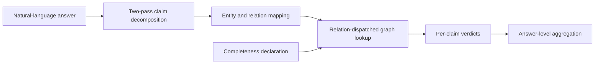

# Methodology of Record

**Updated:** 2026-08-03
**Status:** implemented behavior used by the final automated study

This document describes the code that runs. Current results and the publication assessment live in
[`../benchmarks/comprehensive_final_study_20260803.md`](../benchmarks/comprehensive_final_study_20260803.md).

## 1. Task and verdicts

The core system is a post-hoc verifier. It receives natural-language prose, decomposes it into
atomic claims, maps each claim to a graph triple, and returns one of four outcomes.

| Outcome | Meaning |
| --- | --- |
| `Supported` | The graph contains evidence matching the claim. |
| `Contradicted` | The graph contains incompatible evidence, or a fact is absent from a relation explicitly declared complete. |
| `Not-in-KG` | The available graph cannot settle the claim. |
| `Out-of-scope` | No schema-supported factual claim can be evaluated. |

`Out-of-scope` and execution errors are non-decisions. Evaluation errors are never replaced with a
default label and are excluded from the scored denominator while remaining visible in row-level
outputs.

The incompleteness study wraps the verifier with answer generation. Answers are generated under
closed-book, full graph-context, and degraded graph-context conditions; the verifier itself remains
post-hoc.

## 2. Pipeline

### 2.1 Two-pass decomposition

The LLM emits `{subject, relation, object, claim_type}` objects under a schema-guided prompt. It is
called twice at temperatures `0.1` and `0.2`. A claim is retained only when normalized
`(subject, relation, object)` values agree across passes. If the second call fails, the first pass is
retained and the failure is recorded; a successful but empty second pass is not treated as a call
failure.

This is the meaning of “decomposed with two-pass self-consistency.” It is unrelated to the graph
retention percentages.

### 2.2 Mapping

Subject linking uses this cascade:

1. exact course code or entity identifier;
2. normalized exact label or `code + title`;
3. `all-MiniLM-L6-v2` cosine similarity;
4. token-overlap fallback when the configured threshold permits it;
5. otherwise NIL/unresolved, producing `Not-in-KG`.

Institutional relations use canonical ontology names. Conservative, schema-gated aliases map model
phrases such as “worth four credits,” “offered in Semester 2,” and “precludes” to the canonical
credit, term, and preclusion relations. The gate prevents course-specific aliases from changing
open-domain predicates such as “net worth.” Public-graph relations use subject-record fields and a
surface-relation similarity fallback.

Objects remain in the namespace stored by the graph relation. In particular, open-domain entity
keys can be IDs while relation values are labels; the mapper must not substitute an ID where a
label is stored.

### 2.3 Verification and completeness routing

The default `declared` route reads a per-dataset declaration from
`data/completeness_declarations/`. On a complete relation, absence may license
`Contradicted`. On an incomplete relation, absence yields `Not-in-KG`.

The controlled-deletion builder writes a companion declaration for every degraded graph. Once any
facts are deliberately removed from a relation, that relation is marked incomplete in that graph.
The natural staffing relation (`taughtBy`) remains incomplete even in the full graph.

Two ablations are retained:

| Route | Absence behavior |
| --- | --- |
| `binary` | Collapse `Not-in-KG` to `Contradicted`. |
| `occupancy` | Infer open/closed status from the fraction of records with a non-empty field. |
| `declared` | Use the explicit relation declaration; this is the proposed route. |

Occupancy is a graph-density heuristic, not a measure of real-world completeness. It becomes
non-monotonic during deletion because a sufficiently sparse relation eventually flips from closed
to open.

### 2.4 Relation-specific checks

The symbolic verifier supports scalar equality (credits and school), set membership (semesters,
preclusions, prerequisites), prerequisite paths, explicit empty sets, normalized organizational and
person names, and generic open-domain fields. Numeric strings and numbers compare after numeric
normalization. Canonical prerequisite and preclusion course codes are preserved even when the
target course has no graph node.

### 2.5 Aggregation and confidence

Claim verdicts aggregate by severity: `Contradicted` before `Not-in-KG`, then
`Out-of-scope`, then `Supported`. Claim records retain the decomposition agreement and entity-link
score.

The emitted confidence is heuristic. The calibration experiment fits thresholds only on a held-out
calibration split and reports descriptive selective-risk diagnostics. It is not conformal risk
control and provides no deployment guarantee.

## 3. Controlled incompleteness protocol

All graph entities remain present. Degradation removes relation facts from:

- credit value;
- faculty/school;
- prerequisites;
- preclusions;
- offered semesters.

Nominal retention is `100/95/90/80/50/20%` for NUSMods and `100/50/20%` for RMIT. For example,
`80%` means that approximately 80% of facts in each selected relation remain and approximately 20%
are deleted. It is not a score, answer percentage, or entity-sampling rate.

Random deletion samples individual facts and is exact up to integer rounding. Clustered deletion
removes department groups, so its realized relation-level retention can differ from the nominal
target. Every graph condition records the requested and realized values, source and output hashes,
seed, and deleted triples.

Gold is recomputed from the full graph, the graph condition under test, and the relation semantics.
Saved pilot labels are not trusted during rescoring. This removes direct reuse of Stage 4 outputs,
but the labels remain mechanical rather than independently human annotated.

## 4. Evaluation design

- NUSMods: 200 questions, 300 unique expected triples, three answer-generation conditions, three
  deletion seeds, two deletion modes, and six nominal retention levels.
- RMIT: 50 questions and a light three-level deletion sweep over three seeds and two modes.
- Generator/detector matrix: Azure 4.1 mini and local Gemma 4 through LM Studio, including cross-model
  detector arms.
- Public transfer: RMIT, NUSMods, FactKG, and CoDEx through the same pipeline.
- External baselines: MiniCheck and flat-context LLM verification. Flat context receives the
  relation-specific graph snippet selected from the expected triple and is therefore an
  **oracle-context baseline**, not an end-to-end retriever.
- Controls: direct gold-triple verification, linking + verification, full stage attribution,
  graph-value shuffling, empty-graph destruction, and NIL threshold sweeps.

Primary metrics are tri-state accuracy, macro-F1, false-contradiction rate, false-support rate,
decision coverage, expected-triple precision/recall/F1, In-KB/NIL F1, and stage-wise ceilings.
Incompleteness intervals resample `(deletion seed, question_id)` clusters. Undefined rates, such as
false-contradiction rate when no contradiction is predicted, are recorded as `null`, never zero.

## 5. Validity boundary

The automated study deliberately omits human review at the user's request. Therefore:

- completeness declarations are researcher-authored;
- questions, expected triples, and gold labels are mechanically graph-derived;
- answer generation has one stochastic run per generator/condition;
- the flat-context arm uses oracle-selected context;
- RMIT is small and public benchmarks test transfer, not the deletion hypothesis;
- no calibrated or conformal safety guarantee is established.

The valid claim is a controlled failure characterization: binary absence handling and generic
binary fact checkers increasingly confuse missing evidence with contradiction as graph facts are
removed. The study does not independently prove real-world factuality performance.

## 6. Reproducibility rules

All citable aggregates must be recomputable from row-level files. Long-running runners record input
hashes, script/pipeline hashes captured before model calls, exact arguments, model/provider names,
usage, failures, and elapsed time. Public sweeps use random sampling by default; prefix sampling is
reported only as a bias diagnostic because FactKG is ordered by reasoning type.

The regression suite currently contains 101 tests. Deterministic graph-destruction gates require a
minimum 0.20 prediction-change rate.
