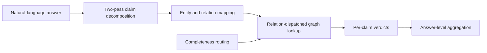

# Methodology of Record

**Updated:** 2026-08-03
**Gold revision:** 2026-08-03c — declaration-independent gold, with set-relation depletion handling
**Status:** implemented behaviour used by the final automated study

This document describes the code that runs. Current results and the publication assessment live in
[`../benchmarks/comprehensive_final_study_20260803.md`](../benchmarks/comprehensive_final_study_20260803.md).

## 1. Task and verdicts

The core system is a post-hoc verifier. It receives natural-language prose, decomposes it into atomic
claims, maps each claim to a graph triple, and returns one of four outcomes.

| Outcome | Meaning |
| --- | --- |
| `Supported` | The graph contains evidence matching the claim. |
| `Contradicted` | The graph contains incompatible evidence, or a fact is absent from a relation the system treats as complete. |
| `Not-in-KG` | The available graph cannot settle the claim. |
| `Out-of-scope` | No schema-supported factual claim can be evaluated. |

`Out-of-scope` and execution errors are non-decisions. Evaluation errors are never replaced with a
default label; they are excluded from the scored denominator while remaining visible in row-level
outputs.

The incompleteness study wraps the verifier with answer generation under closed-book, full
graph-context, and degraded graph-context conditions. The verifier itself remains post-hoc.

## 2. Pipeline

### 2.1 Two-pass decomposition

The LLM emits `{subject, relation, object, claim_type}` objects under a schema-guided prompt. It is
called twice, at temperatures `0.1` and `0.2`. A claim is retained only when the normalized
`(subject, relation, object)` values agree across both passes. If the second call fails, the first
pass is retained and the failure is recorded; a successful but *empty* second pass is not treated as
a call failure.

This is what "decomposed with two-pass self-consistency" means. It is unrelated to the graph
retention percentages.

### 2.2 Mapping

Subject linking uses this cascade:

1. exact course code or entity identifier;
2. normalized exact label, or `code + title`;
3. `all-MiniLM-L6-v2` cosine similarity;
4. token-overlap fallback when the configured threshold permits it;
5. otherwise NIL/unresolved, producing `Not-in-KG`.

Institutional relations use canonical ontology names. Conservative, schema-gated aliases map model
phrases such as "worth four credits", "offered in Semester 2", and "precludes" onto the canonical
credit, term, and preclusion relations. The gate prevents course-specific aliases from rewriting
open-domain predicates such as "net worth".

Objects stay in the namespace the graph relation stores. Open-domain entity keys can be IDs while
relation values are labels; the mapper must not substitute an ID where a label is stored.

### 2.3 Completeness routing

Routing decides what an *absent* fact means. This is the study's independent variable, and the
pipeline supports several treatments as first-class `routing_mode` values.

| Mode | Absence behaviour | Role in the study |
| --- | --- | --- |
| `declared` | Read the per-relation completeness declaration; absence in a complete relation may license `Contradicted`, absence in an incomplete relation yields `Not-in-KG`. | Used for both the `declared_oracle` and `declared_stale` arms — they differ only in *which* declaration file is supplied. |
| `binary` | No third label exists at all. Every `Not-in-KG` the symbolic core would produce — including those caused by an unresolvable entity — collapses to `Contradicted`. | Models an external binary fact checker. Runs its own pass. |
| `occupancy` | Infer open/closed from the fraction of records carrying a non-empty field for the relation. | Metadata-free heuristic. |
| `fixed_cwa` / `fixed_owa` | Force closed- or open-world for every relation. | Debugging and ablation. |
| `dynamic` | Legacy adaptive mode. | Retained for compatibility. |

`binary` is implemented as a genuine routing mode, not as post-processing on another system's
predictions. This matters: in the previous revision `binary` was produced by relabelling the
`declared` output, which made its reported curve an arithmetic transform of the proposed system
rather than an independent measurement.

Occupancy is a graph-density heuristic, not a measure of real-world completeness. It is
non-monotonic during deletion, because a sufficiently sparse relation eventually flips from closed to
open in one step.

### 2.4 Relation-specific checks

The symbolic verifier supports scalar equality (credits, school), set membership (semesters,
preclusions, prerequisites), prerequisite paths, explicit empty sets, normalized organizational and
person names, and generic open-domain fields. Numeric strings and numbers compare after numeric
normalization. Canonical prerequisite and preclusion course codes are preserved even when the target
course has no graph node.

Explicit empty sets are load-bearing. The NUSMods parser writes `"prerequisites": []` deliberately,
so "this course has no prerequisites" stays distinguishable from "prerequisite information is
unavailable". Degradation removes the key entirely rather than emptying it, which is what keeps the
two cases separable throughout the study.

### 2.5 Aggregation and confidence

Claim verdicts aggregate by severity: `Contradicted` before `Not-in-KG`, then `Out-of-scope`, then
`Supported`. Claim records retain the decomposition agreement and the entity-link score.

The emitted confidence is heuristic. The calibration experiment fits thresholds only on a held-out
calibration split and reports descriptive selective-risk diagnostics. It is not conformal risk
control and provides no deployment guarantee. Note that the most accurate system in the study also
has the *worst* expected calibration error — the confidence formula is not fitted to correctness, so
confidence must not be read as a probability.

## 3. Controlled incompleteness protocol

All graph entities remain present. Degradation removes relation facts from:

- credit value (`hasCreditValue`);
- faculty/school (`partOfSchool`);
- prerequisites (`requiresPrerequisite`);
- preclusions (`preclusions`);
- offered semesters (`offeredInTerm`).

Staffing (`taughtBy`) is never degraded. It is the naturally incomplete open-world anchor.

Nominal retention is `100/95/90/80/50/20%` for NUSMods and `100/50/20%` for RMIT. `80%` means roughly
80% of the facts in each listed relation remain. It is not a score, an answer percentage, or an
entity-sampling rate.

Random deletion samples individual facts and hits the requested count up to rounding. Clustered
deletion removes department groups, so realized relation-level retention can differ from the target.
Every condition records requested and realized values, source and output hashes, the seed, and the
full list of deleted triples.

## 4. Gold labels

**This is the part that changed in revisions 2026-08-03b and 2026-08-03c, and it is the most
important section of this document.**

### 4.1 The defect that was fixed

Gold previously decided whether an absent fact should be `Contradicted` or `Not-in-KG` by calling
`store.get_declared_world_assumption(relation)` — the same completeness declaration the `declared`
routing mode consults, with the same branch structure. Gold and system were two implementations of
one definition.

The consequence was a proposed system that scored exactly 1.000 accuracy and 1.000 macro-F1 in every
one of 336 experimental cells, with a `[1.0, 1.0]` bootstrap interval. That is not a strong system;
it is a system graded against its own rule.

### 4.2 The replacement

Gold is now computed by [`scripts/intervention_gold.py`](../../scripts/intervention_gold.py) from two
inputs, and **no completeness declaration is opened at any point**:

| Input | Role |
| --- | --- |
| Reference graph — the full, undegraded snapshot | Stands in for "the world". Defines what is true. |
| Condition graph — the damaged graph for this cell | Defines what evidence was available. |

Two independent properties are recorded per claim.

`world_truth`, established against the reference graph:

- `true` — the reference graph asserts exactly this fact;
- `false` — the reference graph asserts a *different* value for this subject and relation;
- `unknown` — the reference graph is silent (natural incompleteness, e.g. staffing).

`evidence_state`, established against the condition graph:

- `confirming` — the condition graph still asserts the claimed fact;
- `conflicting` — the condition graph asserts a different value;
- `absent` — the condition graph asserts nothing here.

The gold verdict is the strongest label the available evidence justifies:

| `world_truth` | `evidence_state` | Gold | Reasoning |
| --- | --- | --- | --- |
| `true` | `confirming` | `Supported` | The evidence is present. |
| `true` | `absent` | `Not-in-KG` | The claim is true and we deleted the proof. Contradicting it is the harm under study. |
| `false` | `conflicting` | `Contradicted` | The visible graph carries an incompatible value. |
| `false` | `absent` | `Not-in-KG` | The conflicting value is gone; nothing visible licenses a contradiction. |
| `unknown` | `absent` | `Not-in-KG` | Natural open-world absence. |

`true`/`conflicting` and `unknown`/`conflicting` cannot occur, because degradation only removes
facts. The sweep counts any such row as an anomaly.

### 4.3 Set-valued relations, and a bug worth documenting

Random deletion removes **individual members** of a collection and leaves the container behind. A
course whose reference prerequisite list is `[ES2002, ES2660, IS2101, LC1016]` can end up with a
condition list of just `[ES2660]`.

The first implementation of this gold tested only "is the field present?". It therefore treated the
shrunken list as an authoritative statement and read the absence of `ES2002` as a **contradiction** —
even though `ES2002` really is a prerequisite and is missing only because we deleted it.

That mislabelled 230 of 296 supposed contradictions in a single experimental cell, and produced a
published claim that the proposed routing mode over-abstained, recovering only 14.2% of detectable
contradictions. The system was abstaining correctly; the answer key was wrong. The claim was
withdrawn and the actual figure is 94.6–100% contradiction recall.

The rule now applied: **for a set relation, the absence of a claimed member licenses `conflicting`
only when the visible member set is provably identical to the reference member set.** Otherwise the
evidence state is `absent`.

The residual anomaly count across all 61,164 scored rows is **5**, all from the single multi-hop
triple `MA4262 → MA2108S`, where the reference prerequisite is reachable only through an intermediate
course. Those rows fall back to `absent`.

The general invariant — a gold function must never label a reference-world truth as `Contradicted` —
is now enforced by `test_no_true_fact_is_ever_labelled_contradicted` in
[`tests/test_intervention_gold.py`](../../tests/test_intervention_gold.py).

### 4.4 The limitation this definition still carries

Operationally, this coincides with certain-answer semantics over the visible graph: absence never
licenses a contradiction. Two consequences are stated openly rather than buried.

- Any system that refuses to contradict from absence scores zero on the safety metrics **by
  construction**. `declared_oracle` is such a system, so its zero is a ceiling and never a result.
- The scientific content lives in arms that *can* contradict from absence and do not define gold:
  `declared_stale`, `binary`, `occupancy_*`, the flat-context LLM verifiers, and MiniCheck.

Because `world_truth` is recorded on every row, the saved artifacts also support the convention-free
metric described below, and can be re-analysed under a different convention about absence without
re-running anything.

## 5. Evaluation design

- NUSMods: 200 questions, 300 unique expected triples, three answer-generation conditions, three
  deletion seeds, two deletion modes, six nominal retention levels.
- RMIT: 50 questions with a light three-level deletion sweep over three seeds and two modes.
- Generator/detector matrix: `azure-4.1-mini` and local `google/gemma-4-e4b`, including cross-model
  detector arms that reuse identical saved answers.
- Public transfer: RMIT, NUSMods, FactKG, and CoDEx through the same pipeline.
- External baselines: MiniCheck and flat-context LLM verification. Flat context receives the
  relation-specific graph snippet selected from the expected triple, and is therefore an
  **oracle-context baseline**, not an end-to-end retriever.
- Controls: direct gold-triple verification, linking + verification, full stage attribution,
  graph-value shuffling, empty-graph destruction, and NIL threshold sweeps.

### 5.1 Metrics, and which to trust

| Metric | Definition | Depends on a convention? |
| --- | --- | --- |
| **Contradiction rate on true claims (CR-true)** | Of claims true in the reference world, the fraction called `Contradicted`. | **No.** Prefer this. |
| False-contradiction rate (FCR) | Of contradictions announced, the fraction against a gold of `Supported` or `Not-in-KG`. | Yes — assumes absence should be `Not-in-KG`. |
| False-support rate | Of `Supported` predictions, the fraction against a non-`Supported` gold. | Mildly. |
| Decision coverage | Fraction of atoms receiving a decision other than `Not-in-KG`. | No. |
| Tri-state accuracy, macro-F1 | Standard. | Yes, through the gold labels. |
| Expected-triple precision/recall/F1 | Extraction quality against the question's expected triples. | No. |
| In-KB / NIL F1 | Entity-linking quality. | No. |

CR-true is the headline safety number because it needs no assumption about how absence ought to be
labelled: there is one defensible answer to "should you contradict something that is true?".

Incompleteness intervals resample `(deletion seed, question_id)` clusters over 1,000 bootstrap
iterations. Undefined rates — such as false-contradiction rate when nothing was predicted
`Contradicted` — are recorded as `null`, never as zero.

## 6. Validity boundary

The automated study deliberately omits human review at the user's request. Therefore:

- gold is independent of every system under test, but is still derived from graph contents rather
  than human judgement;
- completeness declarations are researcher-authored;
- questions and expected triples are mechanically graph-derived;
- answer generation has one stochastic run per generator/condition;
- the flat-context arm uses oracle-selected context;
- RMIT is small, and public benchmarks test transfer rather than the deletion hypothesis;
- no calibrated or conformal safety guarantee is established.

The valid claims are: (a) a tri-state prompt with oracle evidence measurably reduces but does not
eliminate false contradictions under incompleteness; (b) stale completeness metadata is
indistinguishable from no metadata on the safety metric; (c) binary fact checkers have a label-space
defect; (d) relation-level declarations over-abstain; and (e) decomposition, not symbolic lookup,
dominates the end-to-end error budget. The study does not independently prove real-world factuality
performance.

## 7. Reproducibility rules

All citable aggregates must be recomputable from row-level files. Long-running runners record input
hashes, script and pipeline hashes captured *before* model calls, exact arguments, model and provider
names, usage, failures, and elapsed time. Public sweeps use random sampling by default; prefix
sampling is reported only as a bias diagnostic, because FactKG is ordered by reasoning type and the
sampling method moves the apparent score by over 20 points.

The regression suite currently contains **183 tests**, including
[`tests/test_intervention_gold.py`](../../tests/test_intervention_gold.py), whose
`GoldIndependenceTests` exist specifically to prevent the gold/system coupling defect from
reappearing. Deterministic graph-destruction gates require a minimum 0.20 prediction-change rate.
