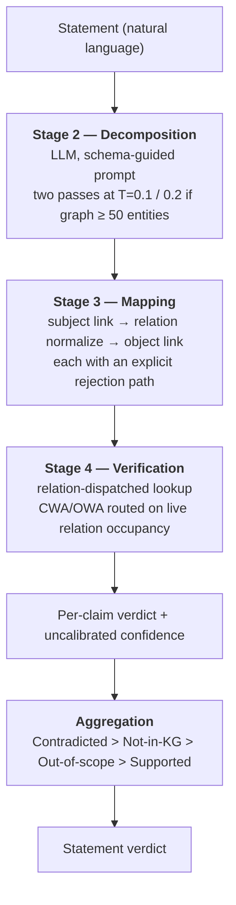

# Methodology of Record

**Updated:** 2026-07-26 · **Status:** describes the system as built and the protocol as practised.

This is the architecture-of-record. Everything here is implemented and exercised by the current
benchmark runs. Components that were designed but not built are **not** described here — they live in
[`design.md`](design.md), which is a forward-looking specification, not a system description.

* Code-level detail (call sites, parameters, fallback ordering): [`system_expert_review.md`](system_expert_review.md)
* Plain-language walkthrough: [`system_explained_v3.md`](system_explained_v3.md)
* Measured results: [`../benchmarks/rerun_20260726_paper.md`](../benchmarks/rerun_20260726_paper.md)
* Artifact validity status: [`../experiment_registry.md`](../experiment_registry.md)

---

## 1. What the system does

A **post-hoc, claim-level fact verifier**. Given a natural-language statement and a knowledge graph,
it returns a verdict per extracted claim and one aggregate verdict for the statement.

**It does not generate text.** There is no drafting stage, no retrieval arm, and no human-review UI.
The unit of input is a statement someone else produced.

### Output space

| Outcome | Meaning | Produced when |
| --- | --- | --- |
| `Supported` | The graph contains the asserted fact | Lookup matches |
| `Contradicted` | The graph asserts something incompatible | Value mismatch, or absence under closed-world routing |
| `Not-in-KG` | The graph cannot settle the claim | Absence under open-world routing, or the subject/object could not be resolved |
| `Out-of-scope` | *Non-decision.* No claim could be parsed, or the relation is outside the ontology | Decomposition returned nothing, or relation is `unclassified` |
| `Error` | *Non-decision, harness-level.* The pipeline raised | Exception during evaluation |

`Out-of-scope` and `Error` are **not** verdicts about the world. Neither can match a gold label.
Since 2026-07-26 an `Error` row is left **unscored** rather than assigned a default class — see
[§6.2](#62-crashes-are-not-predictions).

---

## 2. Pipeline

### 2.1 Stage 2 — Decomposition

The statement is decomposed into typed claim objects `{subject, relation, object, claim_type}` by an
LLM under a **schema-guided prompt** that enumerates the legal relation classes
(`requiresPrerequisite`, `hasCreditValue`, `partOfSchool`, `taughtBy`, `offeredInTerm`) and instructs
the model to emit `claim_type: "unclassified"` for anything outside them. Public-benchmark harnesses
substitute a dataset-specific prompt: for FactKG the legal relations are the claim's own context
triples; for CoDEx and MetaQA the model emits free relation strings.

Multi-hop statements are decomposed into a chain — `A requires C`, `C requires B` — rather than a
single two-step claim.

**Self-consistency.** Decomposition runs twice (temperatures 0.1 and 0.2) and keeps only claims
appearing in both, matched on normalized `(subject, relation, object)` with substring tolerance and
`unclassified` treated as a wildcard. The retained fraction is reported as
`decomposition_agreement`.

> **This is conditional, and the condition matters.** The second pass is skipped when the loaded
> graph holds **fewer than 50 entities**, in which case `decomposition_agreement` is hardcoded to
> 1.0. FactKG builds a transient per-claim context whose size ranges 0–197 entities, so the regime
> switches *row by row within a single dataset* (~91% single-pass). RMIT sits exactly on the
> boundary at 50 courses (the test is strict `<`), so it always runs both passes. Any comparison of
> confidence or agreement across datasets — or across FactKG rows — is confounded by this.

### 2.2 Stage 3 — Mapping

Three resolution problems, each with an explicit rejection path. This stage is where the 2026-07-26
repairs concentrated, because all three had silent failure modes.

**Subject linking** (`link_entity`), in order:

1. six-digit course-code regex → score 1.0
2. normalized exact match in the entity index → score 1.0
3. bi-encoder cosine over `all-MiniLM-L6-v2` embeddings of the entity label list
4. token-overlap fallback

The entity index maps course codes, normalized titles, and code+title combinations to entity ids.
`normalize_text` lowercases, strips academic/organisational prefixes (`School of`, `Dr`, `Professor`),
and removes non-alphanumerics. If `sentence-transformers` cannot load, a TF-IDF character n-gram
vectorizer (2–4 grams) substitutes.

Step 3 accepts only at or above **`entity_link_threshold`**. Below it the subject is reported
unresolved, which routes to `Not-in-KG`. When the threshold exceeds the 0.35 default, step 4 is
skipped — token overlap is strictly more permissive than cosine and would undo the rejection.

> **Methodological point: this threshold is a fitted hyperparameter, not a constant.** At a fixed
> 0.35 the linker never abstains — all 97 CoDEx subjects genuinely absent from the graph were linked
> to a nearest neighbour, so the `Not-in-KG` class was structurally unreachable. The threshold is
> selected on a **held-out development split** (`scripts/sweep_entity_threshold.py`; dev = CoDEx rows
> 500–1000, test = rows 0–500), never on evaluation rows. The sweep is monotone and selects 0.95 for
> CoDEx, generalising dev 0.8435 → test 0.8206. The library default stays 0.35 so the institutional
> path — whose subjects are six-digit codes caught at step 1 — is unaffected.

**Relation normalization.** Fires when the claim's relation is `unclassified`, empty, **or** is
neither an `ONTOLOGY_RELATIONS` member nor a field present on the resolved subject's record. That
last condition is essential: LLM decomposition emits surface phrasings (`is member of`) that do not
match a graph field name (`member of political party`), and without normalization Stage 4 falls
through to "unrecognized relation class" and returns `Not-in-KG` for a fact the graph holds. Matching
is bi-encoder cosine over the record's actual relation keys (accept ≥ 0.30), then a
substring/synonym heuristic. `ONTOLOGY_RELATIONS` exempts the institutional dispatch path.

**Object linking — namespace discipline.** The object must be returned in the namespace the graph
stores its *values* in.

> Entity records are keyed by **id** (a course code on RMIT, a Wikidata Q-id on CoDEx) while their
> field values are **surface labels**: `data/codex_graph.json` holds 17,203 object values, all
> labels, zero Q-ids. Substituting the resolved entity *key* for a claim's object made Stage 4
> compare an id against a label and report a value mismatch for every true claim. Stage 3 resolves
> the object for its confidence contribution, then **projects it back to the stored label**.
> Relations dispatched explicitly by Stage 4 bypass object linking entirely, because institutional
> prerequisites are course codes and both sides are already in id space.

This single asymmetry accounted for most of a 40-point accuracy deficit on CoDEx. Any new graph
backend must declare which namespace its keys and its values occupy.

### 2.3 Stage 4 — Verification

Dispatch is per relation class against `KGStore`:

| Relation | Procedure |
| --- | --- |
| `requiresPrerequisite` | Direct membership, then a **two-hop path check** (`A→C→B`); explicit negation handling for "requires no prerequisites" |
| `hasCreditValue` | Integer extraction and exact comparison (functional relation) |
| `partOfSchool` | Normalized string comparison |
| `taughtBy` | Coordinator name/email comparison, plus an **existence fallback** that scans all records when the subject is a person rather than a course |
| any field present on the record | Generic branch: normalized comparison, list-valued fields handled by membership; an existence-placeholder heuristic treats "X had a successor" as an existence claim rather than a value claim |
| unrecognized | `Not-in-KG` |
| `unclassified` | `Out-of-scope` |

**World-assumption routing** decides what *absence* means:

| `routing_mode` | Behaviour |
| --- | --- |
| `dynamic` *(default, all reported runs)* | `closed` iff `estimate_relation_occupancy(relation) ≥ cwa_threshold` (0.85) |
| `fixed_cwa` | always `closed` |
| `fixed_owa` | always `open` |

Under `closed`, absence yields `Contradicted`. Under `open`, `Not-in-KG`.

> **`estimate_relation_occupancy` measures occupancy, not completeness.** It is the fraction of
> entity records *in the currently loaded graph* with that field populated. It carries no
> information about whether the graph covers the world. On a sparse graph a relation can look
> "closed" merely because the few records present happen to have the field. The name in code is
> deliberate; `estimate_relation_completeness` survives only as a compatibility alias. **Do not
> report occupancy as completeness** — the completeness estimator described in [`design.md`](design.md)
> is not built.

### 2.4 Aggregation

Claim verdicts combine by priority: `Contradicted` > `Not-in-KG` > `Out-of-scope` > `Supported`.
Self-referential prerequisite claims (`A requires A`, a parser artifact) are pruned before voting.

`withhold_unresolved_claims` (default **`False`**) optionally excludes claims whose subject could not
be linked, on the grounds that an unlinkable claim is not evidence; if *every* claim is unresolved
the rule does not apply, since the subject genuinely is absent. Each claim record carries a `voted`
flag. It ships off because its measured effect is inside the noise floor in both directions
([§5.3](#53-ablation-discipline)).

### 2.5 Set-valued answer completeness (separate track)

`AnswerCompletenessVerifier` is a **deterministic, non-LLM** component addressing a different
question: given a query with a set-valued answer ("all prerequisites of X"), is a response
*complete*? It computes the expected answer set from the graph via a `QuerySpec`, extracts response
members, and reports set precision/recall, exact-set match, and explicit missing/unexpected members.
`DualRiskController` applies independent wrong-answer and omission budgets over calibrated risks.

This track is **evaluated separately** from claim verification and is the only genuinely
deterministic part of the system.

---

## 3. Confidence

`calculate_confidence` returns a product:

$$\text{conf} = \text{base\_conf} \times \text{entity\_score} \times \text{decomposition\_agreement}$$

`base_conf` is 1.0 for `Supported`, relation occupancy for `Contradicted`, 1 − occupancy for
`Not-in-KG`, 0.5 for unresolved-entity outcomes, 1.0 for `unclassified`. With `smooth_calibration`
(off by default) a weighted sum `0.70·base + 0.20·smooth_entity + 0.10·smooth_agreement` replaces it.

> [!CAUTION]
> **This score is uncalibrated and must not be used as a risk estimate.** There is no fitted mapping
> from it to empirical correctness and no calibration split is collected by any run; every result row
> carries `confidence_calibrated: false`. Coverage and selective accuracy are reported as
> *descriptive statistics at the default operating point*, never as risk guarantees.
> `DualRiskController` correctly refuses to act on uncalibrated risk, so it always defers and is
> exercised by no benchmark cell. **No false-contradiction rate is currently controlled.**

There is no NLI model anywhere in the system. The `smooth_agreement` term is decomposition
agreement.

---

## 4. Knowledge graph substrate

`KGStore` loads a JSON dictionary keyed by entity id, each record a flat field map. Reserved
scaffolding fields (`course_id`, `title`, `prerequisites`, `credits`, `school`, `coordinator`,
`coordinator_email`, `description`) are distinguished from open-domain relation fields. There is no
triple store, no Cypher, no temporal scoping, and no provenance edge — `evidence` in a result row is
a rendered triple string.

Stores are keyed by graph path so instances loaded from different paths are independent
(regression-tested). `verify_with_context` swaps in a **transient per-claim graph** for
context-grounded benchmarks and restores the background store and index afterwards under a lock;
concurrent isolation is regression-tested.

Graphs currently in use:

| Graph | Entities | Key namespace | Value namespace |
| --- | ---: | --- | --- |
| `data/rmit_graph.json` | 50 | six-digit course code | mixed (codes for prerequisites, labels elsewhere) |
| `data/codex_graph.json` | 1,182 | Wikidata Q-id | **surface labels only** |
| FactKG transient contexts | 0–197 | claim's own subject string | claim's own object string |

---

## 5. Evaluation methodology

### 5.1 Row-level first

**Every aggregate must be reconstructable from saved per-row predictions.** Harnesses write one row
per example (`id`, `gold`, `pred`, `raw_pred`, `reasoning_type`, and for RMIT the full
`claims_detail`), and `scripts/summarize_rerun_results.py` recomputes accuracy, per-class P/R/F1,
macro-F1, majority floor, coverage, selective accuracy, and confusion matrices from those rows,
reporting recomputed and harness-stored values side by side. A disagreement is a defect.

This is not a formality. Three of the most consequential findings in this project's history — a
22.6% crash rate scored as accuracy, a class with 0.039 recall inside a 41.8% accuracy, and a 9.6%
prediction flip rate inside a 0.6-point accuracy move — were all invisible at aggregate level.

Metrics:

* **Accuracy** — exact verdict match over *scored* rows. `Out-of-scope` counts as an error.
* **95% CI** — IID bootstrap over rows, 1,000 resamples. **Anti-conservative**: rows carry no
  subject-entity field, and the only available grouping key is the id prefix, which encodes the gold
  label — so clustered intervals are not computable and true intervals are wider.
* **Majority floor** — accuracy of always predicting the most frequent gold label. Reported beside
  every accuracy; an accuracy that does not clear its floor is not a result.
* **Coverage / selective accuracy** — share of rows returning a decision, and accuracy on those.
  On forced-binary FactKG only `Supported`/`Contradicted` count as covered.
* **Macro-F1** — mean F1 over classes with non-zero support. **Not comparable across systems with
  different abstention rates**: `Out-of-scope` costs recall but never precision, so an abstaining
  system can post macro-F1 above its own accuracy.

### 5.2 Sampling

`--sample random` (seeded, recorded in the output) is the default. Prefix selection is available only
to reproduce historical runs.

> **Why this is a methodology decision, not a detail.** `data/factkg_test.jsonl` is sorted into 45
> contiguous reasoning-type blocks. `data[:500]` therefore selects **2 of 13** reasoning types and a
> majority floor of 64.60% against the full set's 51.35%. The two sampling arms differ by 23–27
> accuracy points on identical code. CoDEx's file is label-interleaved and its arms agree to within
> 1 point. **Prefix sampling is not a sample**; representativeness must be checked per file, not
> assumed.

### 5.3 Ablation discipline

Changes are attributed by paired arms on identical rows, run concurrently, with the noise floor
stated first.

**The noise floor is measured, not assumed.** Replicated identical runs flip 0.2–10.0% of individual
predictions (mean 5.07%), while accuracy moves at most 2.6 points. `azure-4.1-mini` flips 0.2–1.0%;
`gemma-4-e4b` flips 7–10%. **Differences below ~2.5 points are not resolvable from two runs**, and
aggregate stability badly understates instability — offsetting flips cancel.

Two consequences enforced in practice:

* A change is shipped enabled only if its benefit exceeds the noise floor. `withhold_unresolved_claims`
  measured +0.8 points on CoDEx against a 7.2% flip rate in that cell, so it ships **disabled**.
* Slice-level claims need several runs per arm. The RMIT `existence` slice (n=50) ranges 22–29/50
  across five runs; a single paired comparison on it cannot establish causation, and an earlier
  attribution was withdrawn for exactly this reason.

### 5.4 Grounding gate

**Accuracy that does not move when the graph's factual content is destroyed is not verification.**

`scripts/run_kg_destruction_control.py` shuffles object values *within* each relation, preserving the
entity set, relation keys, per-relation value multiset, and type distribution while destroying the
subject–value association. It exits non-zero if fewer than `--min_change_rate` (default 0.20) of
predictions change. `scripts/run_graph_destruction_control.py` does the paired equivalent for the
deterministic completeness component, with zero-fixed-point derangements and subject-clustered
bootstrap intervals.

This is the governing acceptance test for any change to Stages 3–4. Before the object-namespace
repair it read 1.8–2.8%; it now reads 28.9%. Removing all relations collapses the pipeline to the
majority floor exactly, confirming it reacts to a relation key's presence as well as its content.

### 5.5 Reproducibility, honestly

Runs are **not** bitwise reproducible. `eval_rmit.py --seed` seeds only Python's `random`; it does
not constrain LLM sampling, and decomposition runs at temperature 0.1/0.2. Only the deterministic
components (`AnswerCompletenessVerifier`, both destruction controls) reproduce exactly — verified by
matching graph, benchmark, and script hashes.

What *is* recorded: per-cell process manifest with exit codes, UTC timestamps and exact argv; the
sampling mode and seed; `entity_link_threshold`; `n_scored` versus `n_unscored_errors`; and
graph/benchmark/script SHA-256 hashes for the deterministic controls.

---

## 6. Instrumentation rules

### 6.1 Aggregates are derived, never authored

No result-producing runner may emit a hand-written statistic. Runners that did — simulated threshold
sweeps, label-conditioned confidence features, hand-inserted p-values — are marked `disabled` in
[`../experiment_registry.md`](../experiment_registry.md) and must not be run.

### 6.2 Crashes are not predictions

On exception, both harnesses leave the row **unscored**: `pred: null`, `raw_pred: "Error"`, plus the
exception text. `compute_metrics` excludes unscored rows from the denominator and returns `n_scored`
so the gap is visible; output JSON carries `n_scored` and `n_unscored_errors`.

> This rule exists because violating it produced the worst measurement failure in the project's
> history. Substituting the dataset default label on failure converted **113 crashes into 111
> scored-correct predictions** on FactKG, because the default (`Contradicted`) was also the majority
> class. The reported accuracy was 81.4%; the defensible bound was [59.2%, 81.4%]. The 1.2-point
> post-repair delta was a coincidence of label alignment, not evidence the defect was harmless.

### 6.3 Registry gating

Every result artifact carries a status in `experiments/registry.json`. Only `validated` entries may
support a research claim; new runs enter as `candidate`. Rerunning repaired code does not
rehabilitate an old output file — new artifacts require new run ids and manifests.

---

## 7. Known limitations of the methodology itself

Stated here because they bound every number the system produces.

| Limitation | Consequence |
| --- | --- |
| Occupancy substitutes for completeness | The `Contradicted`/`Not-in-KG` split rests on a local tidiness statistic, not on evidence about world coverage. C1 is unevaluated. |
| Confidence is uncalibrated | No risk-controlled operating point exists. Coverage/selective accuracy are descriptive only. C4 is unsupported. |
| Institutional benchmark is circular | `eval_rmit.py:54` verifies `raw_claim`, a template interpolated from the fields the verifier then queries; the stored LLM paraphrase `text` is never evaluated. RMIT measures template round-tripping through Stages 2–3, not advising accuracy. |
| Completeness control is circular | The benchmark generator mints `gold_completeness` with the same verifier the control evaluates, so its 100% baseline is structurally guaranteed. Only the destruction delta is informative. |
| Intervals ignore clustering | Rows carry no subject-entity field; reported CIs are anti-conservative. |
| Forced-binary benchmarks destroy abstention | FactKG collapses `Not-in-KG`/`Out-of-scope`/`Abstained` into `Contradicted`, so the class has support 0 and every abstention is scored as an assertion of falsehood. |
| Self-consistency is conditional | `decomposition_agreement` is a hardcoded 1.0 on ~91% of FactKG rows and measured elsewhere. |
| Threshold fitted on one graph | `entity_link_threshold = 0.95` is validated for CoDEx only. |
| Two runs per cell | Below the ≥3 replicates the flip rate warrants. |
| No multiplicity correction | Ten cells and many per-class comparisons; treat individual comparisons as exploratory. |

---

## 8. Entry points

| Purpose | Command |
| --- | --- |
| Regression suite (35 tests) | `python -m unittest discover -s tests` |
| Stage-3 namespace diagnosis (no LLM) | `python -m scripts.diagnose_object_namespace` |
| Threshold selection on held-out split | `python -m scripts.sweep_entity_threshold` |
| **Grounding gate** | `python -m scripts.run_kg_destruction_control --entity_link_threshold 0.95` |
| Deterministic completeness control | `python scripts/run_graph_destruction_control.py` |
| Full benchmark sweep | `python scripts/run_benchmark_sweep.py --run_id <id>` |
| Recompute aggregates from rows | `python scripts/summarize_rerun_results.py --dir <run_dir>` |
| Paired run comparison / flip rates | `python scripts/compare_runs.py --before <a> --after <b>` |

Exact PowerShell invocations and saved output paths: [`../experiment_runbook.md`](../experiment_runbook.md).
