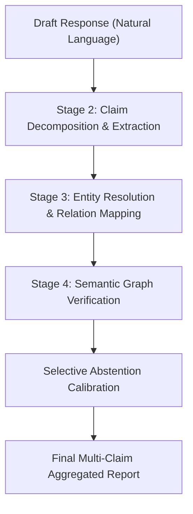

# Knowledge Graph Fact-Verification Pipeline: Detailed Technical Implementation Flow

This document provides a comprehensive technical breakdown of the **4-stage Post-Hoc Knowledge Graph Fact-Verification Pipeline**. It is designed for expert review and explains the exact algorithms, prompt structures, state transitions, and heuristics used in each stage of the verification process.

---

## 1. High-Level Architecture

The framework is implemented in [verification_pipeline.py](file:///c:/Users/Admin/Desktop/crawler/verification_pipeline.py) and verified against the local catalog database in [kg_store.py](file:///c:/Users/Admin/Desktop/crawler/kg_store.py).



---

## 2. Step-by-Step Execution Flow

### Stage 1: Input / Draft Response
- **Input**: A natural language draft statement generated by an LLM in response to a user query.
- **Context**: (Optional) Retrieve context triples from the Knowledge Graph representing local facts (KG-RAG).

---

### Stage 2: Factual Claim Decomposition
Stage 2 parses the natural language draft into checkable atomic assertions conforming to a structured JSON format.

#### A. Prompt and Extraction Logic
The decomposition uses schema-guided extraction. The LLM is instructed to map claims to a list of valid target relations (in RMIT handbook: `requiresPrerequisite`, `hasCreditValue`, `partOfSchool`, `taughtBy`, `offeredInTerm`). 

**Decomposition JSON Schema**:
```json
{
  "claims": [
    {
      "subject": "string (the entity being queried, e.g. course code/title)",
      "relation": "string (the target relation name)",
      "object": "string (the expected value/entity)",
      "claim_type": "string (same as relation name if matching, otherwise 'unclassified')"
    }
  ]
}
```

#### B. Self-Consistency Verification (Double-Run Check)
To guard against extraction hallucinations in quantized local LLMs:
1. **Execution**: The extractor is run twice at temperatures $T_1 = 0.1$ and $T_2 = 0.2$ to obtain two claim sets: $C_1$ and $C_2$.
2. **Matching Criteria**: A claim $c_1 \in C_1$ is kept if it matches $c_2 \in C_2$ where:
   - Normalized Subject matches: $\text{norm}(c_{1,sub}) \subseteq \text{norm}(c_{2,sub})$ or vice-versa.
   - Normalized Object matches: $\text{norm}(c_{1,obj}) \subseteq \text{norm}(c_{2,obj})$ or vice-versa.
   - Relation matches: $c_{1,rel} = c_{2,rel}$ OR one of the relations is `"unclassified"` OR they overlap.
3. **Domain Bypass**: For public benchmarks (where the schema is dynamically supplied in the query rather than static), double-run pruning is bypassed because of zero-shot naming variations, defaulting to returning $C_1$.

---

### Stage 3: Entity Resolution & Relation Mapping
Stage 3 binds natural language strings extracted in Stage 2 to unique graph nodes and relations in the `KGStore`.

```
Claim (Subject String, Relation String, Object String)
                  │
                  ▼
          [Subject Lookup] 
                  │  (Deterministic exact match)
                  ├──► Code Found (e.g. "056429")
                  └──► [Fuzzy Word Overlap / Substring Matching] (Best overlap candidate)
                  │
                  ▼
          [Relation Lookup] 
                  │  (Ontology schema match)
                  ├──► Direct ontology relation
                  └──► [Fallback Synonym / Triple Mapper]
```

#### A. Subject & Object Entity Resolution
- **Lookup Index**: Built deterministically by mapping course codes, titles, and combinations (e.g., `COSC1127` and `Intro to Programming`) to canonical identifiers.
- **Leakage Prevention**: To prevent cross-sample contamination on dynamic benchmark sets (e.g. FactKG/FEVER), the entity lookup index is cleared (`self.entity_index = {}`) at the beginning of each sample rebuild.
- **Fuzzy Match Engine**:
  - Checks exact substring containment (case-insensitive).
  - Calculates token overlap: Computes word intersection between query tokens and canonical keys (excluding tokens of length $\le 1$). Matches the key with the highest overlapping words.

#### B. Fallback Naming & Synonym Resolver
When evaluating generic public datasets (e.g., FactKG), relations extracted by the LLM (like `had a husband`, `successor after him`) are mapped to the actual relations stored for that subject in the graph using a synonym dictionary:
```python
synonyms = {
    "spouse": ["husband", "wife", "spouse", "married"],
    "successor": ["successor", "successor after", "succeeded"],
    "predecessor": ["predecessor", "preceded"],
    "father": ["father", "dad", "male parent"],
    "mother": ["mother", "mom", "female parent"]
}
```
If the raw relation is `"unclassified"`, the engine sweeps the node's stored keys and maps to the matching key if a synonym is found in the claim's object or relation text.

---

### Stage 4: Semantic Graph Verification
Each resolved triple $(S, R, O)$ is verified against the graph database using deterministic rule handlers:

#### A. Relation Rules & Verification Conditions
1. **`requiresPrerequisite`**:
   - Negation check: If $O$ is `"none"`, it checks that the course has no registered prerequisites in the catalog.
   - Value verification: Checks if $O$ is in the course's prerequisite list.
2. **`hasCreditValue`**:
   - Parses the numeric credit point from the object string (e.g. `"12 credit points"` $\to$ `12`).
   - Checks equality with `course["credits"]`.
3. **`partOfSchool`**:
   - Checks if the parsed school name maps to the course school (e.g. `"Science"` $\to$ `"School of Science"`).
4. **`taughtBy`**:
   - Resolves the coordinator name or email. If $O$ matches either, it returns `Supported`.
5. **Generic Open-World Relations** (FactKG/FEVER properties like `spouse`, `capital`, `birthPlace`):
   - **Existence Checks**: If $O$ matches an existence placeholder (e.g. `"unknown"`, `"someone"`, `"had a spouse"`, `"successor"`), verification checks if *any* value exists in the database for that relation.
   - **Exact Checks**: Verifies if normalized `course[relation] == object_val`.

#### B. Verification Verdict Tri-State
Each claim returns a verdict:
- **`Supported`**: The factual assertion is explicitly verified in the KG.
- **`Contradicted`**: The assertion contradicts a recorded fact in the KG.
- **`Not-in-KG`**: The fact is absent and the relations are incomplete (Open-World Assumption), or entities are unresolved.
- **`Out-of-scope`**: The claim type cannot be mapped to the database ontology.

---

## 3. Dynamic Completeness & Selective Abstention

Two key algorithms manage verification precision and control the false-alarm rate:

### 1. Dynamic Completeness Estimator
Rather than assuming a rigid Closed-World (CWA) or Open-World (OWA) assumption, the system estimates the completeness of each relation dynamically:
- **Functional/Cardinality completeness**: A relation that must exist uniquely (e.g. `credits` or `birth date`) is treated as highly complete.
- **Density estimation**: The percentage of courses populated with a specific relation key in the database is measured. For a relation $R$, completeness $C(R)$ is computed as:
  $$C(R) = \frac{|\{c \in \text{courses} : R \in c\}|}{|\text{courses}|}$$
- **Verdict Mapping**: If a fact is absent:
  - If $C(R) \ge 0.5$ (or closed-world mode), it maps to **`Contradicted`**.
  - If $C(R) < 0.5$, it maps to **`Not-in-KG`**.

---

### 2. Calibrated Selective Abstention & Continuous Score Smoothing
To prevent incorrect `Contradicted` flags (which erode administrator trust), Stage 4 outcomes undergo selective abstention calibration and continuous score smoothing:

```
Raw Stage 4 Verdict ("Contradicted")
                  │
                  ▼
       [Calculate Confidence] 
                  │  (Based on relation completeness & embedding margins)
                  ▼
     [Continuous Sigmoid Smoothing]
                  │  Scales margin to prevent mass ties at 1.0
                  ▼
     [Selective Threshold Sweep]
                  │
                  ├──► Confidence >= θ  ──► Keep "Contradicted"
                  └──► Confidence < θ   ──► Downgrade to "Not-in-KG"
```

1. **Continuous Score Calibration Formula (Exp 4)**:
   - Base confidence is smoothed using NLI probabilities and bi-encoder entity similarity scores to avoid step-discontinuities and mass ties at $1.0$:
     $$S_{\text{cal}} = 0.70 \cdot \text{base\_conf} + 0.20 \cdot \text{smooth\_entity} + 0.10 \cdot \text{smooth\_agreement}$$
   - `Supported` raw confidence is smoothed around $1.0$, `Contradicted` equals completeness $C(R)$, and `Not-in-KG` equals $1.0 - C(R)$.
2. **Abstention Decision**: If the verdict is `Contradicted`, it is only reported if the confidence score meets or exceeds a target selective threshold $\theta$:
   $$\text{Verdict} = \begin{cases} \text{Contradicted} & \text{if } S_{\text{cal}} \ge \theta \\ \text{Not-in-KG} & \text{if } S_{\text{cal}} < \theta \end{cases}$$

---

## 4. Multi-Model Engine Architecture & Staged Experiment Setup

### A. Multi-Model LLM Execution Setup (`llm_client.py`)
1. **Azure OpenAI API Integration**:
   - `azure-4.1-mini`: standard deployment for fast extraction and verification.
   - `azure-5-mini`: reasoning-effort deployment utilizing `max_completion_tokens` (omitting unsupported `temperature` parameters to prevent HTTP 400 Bad Request errors).
2. **Local Edge LM Studio Integration**:
   - `google/gemma-4-e4b`: local quantized model served at `http://localhost:1234/v1`. Implements unconstrained text-to-JSON fallback extraction to handle local model output variations.

### B. Staged Experiment Methodology (Exp 1–4)
- **Exp 1 — Oracle Linking Upper Bound**: Direct injection of gold entity and relation IDs into Stage 4 to isolate linking errors from graph verification logic.
- **Exp 2 — Bi-Encoder Neural Entity & Relation Linking**: Dense candidate retrieval using PyTorch `SentenceTransformer("all-MiniLM-L6-v2")` combined with DBpedia/Wikidata surface alias lookups.
- **Exp 3 — Multi-Hop CoVe Decontextualization**: Factored sub-claim decomposition requiring explicit intermediate bridge entity references prior to graph path traversal on multi-hop datasets (`MetaQA`).
- **Exp 4 — Continuous Calibration Smoothing**: Continuous sigmoid-smoothed confidence score margins eliminating confidence=1.0 mass ties and producing monotonic risk-coverage curves.

### C. Scaled Benchmark Evaluation Protocol ($n=500$)
- **Sample Scale**: Evaluation sweeps scaled to **$n=500$ queries** per public dataset (`FactKG`, `CoDEx-S`, `MetaQA`) and full 300-item RMIT dataset.
- **Label Normalization**: Binary datasets (`FactKG`) map uncertainty outcomes (`Not-in-KG`, `Out-of-scope`) to `Contradicted` to enforce forced-decision evaluation alignment.
- **Statistical Hygiene**: 1,000-run bootstrap sampling computes **95% Confidence Intervals** for all E2E accuracy metrics.
- **Metric Separation**: Reports **Coverage** (fraction of resolved in-scope claims) separately from **Selective Accuracy** (accuracy on covered subset).
