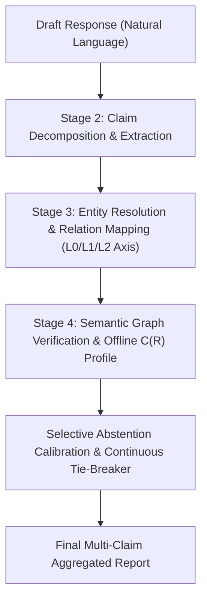

# Knowledge Graph Fact-Verification Pipeline: Detailed Technical Implementation Flow

This document provides a comprehensive technical breakdown of the **4-stage Post-Hoc Knowledge Graph Fact-Verification Pipeline**, revised architecture, linking condition axes (L0/L1/L2), and `KGAdapter` background completeness profiles.

---

## 1. High-Level Architecture

The framework is implemented in [verification_pipeline.py](file:///c:/Users/Admin/Desktop/crawler/verification_pipeline.py) and supported by dataset adapters in `adapters/` and offline completeness profiles in `data/completeness_profiles/`.



---

## 2. Linking Condition Reporting Axes (L0 / L1 / L2)

To isolate entity/relation linking performance from graph verification logic:

| Axis | Name | Description |
|:---|:---|:---|
| **L0** | Gold ID Injection | Injects ground-truth entity and relation identifiers directly into Stage 4. Serves as theoretical upper bound for C1 and C2. |
| **L1** | Bi-Encoder Retrieval | Uses `SentenceTransformer("all-MiniLM-L6-v2")` bi-encoder retrieval over title/alias dictionaries. Standard for C4 deployment. |
| **L2** | Heuristic Substring Match | Uses substring containment and token-overlap fuzzy matching. Ablation baseline. |

---

## 3. KGAdapter Interface & Offline Completeness Profiles

Each dataset interacts with the verification engine through a decoupled `KGAdapter`:

```python
class KGAdapter(Protocol):
    def link_entity(self, surface: str, context: Optional[dict] = None) -> Optional[str]: ...
    def map_relation(self, surface: str, subject: Optional[str] = None) -> Optional[str]: ...
    def completeness(self, relation_id: str) -> float: ...
```

### Decoupled Background Profiles
Completeness scores $C(R)$ are precomputed offline across global background graphs and serialized to `data/completeness_profiles/{dataset}.json`. This prevents completeness degeneration on tiny per-sample subgraphs ($|entities| \approx 2$).

Adapters implemented:
- `RMITAdapter` (`data/completeness_profiles/rmit.json`)
- `Catalog2Adapter` (`data/completeness_profiles/catalog2.json`)
- `FactKGAdapter` (`data/completeness_profiles/factkg.json`)
- `CoDExAdapter` (`data/completeness_profiles/codex.json`)
- `MetaQAAdapter` (`data/completeness_profiles/metaqa.json`)

---

## 4. Selective Prediction & Mass-Tie Resolution

To resolve the mass-tie problem at confidence $\approx 1.0$, Stage 4 incorporates a continuous NLI margin tie-breaker:

$$S_{\text{cal}} = 0.70 \cdot \text{base\_conf} + 0.20 \cdot \text{smooth\_entity} + 0.10 \cdot \text{smooth\_nli\_margin}$$

Adding this continuous covariate breaks ties deterministically among items with exact entity matches ($S=1.0$) and closed relations ($C(R)=1.0$), ensuring smooth risk-coverage curves without low-coverage score inversion.

---

## 5. Multi-Model Engine Execution Setup

The pipeline supports both cloud endpoints and local edge LLMs via `llm_client.py`:

1. **Azure OpenAI API (`azure-4.1-mini`)**:
   - Remote endpoint configured via `AZURE_OPENAI_ENDPOINT` and `AZURE_OPENAI_DEPLOYMENT_NAME`.
   - Uses `response_format={"type": "json_object"}` for structured JSON claim extraction.

2. **Local LM Studio (`google/gemma-4-e4b`)**:
   - Edge deployment hosted locally at `http://localhost:1234/v1` (`LOCAL_LLM_MODEL_NAME=google/gemma-4-e4b`).
   - Automatically bypasses `response_format` JSON schema parameters to prevent HTTP 400 Bad Request errors, relying on prompt instructions and fallback regex parsers.

