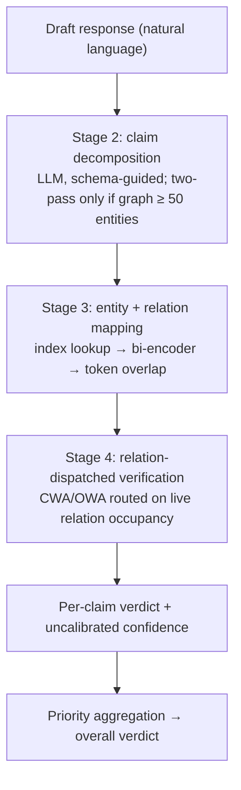

# Knowledge Graph Fact-Verification Pipeline: Implementation Reference

**Updated:** 2026-07-26 · **Scope:** the code as shipped, not the design intent.

This document describes what [`verification_pipeline.py`](file:///c:/Users/Admin/Desktop/crawler/verification_pipeline.py)
actually does. For the design as originally specified — including components that were designed but
not built — see [`design.md`](design.md) and [`system_explained_v3.md`](system_explained_v3.md),
both of which carry status banners marking the gap.

> [!IMPORTANT]
> Earlier revisions of this file described a `KGAdapter`-driven completeness interface, offline
> $C(R)$ profiles feeding Stage 4, and a continuous NLI-margin tie-breaker. **None of those are in
> the execution path.** They are corrected in [§6](#6-documented-but-not-implemented). Current
> empirical results: [`../benchmarks/rerun_20260726_paper.md`](../benchmarks/rerun_20260726_paper.md).

---

## 1. Execution path

```mermaid
graph TD
    A["Draft response (natural language)"] --> B["Stage 2: claim decomposition<br/>LLM, schema-guided; two-pass only if graph ≥ 50 entities"]
    B --> C["Stage 3: entity + relation mapping<br/>index lookup → bi-encoder → token overlap"]
    C --> D["Stage 4: relation-dispatched verification<br/>CWA/OWA routed on live relation occupancy"]
    D --> E["Per-claim verdict + uncalibrated confidence"]
    E --> F["Priority aggregation → overall verdict"]
```

Verdicts: `Supported`, `Contradicted`, `Not-in-KG`, plus the non-decision outcome `Out-of-scope`.
The harnesses add `Error` for a row the pipeline could not complete; since 2026-07-26 an `Error` row
is **unscored**, not assigned a default label.

---

## 2. Stage 3 — mapping

### 2.1 Subject linking and the rejection threshold

`link_entity` resolves a surface form in this order:

1. six-digit course-code regex (score 1.0);
2. normalized exact lookup in `entity_index` (score 1.0);
3. bi-encoder cosine over `all-MiniLM-L6-v2` embeddings of the entity label list;
4. token-overlap fallback.

Step 3 accepts a match only at or above **`entity_link_threshold`** (constructor parameter, default
`0.35`). Below it the surface form is reported unresolved, which routes to `Not-in-KG` rather than
linking the subject to its nearest neighbour.

> **Why the threshold is a parameter.** At the historical fixed 0.35, all 97 CoDEx subjects that are
> genuinely absent from the graph were linked to some wrong entity, so the pipeline never abstained
> on an unresolvable subject. The threshold is selected on a **held-out split**
> (`scripts/sweep_entity_threshold.py`); on CoDEx that selects **0.95**. The default stays 0.35 so
> the RMIT ontology path — whose subjects are six-digit codes short-circuited at step 1 — is
> unaffected.

When the threshold is above 0.35, the token-overlap fallback is skipped: it is strictly more
permissive than cosine similarity and would silently undo the rejection.

### 2.2 Object mapping — namespace discipline

**The object must be returned in the namespace the graph stores its *values* in.**

Entity records are keyed by id (a course code on RMIT, a Wikidata Q-id on CoDEx) while their field
values are surface labels — `data/codex_graph.json` holds 17,203 object values, all labels and zero
Q-ids. Substituting the resolved entity *key* for a claim's object therefore made Stage 4 compare an
id against a label and report a value mismatch for every true claim. Stage 3 now resolves the object
for its confidence signal and then **projects it back to the stored label** before returning.

Relations dispatched explicitly by Stage 4 (`requiresPrerequisite`, `hasCreditValue`,
`partOfSchool`, `taughtBy`, `offeredInTerm`) bypass object linking entirely — RMIT prerequisites are
course codes, so both sides of that comparison are already in id space.

### 2.3 Relation normalization

The open-domain relation fallback fires when the claim's relation is `unclassified`, empty, **or**
is neither an `ONTOLOGY_RELATIONS` member nor a field on the resolved subject's record. The last
condition matters because LLM decomposition emits surface phrasings (`is member of`) that do not
match the graph's field name (`member of political party`); without normalization Stage 4 falls
through to "Unrecognized relation class" and returns `Not-in-KG` for a fact the graph holds.

Matching is bi-encoder cosine over the subject record's actual relation keys (accept at ≥ 0.30),
then a substring/synonym heuristic. `ONTOLOGY_RELATIONS` exempts the institutional dispatch path.

*Known side-effect:* because the fallback now fires whenever a relation is absent from a record, it
can remap a relation that should have been reported missing, trading some `Not-in-KG` recall. Net
positive end-to-end; measured in the benchmark paper.

---

## 3. Stage 4 — verification and world-assumption routing

`get_world_assumption(relation)` returns `closed` or `open`:

| `routing_mode` | Behaviour |
| --- | --- |
| `dynamic` *(default)* | `closed` iff `KGStore.estimate_relation_occupancy(relation) ≥ cwa_threshold` (0.85) |
| `fixed_cwa` | always `closed` |
| `fixed_owa` | always `open` |

Under `closed`, an absent fact yields `Contradicted`; under `open`, `Not-in-KG`.

> [!WARNING]
> **`estimate_relation_occupancy` measures occupancy, not completeness.** It is the fraction of
> entity records in the *currently loaded* graph with that field populated. It carries no
> information about whether the graph covers the world. On a sparse graph a relation can look
> "closed" merely because the few records present happen to have the field. The method
> `estimate_relation_completeness` is retained only as a compatibility alias.

Dispatch is per relation class: `requiresPrerequisite` (with a two-hop path check and explicit
negation handling), `hasCreditValue`, `partOfSchool`, `taughtBy` (with a coordinator name/email
existence fallback), then a generic branch for any relation present on the record. The generic
branch normalizes both sides via `normalize_text` and handles list-valued fields. An unrecognized
relation returns `Not-in-KG`; an `unclassified` relation returns `Out-of-scope`.

---

## 4. Verdict aggregation

Claim verdicts combine by priority: `Contradicted` > `Not-in-KG` > `Out-of-scope` > `Supported`.

`withhold_unresolved_claims` (constructor, **default `False`**) optionally excludes claims whose
subject could not be linked from the vote, on the grounds that an unlinkable claim is not evidence.
Every claim record carries a `voted` flag. If *all* claims are unresolved the rule does not apply —
the subject genuinely is absent and `Not-in-KG` stands.

It ships **off**: a paired ablation measured +0.80 points on CoDEx (inside that cell's 7.2%
run-to-run flip rate) and no attributable effect on RMIT once slice variance is accounted for. It is
retained behind a flag for re-measurement after the coordinator-existence decomposition is fixed.

---

## 5. Confidence — uncalibrated by construction

`calculate_confidence` returns a **product**:

$$\text{conf} = \text{base\_conf} \times \text{entity\_score} \times \text{decomposition\_agreement}$$

where `base_conf` is 1.0 for `Supported`, relation occupancy for `Contradicted`, and
1 − occupancy for `Not-in-KG` (0.5 for unresolved-entity outcomes, 1.0 for `unclassified`).

With `smooth_calibration=True` (off by default) this is replaced by a weighted sum
`0.70·base_conf + 0.20·smooth_entity + 0.10·smooth_agreement`, where the third term is
**decomposition agreement** — not an NLI margin.

> [!CAUTION]
> There is **no fitted mapping from this score to empirical correctness**, and no calibration split
> is used anywhere. Every result row carries `confidence_calibrated: false`. Coverage and selective
> accuracy are descriptive statistics at the default operating point and must never be reported as
> risk guarantees. `abstention_controller.DualRiskController` correctly refuses to act on
> uncalibrated risk, so it always defers and is not exercised by any benchmark cell.

**Two measurement confounds to know about:**

* `verification_pipeline.py:230` short-circuits to a **single** decomposition pass when the loaded
  graph holds fewer than 50 entities, hardcoding `decomposition_agreement = 1.0`. FactKG builds a
  transient per-claim context whose size varies from 0 to 197 entities, so the regime switches
  **row by row within one dataset** (~91% single-pass). RMIT sits exactly on the boundary (50
  courses, strict `<`). Any cross-dataset comparison of confidence or agreement is confounded.
* `eval_rmit.py` sets `random.seed(42)`, which seeds only Python's `random` module. It does not
  constrain LLM sampling, and decomposition runs at temperature 0.1/0.2. Runs are **not**
  reproducible bitwise; measured prediction flip rate between identical reruns is 5.07% (max 10.0%).

---

## 6. Documented but not implemented

Kept explicit so the gap is not rediscovered.

| Previously documented | Reality |
| --- | --- |
| `KGAdapter` protocol with `completeness()` drives Stage 4 | `BaseKGAdapter` exists but **only `Catalog2Adapter` subclasses it**. `VerificationPipeline` never calls it. |
| Offline $C(R)$ profiles in `data/completeness_profiles/*.json` feed verification | **Dead code with respect to every result.** Routing computes occupancy live from the loaded graph. |
| `RMITAdapter`, `FactKGAdapter`, `CoDExAdapter`, `MetaQAAdapter` implement the adapter interface | They are plain data loaders (`load_data()`); none implements `link_entity` / `map_relation` / `completeness`. |
| Continuous **NLI margin** tie-breaker in Stage 4 | **No NLI model exists anywhere in the pipeline.** The only `nli_*` references are hardcoded constants or `np.random.uniform` draws inside registry-invalidated scripts. |
| L0 / L1 / L2 linking axes as a reporting dimension | Only `oracle_linking` (≈L0) is a live flag. L1/L2 are not separately selectable; the bi-encoder and token-overlap paths are sequential fallbacks inside `link_entity`. |
| SHACL / constraint-typed relation class | Not implemented. No constraint evaluation exists. |
| Temporal scoping by catalogue year | Not implemented. The graph carries no `validInYear` scoping. |
| Provenance links to source documents | Not implemented in the verification path; `evidence` is a rendered triple string. |

---

## 7. Multi-model execution

`llm_client.py` dispatches by provider:

1. **Azure OpenAI** (`azure-4.1-mini`, `azure-5-mini`) — endpoint and deployment from
   `AZURE_OPENAI_ENDPOINT` / `AZURE_OPENAI_DEPLOYMENT_NAME`; uses
   `response_format={"type": "json_object"}` for structured extraction. Reasoning deployments use
   `max_completion_tokens`.
2. **Local LM Studio** (`google/gemma-4-e4b`) — `http://localhost:1234/v1`. Skips `response_format`
   to avoid HTTP 400 from unconstrained local servers, relying on prompt instruction plus a regex
   fallback parser.

Engine stability differs materially: replicated CoDEx cells flip 0.2–1.0% of predictions under
`azure-4.1-mini` versus 7.2–10.0% under `gemma-4-e4b`.

---

## 8. Grounding gate

`scripts/run_kg_destruction_control.py` is the acceptance test for any change to Stages 3–4. It
shuffles object values within each relation — preserving entity set, relation keys, per-relation
value multiset, and type distribution while destroying the subject–value association — and fails
(non-zero exit) if fewer than `--min_change_rate` of predictions change.

Accuracy that does not move when the graph's factual content is destroyed is not verification.
Before the Stage-3 namespace repair this control sat at **1.8–2.8%**; it now reads **28.9%**.
