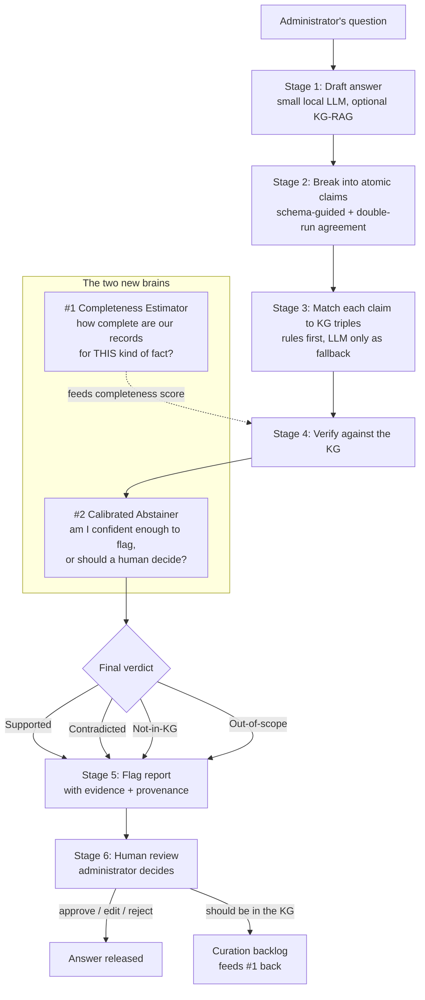

# The Complete System, Explained Simply (v3)

*A schema-guided, tri-state, claim-level verification framework for locally-run small LLMs — now with **estimated completeness** (recommendation #1) and **calibrated abstention** (recommendation #2) built in.*

---

## 1. The big picture, in one analogy

Imagine a **diligent fact-checking assistant** sitting next to a university administrator. The administrator asks a question ("What are the prerequisites for CS201 this year?"), a small AI drafts an answer, and the assistant's job is to **check that draft sentence by sentence against the university's official records** before anyone sends it out.

The assistant does four things a normal spell-checker can't:

1. It breaks the draft into small checkable facts ("claims").
2. It looks each claim up in a **well-organized filing cabinet** (the knowledge graph, or KG) built from official handbooks and regulations.
3. For each claim it returns **one of four honest verdicts** instead of just true/false.
4. It **knows the limits of its own filing cabinet** — and says so, instead of bluffing.

The whole thing runs **on the university's own computer**. No student data ever leaves the building.

The two new ideas make the assistant smarter about #3 and #4:

- **Estimated completeness (#1):** instead of a human hand-labelling every kind of fact as "our records are complete for this" vs "our records may have gaps here," the system **measures** how complete the filing cabinet is for each kind of fact, automatically.
- **Calibrated abstention (#2):** the assistant only shouts "this is wrong!" when it's **statistically confident enough** to keep false alarms below a rate you choose (say, 5%). When it isn't sure, it politely hands the claim to the human instead of guessing.

---

## 2. The four verdicts (the heart of the system)

Every claim gets exactly one label:

| Verdict | Plain meaning | When it fires |
|---|---|---|
| **Supported** ✅ | "The records back this up." | The fact is found in the KG and matches. |
| **Contradicted** ❌ | "The records say otherwise — likely a hallucination." | The KG has the answer, and the draft disagrees with it. |
| **Not-in-KG** ❔ | "We can't confirm this — it might be a real gap in our records." | The KG doesn't have it, *and* we're not sure our records are complete here. |
| **Out-of-scope** ⬜ | "This isn't the kind of thing our records can check at all." | The claim is a policy nuance or judgement call the KG was never meant to cover. |

The **entire point** of the project is that "we can't confirm this" (Not-in-KG) is treated as an *honest, useful outcome routed to a human* — not silently called "false." Most existing tools collapse everything into true/false and therefore produce confident wrong answers. This is the gap the design attacks.

---

## 3. The pipeline, stage by stage

**Stage 1 — Draft the answer.** A small open model (Qwen2.5-7B or Llama-3.1-8B — *not* Phi-3.5 for the structured stages, per the JSON-reliability finding) writes a first-draft answer. Two versions are kept as experiment conditions: **A1** = plain draft, **A2** = draft grounded in retrieved KG facts (KG-RAG). Comparing them shows whether verification still helps *even after* good retrieval.

**Stage 2 — Break the draft into atomic claims.** The draft is chopped into single checkable statements, but — unlike open-domain tools — the model is **told the exact menu of fact-types the university cares about** (prerequisite, credit value, term offered, fee, deadline, eligibility, …) and must output each claim as a typed record. Anything that fits no type is auto-labelled **Out-of-scope**. To survive small-model mistakes, extraction runs **twice** and a claim is kept only if both runs agree — otherwise it's demoted to human review. *(This is your existing double-run trick; you'll now report its stability as a measured number.)*

**Stage 3 — Match claims to the filing cabinet.** For structured facts (course codes, credits, dates), plain **rules and lookups** do the matching — no AI involved, so no hallucination possible. Fuzzy name matching links course/programme names to KG entries; anything below a confidence threshold becomes **Not-in-KG ("couldn't resolve")**. The AI is only used as a last resort for free-text claims, and even then it only *proposes* — the KG decides.

**Stage 4 — Verify (this is where #1 plugs in).** For each matched fact the engine looks in the KG. What it does when the fact is **absent** depends on a single number: **how complete are our records for this type of fact?**
- If completeness is **high** (we trust we have everything, e.g. prerequisites within a published catalogue year) → absent means **Contradicted**.
- If completeness is **low/uncertain** (e.g. who teaches a course) → absent means **Not-in-KG**.

Previously a human had to declare this per fact-type by hand. **Now the Completeness Estimator (#1) computes it** (see §4).

**Stage 5 — Assemble the flag report (this is where #2 finalizes verdicts).** Each claim becomes one row: the verdict, the highlighted text, the **supporting or contradicting evidence with a link back to the source document/clause**, a reason code, and a suggested action. Crucially, before a "Contradicted" is shown, the **Calibrated Abstainer (#2)** checks: *is my confidence above the threshold that keeps false alarms under the target rate?* If not, it downgrades to "needs human check" rather than risk a false accusation (see §5). The report **never auto-edits the draft** — correcting is the human's job.

**Stage 6 — Human review + feedback.** The administrator sees the draft colour-coded (green/red/amber/grey), and approves, edits, or rejects. When they mark a Not-in-KG flag as "this *should* be in our records," it goes to a **curation backlog** — which also feeds fresh signal back into the Completeness Estimator. This loop is what lets you measure "coverage vs curation cost" for real.

---

## 4. New brain #1 — the Completeness Estimator (in plain terms)

**The problem it fixes:** your original design says a data owner must hand-declare, for every relation, whether the KG is "complete" (closed-world) or "may have gaps" (open-world). Reviewers will say: *that hand-labelling is the whole trick, and it won't scale.* This turns that weakness into a method.

**The idea:** for each type of fact, **measure** how complete the records are, using signals the KG already contains:
- **Cardinality signals** — e.g. every course *must* have exactly one credit value, so if 99% of courses have one and this one doesn't, absence is suspicious (leans closed-world). Contrast: "teaching staff" varies wildly, so absence means little (leans open-world).
- **Source-coverage signals** — did we actually ingest the document that *would* contain this fact? If the prerequisite table for CS201's catalogue year was fully parsed, absence is meaningful. If we never loaded that page, absence is just a gap.
- **Local completeness (LCWA)** — if the KG already knows *some* prerequisites for CS201, it probably knows *all* of them → absence of a claimed extra one leans Contradicted.

**Where it comes from:** the KG-quality literature already has completeness-estimation tools (local closed-world assumption, partial-completeness / PCA-style estimators, cardinality checks). **Nobody has wired them into hallucination verdicts** — that connection is your novelty. The estimator outputs a **completeness score per relation** (0 = totally open, 1 = provably complete), and Stage 4 uses that score — not a hand-label — to choose between Contradicted and Not-in-KG.

**Bonus:** the Stage-6 curation backlog is literally a live log of "facts we were missing," which you can use to check and improve the estimator over time.

---

## 5. New brain #2 — the Calibrated Abstainer (in plain terms)

**The problem it fixes:** a *false* "Contradicted" flag is the worst thing the system can do — it tells an administrator a correct sentence is a hallucination, and destroys their trust in the tool. Your design already notes this asymmetry. So the system must be able to **control how often it false-alarms**.

**The idea:** treat every verdict as coming with a confidence, then use a small held-out calibration set to find the **confidence cut-off** that keeps false alarms under a target you choose. This is **conformal prediction / calibrated selective classification** — a standard, rigorous statistical technique, but new to this domain.

In practice:
- You pick a budget: "I'm willing to accept at most a **5% false-Contradicted rate**."
- The Abstainer only shows "Contradicted" when confidence clears the calibrated bar for that budget.
- Everything below the bar becomes **"needs human check"** (routed to Stage 6).
- The trade-off is reported as a **risk–coverage curve**: *the stricter you set the false-alarm budget, the more claims get sent to a human.* You show the administrator exactly where that dial sits.

**Why this is a contribution:** existing KG-verification papers report a single F1 and never give the reviewer any *guarantee* about false flags. A calibrated, tunable false-alarm rate is exactly what a real administrator (and a human-subjects study) needs — and it's a metric standard leaderboards can't express, which nicely justifies why you report differently.

---

## 6. A worked example (following one claim through)

> **Question:** "What does a student need before taking CS201 in 2026?"
> **Draft (small LLM):** *"CS201 requires CS101 and MA110, is worth 15 credits, and is taught by Dr. Lee."*

| Claim | Stage 3 match | Stage 4 + #1 completeness | #2 abstainer | Final verdict |
|---|---|---|---|---|
| CS201 requires CS101 | rule match, found | prerequisites ~complete (score 0.95); present | high confidence | **Supported** ✅ |
| CS201 requires MA110 | rule match, **absent** | prerequisites ~complete (0.95) → absence is meaningful → Contradicted | confidence clears 5% bar | **Contradicted** ❌ (evidence: the 2 real prereqs attached) |
| CS201 is worth 15 credits | rule match, KG says **12** | credit value is functional (exactly one) → mismatch | high confidence | **Contradicted** ❌ (counter-evidence: 12) |
| CS201 is taught by Dr. Lee | staff lookup, absent | staffing completeness low (~0.20) → absence not meaningful | — | **Not-in-KG** ❔ (routed to human) |

The administrator sees three green/red/amber flags with sources, fixes the two red ones in one click each, and confirms the teaching staff manually. Total draft repaired in seconds, with a full audit trail.

---

## 7. How you evaluate it (the analysis plan)

**Two tracks, one harness.** A single benchmark runner with pluggable "adapters" runs the *same* pipeline over public datasets (for comparability) and your custom admin dataset (for the domain claim).

**Public benchmarks — to prove the engine is competitive:**

| Dataset | What it checks | Compare against |
|---|---|---|
| **FactKG** | KG-based reasoning, 5 reasoning types | SOTA ~93.5%; ClaimPKG, GraphCheck, KG-GPT |
| **FEVER** | 3-way incl. "not enough info" → tests your Not-in-KG mapping | BEVERS ~80% |
| **RAGTruth** | span-level hallucination detection | RAG-HAT 83.9%, LettuceDetect (span 58.9%) |
| **HaluEval / FELM-WK** | broad sanity check | reported baselines |

*Honesty rule:* public sets are binary/3-class, so they can't fully test your four-verdict logic — report those cells as "structurally absent," not zero, and say so.

**Custom admin benchmark — your headline result:** authentic + seeded queries, atomic claims labelled with all four verdicts *plus* evidence pointers, dual-annotated with agreement reported (aim for κ ≥ 0.7). This is the only dataset where all four verdicts are natively gold-labelled.

**New metrics the two brains unlock (these are your differentiators):**
- **Risk–coverage curve** (from #2): false-flag rate vs how much gets auto-verified vs sent to human.
- **Calibration quality** (from #2): does a claimed 95% confidence actually mean 95% correct?
- **Completeness-estimator accuracy** (from #1): does the estimated completeness match reality (checked against the curation backlog)?
- **The key ablation:** turn #1 off (single hand-labelled or naive closed-world) and show the four-verdict split with #1 on produces **fewer false hallucination flags** than a RefChecker-style single "unverifiable" bucket. *This experiment is what proves your novelty is real.*
- Standard stuff: per-verdict precision/recall/F1, per-reasoning-type breakdown, per-stage error attribution (generator vs extractor vs mapper vs KG), and latency/RAM (the fully-local budget).

---

## 8. The contributions, restated (what changed)

**C1 — Methodological *(now much stronger)*.** A schema-guided, tri-state (+Out-of-scope) claim-level verification method for fully-local small LLMs, in which the third/fourth verdicts are produced by **(a) automatically estimated per-relation completeness** (#1) and **(b) calibrated abstention with a controllable false-flag rate** (#2). This is the piece that separates you from RefChecker (whose single "Neutral" bucket has no completeness reasoning and no calibration) — you turned a heuristic into a method with a guarantee.

**C2 — Design / ontological *(unchanged, still your safest win)*.** A verification-oriented administrative KG ontology with mandatory completeness declarations (now *learnable*, not just declared), temporal scoping by catalogue year, provenance, and an explicit machine-checkable-vs-human-only boundary. Best home: ISWC resource track or LREC-COLING.

**C3 — Resource *(unchanged, most citable)*.** The first administrative-domain hallucination benchmark with four-way gold labels and evidence pointers, plus the portable harness and annotation guidelines. No public dataset pairs LLM responses with a curated domain KG and tri-state labels.

**C4 — Empirical *(now with two new results)*.** (i) Whether KG post-hoc verification holds up when *every* component is a small quantized local model, with per-stage error attribution; (ii) **the risk–coverage and calibration results** (new — nobody reports these for KG verification); (iii) coverage-vs-curation-cost from a live backlog; (iv) a human study of claim-level flags vs global confidence vs no flags. C4(iv) is a natural second paper (CHI/CSCW/IUI).

**How #1 and #2 defend you in review:**
- *"Manual completeness doesn't scale"* → #1 estimates it.
- *"Your Contradicted/Not-in-KG split is heuristic"* → #1 grounds it in measured completeness; #2 makes flagging statistically controlled.
- *"How is this different from RefChecker / KGValidator?"* → the completeness-driven four-way verdict + calibrated false-flag budget; run the ablation in §7 to prove it.
- *"Weak baselines"* → you now benchmark against MiniCheck, LettuceDetect, RefChecker, SelfCheckGPT.

---

## 9. What to build first (minimal defensible path)

1. **Freeze C2 + C3** — the ontology spec and the four-verdict benchmark schema. Get inter-annotator agreement early; it's make-or-break for a resource paper.
2. **Build the harness** and get *any* number on RAGTruth + FactKG against real baselines. This tells you if the engine is competitive before you invest further.
3. **Add #1 (completeness estimator)** and run the key ablation (§7) — completeness-driven four-way vs single-bucket.
4. **Add #2 (calibrated abstainer)** and produce the risk–coverage curve.
5. **Then** the admin-domain headline run (C4-i/ii/iii). The human study (C4-iv) is a separate paper.

> **Minimal publishable unit:** C2 + C3 + a harness evaluation on 2–3 public datasets + the completeness ablation. That's a complete resource-and-method paper for Findings / LREC-COLING / ISWC. #2's calibration results and the human study each *strengthen* it or *become* the next paper — they aren't required for the first one.
