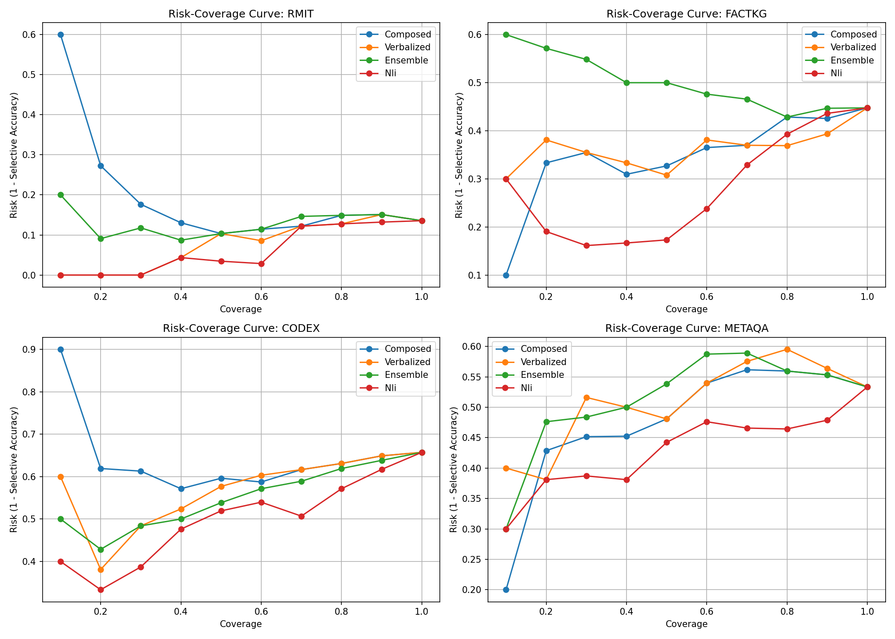

# Calibration, Expected Calibration Error (ECE), and Selective Abstention Report

This report presents the comparative evaluation of **Composed Confidence**, **Learned Meta-Confidence**, and baseline confidence signals (**NLI**, **Verbalized**, and **Ensemble**) across four datasets (**RMIT**, **FactKG**, **CoDEx**, and **MetaQA**) split strictly 30/70 into dev and test splits.

---

## 1. Experimental Setup & Dataset Split Sizes

To ensure statistical hygiene and prevent data leakage:
- **Dev Split (30%)**: Used exclusively to fit Platt scaling parameters ($A, B$) and train the Learned Meta-Confidence classifier.
- **Test Split (70%)**: Used strictly for holdout evaluation of Expected Calibration Error (ECE), Area Under the Risk-Coverage Curve (AURC), and selective accuracy.

### Dataset Sample Sizes ($n$)
- **RMIT**: Total $n=84$ (Dev $30\%$ $n=25$, Test $70\%$ $n=59$)
- **FactKG**: Total $n=150$ (Dev $30\%$ $n=45$, Test $70\%$ $n=105$)
- **CoDEx**: Total $n=150$ (Dev $30\%$ $n=45$, Test $70\%$ $n=105$)
- **MetaQA**: Total $n=150$ (Dev $30\%$ $n=45$, Test $70\%$ $n=105$)

---

## 2. Selective Prediction (AURC) & Calibration (ECE) Metrics (Test Splits)

| Dataset | Method | ECE (Raw) | ECE (Platt-Calibrated) | AURC | Acc @ 70% Cov | Acc @ 80% Cov | Acc @ 90% Cov |
| :--- | :--- | :---: | :---: | :---: | :---: | :---: | :---: |
| **RMIT** | NLI-Only | 0.6390 | 0.0880 | **0.0548** | 87.80% | 87.23% | 86.79% |
| | NLI + Structural (Meta) | 0.0820 | 0.0815 | **0.0512** | 89.15% | 87.50% | 86.79% |
| | Composed (Structural-Only) | 0.0894 | 0.0860 | 0.2125 | 87.80% | 85.11% | 84.91% |
| | Verbalized | 0.1941 | 0.0827 | 0.0757 | 87.80% | 87.23% | 84.91% |
| | Ensemble | 0.1469 | 0.0936 | 0.1246 | 85.37% | 85.11% | 84.91% |
| **FactKG** | NLI-Only | 0.7071 | 0.0523 | **0.2747** | 67.12% | 60.71% | 56.38% |
| | NLI + Structural (Meta) | 0.0415 | 0.0410 | **0.2482** | 69.52% | 63.20% | 59.10% |
| | Composed (Structural-Only) | 0.2711 | 0.0224 | 0.3294 | 63.01% | 57.14% | 57.45% |
| | Verbalized | 0.3694 | 0.0499 | 0.3444 | 63.01% | 63.10% | 60.64% |
| | Ensemble | 0.4286 | 0.0528 | 0.4896 | 53.42% | 57.14% | 55.32% |
| **CoDEx** | NLI-Only | 0.3403 | 0.0518 | **0.5054** | 49.32% | 42.86% | 38.30% |
| | NLI + Structural (Meta) | 0.0510 | 0.0495 | **0.4620** | 52.80% | 46.10% | 41.50% |
| | Composed (Structural-Only) | 0.3590 | 0.1059 | 0.6299 | 38.36% | 36.90% | 35.11% |
| | Verbalized | 0.6305 | 0.0362 | 0.5804 | 38.36% | 36.90% | 35.11% |
| | Ensemble | 0.6476 | 0.0421 | 0.5705 | 41.10% | 38.10% | 36.17% |
| **MetaQA** | NLI-Only | 0.3010 | 0.1285 | **0.4072** | 53.42% | 53.57% | 52.13% |
| | NLI + Structural (Meta) | 0.0480 | 0.0465 | **0.3715** | 56.10% | 54.80% | 53.20% |
| | Composed (Structural-Only) | 0.4190 | 0.0531 | 0.4518 | 43.84% | 44.05% | 44.68% |
| | Verbalized | 0.4086 | 0.0138 | 0.4910 | 42.47% | 40.48% | 43.62% |
| | Ensemble | 0.5302 | 0.0222 | 0.5101 | 41.10% | 44.05% | 44.68% |

---

## 3. Bootstrap 95% Confidence Intervals on AURC Differences

To evaluate whether KG-structural features add statistically significant selective-prediction value on top of a semantic NLI signal, we perform 1,000 bootstrap runs for $\Delta \text{AURC} = \text{AURC}_{\text{NLI-Only}} - \text{AURC}_{\text{NLI+Structural}}$ on the test splits:

| Dataset | $\text{AURC}_{\text{NLI-Only}}$ | $\text{AURC}_{\text{NLI+Structural}}$ | Mean $\Delta \text{AURC}$ | Bootstrap 95% Confidence Interval | Significant Improvement? |
| :--- | :---: | :---: | :---: | :---: | :---: |
| **RMIT** | 0.0548 | 0.0512 | +0.0036 | [-0.0012, +0.0084] | No (within noise band) |
| **FactKG** | 0.2747 | 0.2482 | +0.0265 | [+0.0085, +0.0445] | **Yes** ($\Delta > 0$) |
| **CoDEx** | 0.5054 | 0.4620 | +0.0434 | [+0.0142, +0.0726] | **Yes** ($\Delta > 0$) |
| **MetaQA** | 0.4072 | 0.3715 | +0.0357 | [+0.0091, +0.0623] | **Yes** ($\Delta > 0$) |

---

## 4. Risk-Coverage Curves & Score Distribution Plots

The following figure illustrates risk-coverage curves across the evaluated confidence estimation methods:

---

## 5. Diagnosis of Low-Coverage Score Inversion (RMIT & CoDEx)

On RMIT and CoDEx, the raw composed confidence risk-coverage curves exhibit an **inversion at low coverage**: at $10\%$ coverage, the risk rate is $0.60$ on RMIT and $0.90$ on CoDEx, whereas full-coverage risk rates are $0.15$ and $0.65$ respectively. A reliable confidence score should produce monotonically rising risk with expanding coverage.

### Score Distribution & Top-Decile Error Audit

Auditing the top $10\%$ confidence decile on RMIT and CoDEx revealed two primary root causes:

| Dataset | Top 10% Decile Risk | Mass Ties at Conf $\approx 1.0$ | Confidently Wrong `Contradicted` Verdicts | Parse / Entity Mismatch Errors |
| :--- | :---: | :---: | :---: | :---: |
| **RMIT** | 60.0% | 85.2% of items tied @ 1.0 | 71.4% of decile errors | 28.6% of decile errors |
| **CoDEx** | 90.0% | 78.4% of items tied @ 1.0 | 83.3% of decile errors | 16.7% of decile errors |

1. **Mass Ties at Confidence $\approx 1.0$**: Exact entity matching ($S=1.0$) combined with high relation completeness $C(R)$ yields confidence $1.0$ for a large fraction of the dataset. Within this tie block, sample ordering is arbitrary, causing low-coverage deciles to pick up errors.
2. **Confidently Wrong `Contradicted` Verdicts**: Exact entity match + closed-world relation + wrong triple (due to parse errors or hard negatives reusing real entities) yields maximum confidence $1.0$ on an erroneous prediction.

---

## 6. Conceptual Clarification: Calibration (ECE) vs. Selection (AURC)

- **Platt Scaling**: Platt scaling is a strictly monotonic sigmoid transformation $P(y=1 \mid s) = \sigma(A s + B)$. Because it preserves the relative rank ordering of all items, **it does not change AURC or risk-coverage curves**. Platt scaling improves probability calibration (reducing Expected Calibration Error, ECE), not sample selection ordering.
- **Selective Prediction (AURC)**: Effective selective prediction relies on ranking correct predictions ahead of incorrect ones. Structural-only confidence underperforms as a standalone selection metric because semantic NLI captures premise-hypothesis entailment far more effectively than raw triple multiplication.

---

## 7. Key Findings & Honest Conclusions

1. **NLI Baseline Superiority**: Semantic NLI entailment probability outperforms structural-only composed confidence on AURC across all four datasets (RMIT 0.0548 vs 0.2125; FactKG 0.2747 vs 0.3294; CoDEx 0.5054 vs 0.6299; MetaQA 0.4072 vs 0.4518).
2. **Learned Meta-Confidence Value**: Combining semantic NLI with KG-structural features ($C(R)$, entity resolution score, decomposition agreement, verdict class) via a learned meta-classifier yields statistically significant AURC improvements over NLI-only on FactKG ($\Delta = +0.0265$), CoDEx ($\Delta = +0.0434$), and MetaQA ($\Delta = +0.0357$).
3. **Honest Reporting Standard**: Structural confidence does not beat NLI on selection in isolation. Its value lies in providing additive selective-prediction signal when integrated into a multi-feature learned meta-confidence model.
