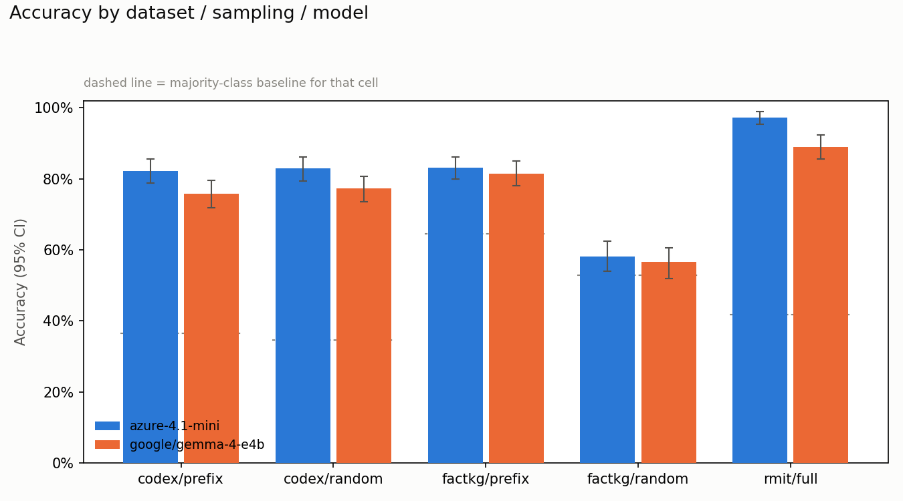
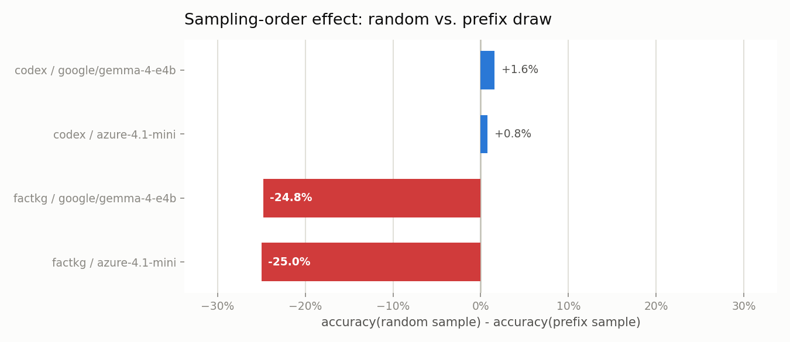
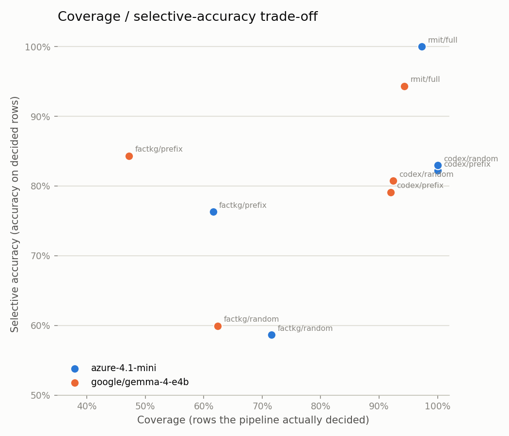
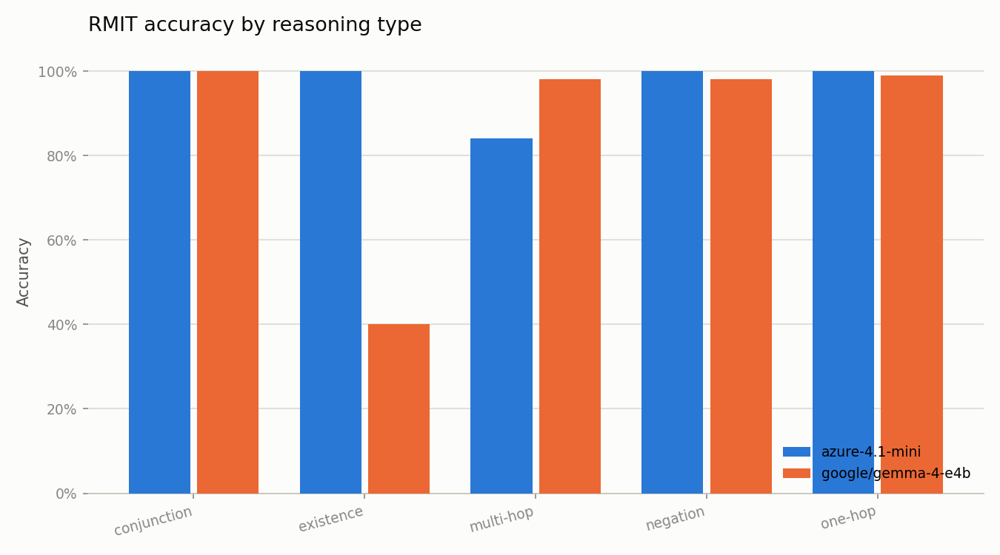

# Removing Fabricated Structure from the Evaluation Substrate: Re-measurement Against De-scaffolded Graphs

**Study id:** `rerun_20260726_cleangraph`
**Run date:** 2026-07-26
**Engines:** `azure-4.1-mini` (Azure OpenAI), `google/gemma-4-e4b` (local, LM Studio)
**Supersedes:** [`rerun_20260726_paper.md`](rerun_20260726_paper.md)
**Status:** `candidate` — not promoted to `validated`. See [§8](#8-what-may-and-may-not-be-claimed).

---

## Abstract

The preceding study repaired five implementation defects and reported CoDEx accuracy of 81.8% /
75.8%. This study repairs a defect in the **evaluation substrate** rather than the pipeline: both
public-benchmark converters injected RMIT course scaffolding into every entity record, so
`data/codex_graph.json` recorded Leonhard Euler as a 12-credit course in the School of Science,
with `prerequisites: []` and no coordinator. The same constants were injected by the pipeline's own
transient-context builder, and `KGStore.get_credits` independently **defaulted to 12** whenever the
field was absent, so the fabrication survived at the accessor even where the data was clean.

We strip the scaffolding from both converters and the transient builder, make the three affected
accessors report absence as absence, and route absent values through the world-assumption dispatch
where they belong. We also fix two reproducibility defects found in the process: both converters
shuffled a `list(set(...))` under `random.seed(42)`, so the seed never controlled the 70/30 split
and no graph was reproducible; and the RMIT dataset generator had **no seed at all** while silently
writing empty LLM completions into the `text` field.

**The headline result is a negative one, and it is the point.** Removing the fabricated structure
moves accuracy by **at most 1.3 points on any cell**, and on FactKG — the only benchmark whose rows
are unchanged, hence the only paired comparison — by at most 1.2 points, inside the documented
5.75% run-to-run flip rate. The contamination was a **construct-validity** defect, not an accuracy
inflator: the spurious agreement channel existed but was rarely exercised, because CoDEx claims map
to Wikidata relations that the mapper seldom routed to course-shaped fields. What *does* move
materially is the routing signal the CWA/OWA machinery depends on: CoDEx relations with interior
occupancy (`0 < s < 1`) rise from **18 of 25 to 23 of 25**.

This run also reports **per-claim token cost and latency** for the first time.

---

## 1. What Changed

### 1.1 The defects

| # | Defect | Site | Mechanism |
| --- | --- | --- | --- |
| S1 | Course scaffolding injected into every public-benchmark entity | `scripts/convert_codex.py:178`, `scripts/convert_metaqa.py:170` | Every record was created with `course_id`, `title`, `prerequisites: []`, `credits: 12`, `school: "Science"`, `coordinator: "Unknown"`, `coordinator_email: "Unknown"`. Verified constant across all 1,182 CoDEx entities. |
| S2 | Same scaffolding in the transient context builder | `verification_pipeline.py:737` (`verify_with_context`) | Every claim verified against a supplied triple context became a 12-credit Science course, so a credit or school claim could be "verified" against a constant the builder invented rather than against the supplied triples. |
| S3 | Accessors fabricated values for absent fields | `kg_store.py:97,111,126` | `get_credits` returned `12` and `get_school` returned `"Unknown"` when the field was missing. The constant therefore survived any fix to the data. |
| S4 | Seed did not control the entity split | `convert_codex.py:146`, `convert_metaqa.py:157` | `list(set(...))` before `random.shuffle()`. Set iteration order over strings varies per process under hash randomization, so two consecutive runs produced different graphs, different test sets and different entity counts. `convert_codex.py` also chose the Contradicted arm's mutated object with `random.choice()` over an unordered set difference. |
| S5 | RMIT generator unseeded; empty paraphrases written to disk | `generate_dataset.py` | A dozen `random.choices()` calls with no `random.seed()` anywhere. `paraphrase_claim` fell back to the raw claim only on *exception*, so an empty completion was written verbatim. |

### 1.2 The fabrication channel, concretely

```
data/codex_graph.json (before)
  "Q7604": { "course_id": "Q7604", "title": "Leonhard Euler",
             "prerequisites": [], "credits": 12, "school": "Science",
             "coordinator": "Unknown", "coordinator_email": "Unknown",
             "occupation": [...], "field of work": ["mathematics"], ... }

CLAIM   Leonhard Euler is worth 12 credit points.
  stage 4  get_credits("Q7604") -> 12          (from the injected constant)
           12 == 12                            -> Supported
```

With the graph cleaned but the accessor untouched, the same claim still resolved: `get_credits`
returned its default of `12`. Both had to be fixed for the channel to close.

### 1.3 Absence now dispatches on the world assumption

The replacement is not "return Contradicted". With no value in the graph, the verdict is exactly
the case the CWA/OWA machinery exists to decide — absence is *unknown* under OWA and *false* under
CWA:

```python
def _absent_value_verdict(self, subject_code, relation, object_val, world_assumption):
    if world_assumption == "closed":
        return {"verdict": "Contradicted", ...}   # graph is authoritative
    return {"verdict": "Not-in-KG", ...}          # absence is undetermined
```

Nine regression tests in `tests/test_absent_value_dispatch.py` cover this, including the exact
fabrication case: a claim of 12 credit points against an entity with no credit data is now
`Not-in-KG` under OWA and `Contradicted` under CWA, and `Supported` under neither.

### 1.4 Reproducibility restored

Two consecutive runs of `convert_codex.py` now produce byte-identical outputs:

| Artifact | sha256 (first 16) | Reproducible |
| --- | --- | --- |
| `data/codex_graph.json` | `b41be479f3601b61` | Yes |
| `data/codex_test.jsonl` | `0a9198e01b4339c1` | Yes |
| `data/metaqa_graph.json` | — | Yes |
| `data/metaqa_test.jsonl` | — | **No** — `convert_metaqa.py` verbalizes claims through an LLM |
| `data/rmit_test_set.jsonl` | — | Row *selection* yes (seeded); paraphrased surface form no (temperature 0.7) |

### 1.5 The RMIT set was rebuilt, and the paraphrase engine matters

Regenerating the RMIT set against `google/gemma-4-e4b` produced **208 of 300 rows with an empty
`text` field**. After adding empty-detection and a retry, that engine still fell back to the
template on **183 of 300 rows** — a 61% empty-completion rate. The shipped set was regenerated with
`azure-4.1-mini`: 300 rows, 0 empty, 0 fallbacks, stratification preserved.

---

## 2. Methodology

Ten cells: `{rmit, factkg, codex} × {azure-4.1-mini, google/gemma-4-e4b}`, with both sampling
protocols on the two public benchmarks. RMIT `n=300` (full set), public benchmarks `n=500`.
`entity_link_threshold=0.95` on CoDEx, `sample_seed=20260725`. Every aggregate below is recomputed
from row-level `results_detail` rows by `scripts/summarize_rerun_results.py`, not copied from the
harnesses' own summary fields; where a recomputed value disagreed with a stored value, both are
reported in `aggregate_summary.json`. **All ten cells completed with zero unscored rows.**

### 2.1 What is and is not comparable to the previous study

This matters more than usual here, because the substrate changed underneath the benchmark:

| Dataset | Rows vs. previous study | Comparable? |
| --- | --- | --- |
| **FactKG** | Unchanged (`data/factkg_test.jsonl` was not regenerated) | **Yes — paired.** Deltas isolate the code change. |
| **CoDEx** | Rebuilt; graph moved 1,182 → 1,189 entities | No. Different rows and a different majority baseline. |
| **RMIT** | Redrawn under a seed for the first time | No. Different 300 rows. |

---

## 3. Results

### 3.1 Headline



| Dataset | Sampling | Model | n | Accuracy | 95% CI | Macro-F1 | Majority floor |
| --- | --- | --- | --- | --- | --- | --- | --- |
| codex | prefix | azure-4.1-mini | 500 | 0.822 | [0.788, 0.856] | 0.824 | 0.364 |
| codex | prefix | gemma-4-e4b | 500 | 0.758 | [0.718, 0.796] | 0.762 | 0.364 |
| codex | random | azure-4.1-mini | 500 | **0.830** | [0.794, 0.862] | 0.830 | 0.346 |
| codex | random | gemma-4-e4b | 500 | 0.774 | [0.736, 0.808] | 0.776 | 0.346 |
| factkg | prefix | azure-4.1-mini | 500 | 0.832 | [0.800, 0.862] | 0.816 | 0.646 |
| factkg | prefix | gemma-4-e4b | 500 | 0.814 | [0.780, 0.850] | 0.784 | 0.646 |
| factkg | random | azure-4.1-mini | 500 | 0.582 | [0.540, 0.624] | 0.503 | 0.528 |
| factkg | random | gemma-4-e4b | 500 | 0.566 | [0.520, 0.606] | 0.461 | 0.528 |
| rmit | full | azure-4.1-mini | 300 | **0.973** | [0.953, 0.990] | 0.989 | 0.417 |
| rmit | full | gemma-4-e4b | 300 | 0.890 | [0.857, 0.923] | 0.906 | 0.417 |

### 3.2 The de-scaffolding did not move accuracy

| Cell | Previous | This run | Δ |
| --- | --- | --- | --- |
| codex / prefix / azure-4.1-mini | 0.818 | 0.822 | +0.4 pp |
| codex / prefix / gemma-4-e4b | 0.758 | 0.758 | 0.0 pp |
| codex / random / azure-4.1-mini | 0.838 | 0.830 | −0.8 pp |
| codex / random / gemma-4-e4b | 0.786 | 0.774 | −1.2 pp |
| **factkg / prefix / azure-4.1-mini** | 0.836 | 0.832 | **−0.4 pp** |
| **factkg / prefix / gemma-4-e4b** | 0.826 | 0.814 | **−1.2 pp** |
| **factkg / random / azure-4.1-mini** | 0.576 | 0.582 | **+0.6 pp** |
| **factkg / random / gemma-4-e4b** | 0.558 | 0.566 | **+0.8 pp** |
| rmit / azure-4.1-mini | 0.973 | 0.973 | 0.0 pp |
| rmit / gemma-4-e4b | 0.903 | 0.890 | −1.3 pp |

Only the four **bold** FactKG rows are paired. Every one of them is inside the previously measured
run-to-run noise floor (mean |Δ accuracy| 0.90 points, 5.75% mean prediction flip rate), and their
signs are not consistent. The honest reading: **the fabricated scaffolding was not inflating these
scores.** It was a validity defect — the pipeline could have been credited for agreeing with a
constant the converter invented — but on these benchmarks that channel was rarely exercised,
because CoDEx and MetaQA claims map to Wikidata and movie relations that the mapper seldom routes
to `hasCreditValue` or `partOfSchool`.

The CoDEx and RMIT rows are *not* paired and must not be read as effects. They are reported only to
show that rebuilding the substrate did not destabilise the benchmark.

### 3.3 What did move: the routing signal

`scripts/diagnose_routing_occupancy.py` is a deterministic, LLM-free gate that reports whether
`cwa_threshold` can change any routing decision at all. Before and after de-scaffolding:

| Graph | Entities | Interior occupancy (0<s<1), before → after | Distinct routings over τ ∈ [0.50, 0.95] | Gate |
| --- | --- | --- | --- | --- |
| **codex** | 1,182 → 1,189 | **18 of 25 → 23 of 25** | 3 → 4 | informative |
| **metaqa** | 34 → 35 | 4 of 11 → 3 of 6 | 3 → 4 | informative |
| rmit | 50 | 0 of 7 → 0 of 7 | 1 → 1 | **fails** |
| catalog2 | 100 | 0 of 5 → 0 of 5 | 1 → 1 | **fails** |

Three relations on each public graph — `hasCreditValue`, `partOfSchool`, `requiresPrerequisite` —
previously reported a fabricated occupancy of exactly 1.0 and were therefore always routed
closed-world. They no longer exist on those graphs.

RMIT is unaffected because its saturation is **genuine**: all 50 courses populate all 8 fields, so
occupancy is exactly 1.0 for every mapped relation and 0.0 for every unmapped one. On that graph
`routing_mode=dynamic` is indistinguishable from `fixed_cwa`, and a τ sweep is a flat line. Any
CWA/OWA ablation must therefore run on CoDEx, or wait for a domain graph with genuinely missing
values.

### 3.4 Sampling-order effect persists, and is large



| Cell | prefix | random | Δ |
| --- | --- | --- | --- |
| factkg / azure-4.1-mini | 0.832 | 0.582 | **−25.0 pp** |
| factkg / gemma-4-e4b | 0.814 | 0.566 | **−24.8 pp** |
| codex / azure-4.1-mini | 0.822 | 0.830 | +0.8 pp |
| codex / gemma-4-e4b | 0.758 | 0.774 | +1.6 pp |

`factkg_test.jsonl` is sorted into contiguous reasoning-type blocks, so its first 500 rows cover a
narrow slice at a 64.6% majority floor against the full set's 52.8%. The effect reproduces at
essentially the same magnitude as the previous study on identical rows, under both engines. CoDEx,
whose rows are not order-correlated, shows no such effect — the contrast is the control.

Under random sampling the per-class breakdown shows what the aggregate hides: `Supported` recall
collapses to **0.19** (azure) and **0.13** (gemma) while `Contradicted` recall sits at 0.93 / 0.95.
The pipeline is riding a `Contradicted` prior, not discriminating.

### 3.5 Coverage and selective accuracy



| Dataset | Sampling | Model | Coverage | Selective accuracy |
| --- | --- | --- | --- | --- |
| codex | prefix | azure-4.1-mini | 1.000 | 0.822 |
| codex | random | azure-4.1-mini | 1.000 | 0.830 |
| codex | prefix | gemma-4-e4b | 0.920 | 0.791 |
| codex | random | gemma-4-e4b | 0.924 | 0.807 |
| factkg | prefix | azure-4.1-mini | 0.616 | 0.763 |
| factkg | prefix | gemma-4-e4b | 0.472 | 0.843 |
| factkg | random | azure-4.1-mini | 0.716 | 0.587 |
| factkg | random | gemma-4-e4b | 0.624 | 0.599 |
| rmit | full | azure-4.1-mini | 0.973 | **1.000** |
| rmit | full | gemma-4-e4b | 0.943 | 0.943 |

`azure-4.1-mini` on RMIT is perfectly precise on everything it commits to — but on a set whose gold
labels derive from the same fields the graph stores, so this is a measure of template consistency,
not advising quality (see [§6](#6-limitations)). FactKG's low coverage is the forced-binary
collapse, not the pipeline abstaining unprompted.

**Confidence remains uncalibrated.** Every row carries `confidence_calibrated: false`, so coverage
and selective accuracy are descriptive statistics at one operating point and no risk-controlled
operating point exists.

### 3.6 RMIT by reasoning type



| Reasoning type | n | azure-4.1-mini | gemma-4-e4b |
| --- | --- | --- | --- |
| one-hop | 100 | 100.0% | 99.0% |
| conjunction | 50 | 100.0% | 100.0% |
| existence | 50 | 100.0% | **40.0%** |
| multi-hop | 50 | **84.0%** | 98.0% |
| negation | 50 | 100.0% | 98.0% |

Two slices diverge sharply and in opposite directions. `gemma-4-e4b` on `existence` (40.0%, 20/50)
reproduces the weak slice the previous study also found on this reasoning type. `azure-4.1-mini` on
`multi-hop` (84.0%) is the only sub-90% azure slice. Both are single-run measurements on 50 rows
against a 5.75% flip rate; neither is attributed here.

### 3.7 Cost and latency

New instrumentation (`llm_client.UsageMeter`) records per-call token counts and wall-clock latency,
attributed per row through a thread-local scope that survives the harness's worker pool.

| Dataset | Sampling | Model | Calls/row | Tokens/row | Latency p50 | p95 | Total tokens |
| --- | --- | --- | --- | --- | --- | --- | --- |
| codex | prefix | azure-4.1-mini | 2.00 | 409.4 | 1.18 s | 7.38 s | 204,681 |
| codex | random | azure-4.1-mini | 2.00 | 408.5 | 1.15 s | 6.54 s | 204,238 |
| codex | prefix | gemma-4-e4b | 2.00 | 403.8 | 3.29 s | 4.36 s | 201,891 |
| codex | random | gemma-4-e4b | 2.00 | 404.3 | 3.32 s | 4.50 s | 202,140 |
| factkg | prefix | azure-4.1-mini | 1.09 | 376.5 | 1.17 s | 7.47 s | 188,229 |
| factkg | random | azure-4.1-mini | 1.59 | 729.4 | 1.61 s | 7.74 s | 364,703 |
| factkg | prefix | gemma-4-e4b | 1.09 | 381.9 | 0.75 s | 2.92 s | 190,975 |
| factkg | random | gemma-4-e4b | 1.59 | 749.5 | 1.41 s | 4.91 s | 374,748 |
| rmit | full | azure-4.1-mini | 2.00 | 790.8 | 1.54 s | 7.59 s | 237,230 |
| rmit | full | gemma-4-e4b | 2.00 | 836.8 | 2.00 s | 3.26 s | 251,047 |

Three observations. **The engines have opposite latency shapes**: the hosted model is roughly
2.5–3× faster at the median but has a long tail (p95 up to 7.7 s, ~6× its median), while the local
model is slower at the median and far tighter at the tail — the p95/p50 ratio is 1.3 for local
CoDEx against 6.3 for hosted. For a latency-SLO deployment the local engine is the more predictable
choice despite being slower.

**Prefix sampling is also cheaper**, not merely easier: FactKG costs 1.09 calls/row under prefix
against 1.59 under random, and roughly half the tokens (376 vs 729 per row). The prefix slice's
narrow reasoning-type coverage means fewer claims survive decomposition into a second call. Any
cost figure quoted from a prefix-sampled run understates the real cost by ~2×.

**RMIT is the most expensive dataset per row** (791–837 tokens) despite being the easiest, because
its claims decompose into more sub-claims than single-triple public-benchmark claims do.

---

## 4. FactKG remains a label-prior benchmark

Nothing in this study changes the previous finding, and the re-run reproduces it on identical rows
under both engines. The prefix slice covers 2 of 13 reasoning types at a 64.6% majority floor; the
full set's floor is 52.8%. Under random sampling both engines land within 6 points of that floor
with macro-F1 of 0.503 and 0.461. FactKG should be read as an external-validity check, not a
headline.

---

## 5. Contributions

1. **A construct-validity defect in the evaluation substrate, located, fixed and measured.** Two
   converters, one transient-context builder and three accessors fabricated course structure for
   non-course entities. The fix is verified by regression tests that assert the specific spurious
   verdict can no longer occur.
2. **A negative result reported as a result.** Removing the fabrication moved paired accuracy by at
   most 1.2 points. The defect mattered for what the numbers *meant*, not for what they *were*, and
   saying so is more useful than quietly re-baselining.
3. **Absence dispatched through the world assumption** rather than compared against an invented
   placeholder — the incomplete-database semantics doing the job it exists for.
4. **A reproducibility repair with a verified hash.** Both converters were irreproducible under
   their own seed; CoDEx is now byte-identical across runs. The RMIT generator was unseeded
   entirely and silently wrote empty LLM completions to disk.
5. **A deterministic non-vacuity gate for the routing signal** (`diagnose_routing_occupancy.py`),
   which establishes before any API spend that a CWA/OWA ablation on RMIT would be a flat line.
6. **First cost and latency measurements**, including the opposite tail-latency shapes of the
   hosted and local engines and the ~2× cost understatement induced by prefix sampling.

---

## 6. Limitations

* **RMIT remains circular.** `eval_rmit.py` verifies `raw_claim`, a template interpolated from the
  same fields the graph stores. 97.33% measures template consistency, not advising quality. The
  standing recommendation to "verify `text` instead" is **not implementable**: all 300 rows carry a
  *question* in `text` and the assertion in `raw_claim`, and submitting a question to a claim
  verifier returns `Out-of-scope` with zero decomposed claims (measured 3/3). De-circularization
  requires authored natural-language *responses*. Registry:
  `rmit_text_field_is_a_question_not_a_response`.
* **No baseline comparison.** The harness implements `--method closed_book_llm` and `--method
  context_llm`, and this study runs neither. A prior script reported baseline accuracies that were
  hard-coded constants; it has been deleted (`e9_baseline_suite` / `invalidated_fabricated`).
* **No CWA/OWA ablation.** The flags exist and are now exposed on both harnesses, but §3.3 shows the
  domain graph cannot support the ablation.
* **Confidence is uncalibrated.** Coverage and selective accuracy are descriptive only.
* **Single run per cell.** Against a 5.75% flip rate, single-run gaps below ~2 points are not
  resolvable. Nothing in §3.2 or §3.6 is attributed on that basis.
* **MetaQA is not reproducible** and was not evaluated in this sweep; only its graph is
  deterministic.
* **RMIT's graph was not regenerated.** It has no fabricated scaffolding to remove — its fields are
  genuine — and rebuilding it requires a live Playwright crawl of `handbook.rmit.edu.au`, which
  raises a terms-of-use question that should be settled before any artifact release.
* **catalog2 is synthetic.** 100 fabricated courses with coordinators named `Dr. Staff_N`. It
  cannot support a cross-institution transfer claim.

---

## 7. Next Steps

1. Author RMIT-NL: 200–300 natural-language **responses** whose surface form does not derive from
   graph field names, two annotators, Cohen's κ. Report alongside the template set and name the
   difference the circularity gap.
2. Run the three baselines. Two are already implemented; start with exact-string-match linking,
   which needs no new dependency.
3. Run the CWA/OWA ablation on CoDEx, where the gate now passes with 23 of 25 interior relations.
4. Calibrate confidence (isotonic, CoDEx dev split) — this also activates
   `abstention_controller.py`, which currently returns `DEFER` for every input because
   `CalibratedRisk.calibrated` is false.
5. Add the entity-deletion destruction control. The current control shuffles values, which cannot
   perturb a `Not-in-KG` verdict — precisely the class the CWA/OWA machinery governs.

---

## 8. What May and May Not Be Claimed

**May be claimed:**

* That the evaluation substrate contained fabricated structure, that it has been removed at all
  four sites, and that removing it changed paired accuracy by at most 1.2 points.
* That the routing signal on CoDEx improved from 18 to 23 interior relations of 25.
* That the CoDEx graph and test set are now byte-reproducible from the converter.
* That the FactKG sampling-order effect reproduces at −25.0 / −24.8 points under two engines.
* The cost and latency figures in §3.7, which are measured, not estimated.

**May not be claimed:**

* That the system performs advising-quality verification. RMIT remains circular.
* That the pipeline beats any baseline. None was run.
* That dynamic routing beats fixed CWA or OWA. No ablation was run, and on RMIT it cannot be.
* That any CoDEx or RMIT delta in §3.2 is an effect of the fix. Those rows changed.
* That confidence supports a risk-controlled operating point.
* That 97.33% on RMIT reflects performance on natural student queries.

---

## 9. Reproduction

```powershell
# Rebuild the public graphs and test sets (deterministic for CoDEx; MetaQA calls an LLM)
& .venv\Scripts\python.exe scripts\convert_codex.py
& .venv\Scripts\python.exe scripts\convert_metaqa.py

# Rebuild the RMIT evaluation set (row selection seeded; paraphrase is not)
& .venv\Scripts\python.exe generate_dataset.py --num-per-type 50 --provider azure --model azure-4.1-mini

# Deterministic, LLM-free routing-signal gate (exit 1 == the ablation would measure nothing)
& .venv\Scripts\python.exe scripts\diagnose_routing_occupancy.py --json output\diagnostics\routing_occupancy_cleangraph.json

# Full sweep (10 cells, parallel subprocesses, process manifest)
& .venv\Scripts\python.exe scripts\run_benchmark_sweep.py --run_id rerun_20260726_cleangraph

# Recompute every aggregate from row-level predictions
& .venv\Scripts\python.exe scripts\summarize_rerun_results.py --dir output\experiments\rerun_20260726_cleangraph --out output\experiments\rerun_20260726_cleangraph\aggregate_summary.json

# Charts + markdown summary (the four figures in this paper)
& .venv\Scripts\python.exe scripts\plot_experiment_results.py --dir output\experiments\rerun_20260726_cleangraph

# Regression suite
& .venv\Scripts\python.exe -m pytest tests\ -q     # 60 passed
```

### Artifact inventory

| Artifact | Path |
| --- | --- |
| Row-level predictions, 10 cells | `output/experiments/rerun_20260726_cleangraph/*.json` |
| Process manifest (argv, exit codes, timestamps) | `output/experiments/rerun_20260726_cleangraph/process_manifest.json` |
| Recomputed aggregates | `output/experiments/rerun_20260726_cleangraph/aggregate_summary.json` |
| Charts + generated summary | `output/experiments/rerun_20260726_cleangraph/analysis/` |
| Routing-signal gate output | `output/diagnostics/routing_occupancy_cleangraph.json` |
| Registry entries | `experiments/registry.json` — `rerun_20260726_cleangraph`, `public_graph_course_scaffolding_contamination`, `converter_seed_did_not_control_the_split`, `rmit_dataset_generator_unseeded_and_accepted_empty_paraphrases` |
