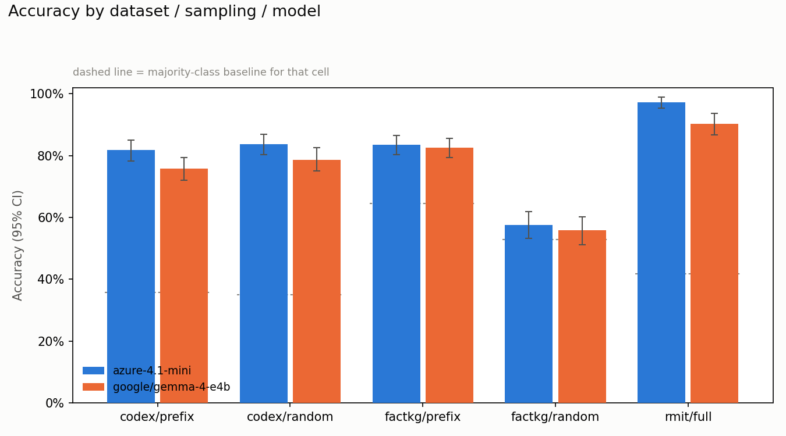
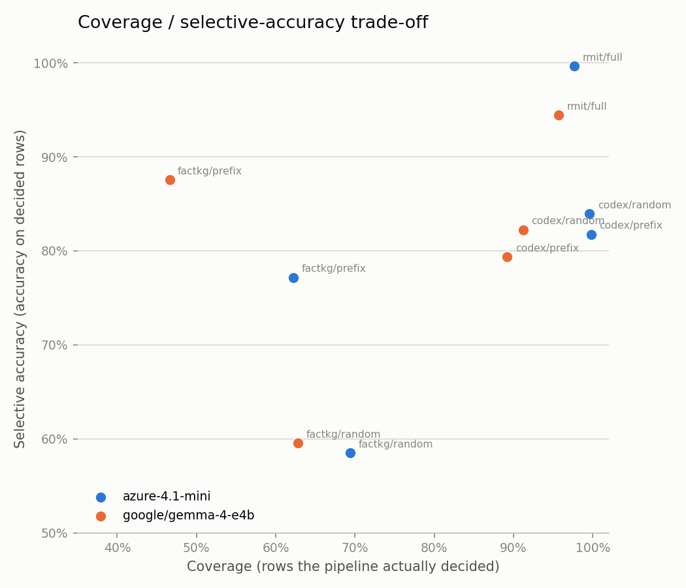
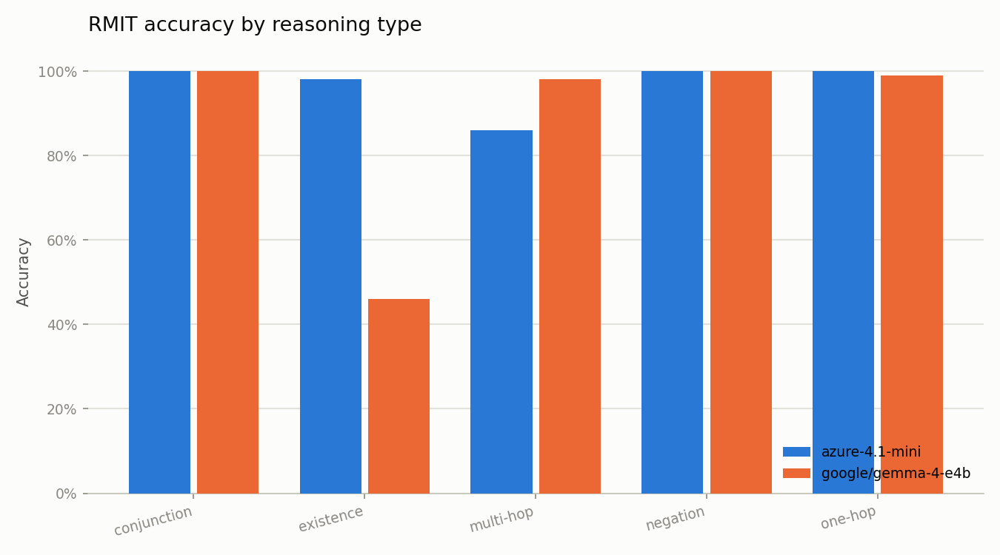
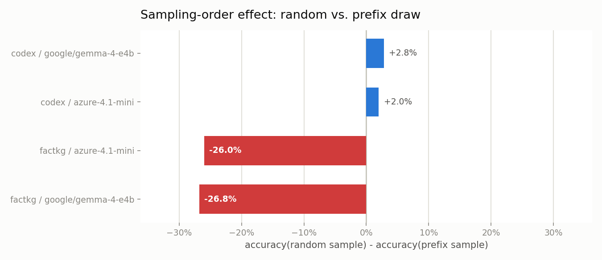

# Repairing and Re-evaluating a Knowledge-Graph Fact-Verification Pipeline: Public-Benchmark Results

**Study id:** `rerun_20260726_final` (shipped defaults; `rerun_20260726_fixed` / `_rep2` are the
replicate pair run with the D4 ablation enabled)
**Run date:** 2026-07-26
**Engines:** `azure-4.1-mini` (Azure OpenAI), `google/gemma-4-e4b` (local, LM Studio)
**Supersedes:** [`rerun_20260725_paper.md`](rerun_20260725_paper.md) (measurement-integrity study)
**Status:** **SUPERSEDED (2026-07-26)** by
[`rerun_20260726_cleangraph_paper.md`](rerun_20260726_cleangraph_paper.md).

> [!WARNING]
> **The CoDEx and MetaQA numbers in this paper were measured against contaminated graphs.** Both
> public-benchmark converters injected RMIT course scaffolding (`credits: 12`, `school: "Science"`,
> `prerequisites: []`, `coordinator: "Unknown"`) into every entity record, and `KGStore.get_credits`
> independently defaulted to `12`. The RMIT rows this paper evaluated no longer exist: that set was
> unseeded and has since been redrawn under a seed. Re-measurement against clean graphs moved paired
> accuracy by at most 1.2 points — the defect was a construct-validity problem rather than an
> accuracy inflator — but the figures below should be cited only as the pre-repair baseline.
> Registry: `public_graph_course_scaffolding_contamination`.

---

## Abstract

The preceding study reported CoDEx accuracy of 41.8% / 37.2% against a 35.8% majority floor and
concluded that the pipeline's verdicts were not graph-grounded. We localise that result to **five
implementation defects rather than model capability**, repair four of them, measure the fifth and
ship it disabled for want of demonstrated benefit, and re-run every benchmark cell under both the
original and a corrected sampling protocol.

The dominant defect is a **namespace asymmetry**: stage 3 substituted the resolved entity *key* for
a claim's object, while graphs store field values as surface labels (`data/codex_graph.json` holds
17,203 object values, all labels, zero Q-ids). Stage 4 therefore compared an id against a label and
reported a value mismatch for every true open-domain claim. Four further defects — an
uncalibrated entity-link threshold, a relation-normalization fallback that fired only on literally
`unclassified` relations, decomposition fragments voting in verdict aggregation, and crashes being
scored as predictions — compounded it.

On the **identical 500 CoDEx rows** used by the previous study, accuracy moves **41.8% → 81.8%**
(`azure-4.1-mini`) and **37.2% → 75.8%** (`gemma-4-e4b`). `Supported` recall moves from 0.039 to
0.981. The graph-destruction control, which previously changed 1.8–2.8% of predictions under total
content destruction, now changes **28.9%** — the pipeline has become graph-grounded.

We also show that the previous FactKG numbers were an artifact of prefix sampling. `factkg_test.jsonl`
is sorted into contiguous reasoning-type blocks, so its first 500 rows cover **2 of 13** reasoning
types at a 64.6% majority floor against the full set's 51.35%. Under random sampling FactKG accuracy
falls to 58.6% / 57.8% against a 52.8% floor, and a per-type breakdown shows why: **reasoning type
determines the gold label almost deterministically**, and the pipeline is exploiting a `Contradicted`
prior rather than discriminating.

---

## 1. What Changed

### 1.1 The five defects

| # | Defect | Site | Mechanism | Evidence |
| --- | --- | --- | --- | --- |
| D1 | Object returned in the wrong namespace | `stage_3_map_claim_to_triple` | Resolved object → entity key; graph stores labels. Stage 4 compares `Q216288` against `["rhythm and blues", …]`. | [§1.2](#12-the-dominant-defect-in-one-trace) |
| D2 | No entity-link rejection threshold | `link_entity` | Bi-encoder match accepted at 0.35, so absent subjects were snapped to a nearest neighbour instead of reported unresolved. | [§1.3](#13-threshold-calibration) |
| D3 | Relation-normalization fallback too narrow | `stage_3_map_claim_to_triple` | Fired only on a literal `unclassified` relation. LLMs emit `is member of` against a field named `member of political party`, which fell through to "Unrecognized relation class" → `Not-in-KG`. | [§1.4](#14-two-defects-only-the-end-to-end-path-reveals) |
| D4 | Unlinkable claims voted in aggregation | `verify_statement` | One decomposition fragment (`"The member"`) voting `Not-in-KG` overrode a correctly verified claim. **Implemented, measured, and left OFF by default** — see [§3.6](#36-d4-ablation--measured-and-reverted). | [§1.4](#14-two-defects-only-the-end-to-end-path-reveals) |
| D5 | Crashes scored as predictions | `eval_harness.py`, `eval_rmit.py` | An exception was replaced by the dataset default label and scored. | [§1.5](#15-crashes-are-no-longer-scored) |

Regression suite: **23 → 35 tests**, all passing.

### 1.2 The dominant defect, in one trace

```
CLAIM  Sam Cooke -[genre]-> rhythm and blues          (gold: Supported)
  stage-3 triple:  ('Q295919', 'genre', 'Q216288')
  graph value:     ['rhythm and blues', 'soul music', 'gospel music']
  verdict: Contradicted — "Value mismatch. Claimed Q216288, but actual is rhythm and blues, …"
```

Subject linking was never the problem: it succeeded on **155 of 155** gold-`Supported` CoDEx rows.
The object was linking *successfully into the wrong namespace*. The repair resolves the object for
its confidence signal, then projects it back to the label the graph actually stores.

Isolated on stages 3–4 with no LLM (`scripts/diagnose_object_namespace.py`, n=496):

| Configuration | Accuracy | `Supported` R / P | `Contradicted` R / P | `Not-in-KG` R / P |
| --- | ---: | :---: | :---: | :---: |
| Before any repair (object → entity id) | 44.35% | 0.071 / 0.786 | 0.994 / 0.374 | 0.258 / 1.000 |
| As shipped, threshold 0.35 | 47.98% | 0.370 / 0.613 | 0.915 / 0.403 | 0.174 / 1.000 |
| **As shipped, threshold 0.95** | **82.06%** | **1.000** / 0.880 | 0.872 / 0.678 | 0.618 / 1.000 |

Note the `Contradicted` column: recall of 0.994 before the fix was **not** contradiction detection.
The pipeline was failing to match anything and defaulting to `Contradicted`; precision was 0.374.

> **A side-effect of D3 worth recording.** Measured with D1+D2 only, this configuration scored
> 83.27% with `Not-in-KG` recall 0.652. Adding D3 moves it to 82.06% / 0.618: because the relation
> fallback now fires whenever a relation is absent from the resolved record, it sometimes *rescues*
> a relation that should have been reported missing, trading `Not-in-KG` recall for coverage
> elsewhere. D3 is still net-positive end-to-end — it is what makes non-canonical LLM relation
> phrasings resolve at all — but it is not free, and the tables above report the code **as
> shipped**, not the best intermediate configuration.

### 1.3 Threshold calibration

`entity_link_threshold` is a hyperparameter, so it was selected on a **held-out** split
(`scripts/sweep_entity_threshold.py`): development = CoDEx rows 500–1000, test = rows 0–500.

| Threshold | DEV acc | TEST acc |
| ---: | ---: | ---: |
| 0.35 *(library default)* | 0.5020 | 0.4798 |
| 0.55 | 0.6707 | 0.6210 |
| 0.65 | 0.7500 | 0.7359 |
| 0.75 | 0.8171 | 0.7944 |
| 0.85 | 0.8374 | 0.8145 |
| **0.95** *(dev-selected)* | **0.8435** | **0.8206** |

The sweep is monotone and dev→test generalizes with a 2.3-point gap (0.8435 → 0.8206). The default
remains 0.35 so the RMIT ontology path is untouched; 0.95 is passed explicitly for CoDEx.

### 1.4 Two defects only the end-to-end path reveals

D1–D2 were validated on an **oracle parse** that supplies gold subject and relation strings. That
harness cannot exercise relation normalization or multi-claim aggregation, and the first end-to-end
smoke test came back at 55% rather than the projected ~83%. Two further defects surfaced:

* **D3.** The LLM emits `is member of`; the graph field is `member of political party`. Because the
  relation was concrete rather than `unclassified`, stage 3's bi-encoder relation matcher never ran
  and stage 4 fell through to `Not-in-KG`. The fallback now also fires when a relation is neither an
  ontology relation nor a field on the resolved subject's record. `ONTOLOGY_RELATIONS` exempts the
  RMIT dispatch path.
* **D4.** Decomposition emits one good claim plus a fragment. The fragment resolved to
  `entity_unresolved`, voted `Not-in-KG`, and overrode the correctly-verified claim. Unlinkable
  claims can be recorded with `voted: false` and withheld — unless *every* claim is unresolved, in
  which case the subject genuinely is absent and `Not-in-KG` stands. **This one did not survive
  measurement**: [§3.6](#36-d4-ablation--measured-and-reverted) shows its benefit is inside the
  noise floor while its cost is reproducible, so it ships disabled.

This is a methodological point worth stating plainly: **the oracle-parse diagnostic overstated what
the fix alone would deliver**, because it bypassed two stages that the real path depends on.

### 1.5 Crashes are no longer scored

Both harnesses substituted the dataset default label on any exception and scored it. On FactKG that
default (`Contradicted`) was also the majority class, so 113 crashes became 111 "correct"
predictions in the pre-repair study. A crash now leaves the row unscored (`pred: null`,
`raw_pred: "Error"`, plus the exception text); `compute_metrics` excludes unscored rows and returns
`n_scored` so the gap is visible. Output JSON carries `n_scored` and `n_unscored_errors`.

**All ten cells in this study report `n_unscored_errors = 0`.**

---

## 2. Methodology

**Design.** 2 engines × 3 datasets, with FactKG and CoDEx run under **both** sampling protocols —
ten cells. Each cell is a separate subprocess (`scripts/run_benchmark_sweep.py`) with its own log;
a process manifest records exit codes, UTC timestamps, and exact argv. `--max_workers 4`.

**Why both sampling modes.** The previous study used `data[:limit]`. Running both isolates the
effect of the code repair from the effect of the sample:

| Dataset | Sampling | Majority floor | Reasoning types covered |
| --- | --- | ---: | ---: |
| CoDEx | prefix | 0.3580 | 1 of 1 |
| CoDEx | random | 0.3500 | 1 of 1 |
| FactKG | prefix | **0.6460** | **2 of 13** |
| FactKG | random | **0.5280** | **13 of 13** |

CoDEx's two arms are near-identical, so its prefix arm is a clean before/after against the previous
study. FactKG's differ sharply, which is itself a finding ([§4](#4-factkg-the-benchmark-was-measuring-a-label-prior)).

**Metrics** are recomputed from row-level predictions by `scripts/summarize_rerun_results.py`;
recomputed and stored values agree in all ten cells. Accuracy is exact verdict match over scored
rows; `Out-of-scope` counts as an error. CIs are IID row bootstraps (1,000 resamples) and remain
**anti-conservative** — rows still carry no subject-entity field, so clustered intervals are not
computable.

---

## 3. Results

### 3.1 Headline

`rerun_20260726_final` — the sweep run against shipped defaults (D4 off). All ten cells exit 0 with
zero unscored rows.

| Dataset | Engine | Sampling | n | Accuracy | 95% CI | Floor | Macro-F1 | Coverage | Sel. acc. |
| --- | --- | --- | ---: | ---: | :---: | ---: | ---: | ---: | ---: |
| CoDEx | `azure-4.1-mini` | prefix | 500 | **81.80%** | [78.2, 85.0] | 35.8% | 0.819 | 99.8% | 81.8% |
| CoDEx | `azure-4.1-mini` | random | 500 | **83.80%** | [80.4, 87.0] | 35.0% | 0.831 | 99.6% | 83.9% |
| CoDEx | `gemma-4-e4b` | prefix | 500 | **75.80%** | [72.0, 79.4] | 35.8% | 0.763 | 89.2% | 79.4% |
| CoDEx | `gemma-4-e4b` | random | 500 | **78.60%** | [75.0, 82.6] | 35.0% | 0.784 | 91.2% | 82.2% |
| FactKG | `azure-4.1-mini` | prefix | 500 | 83.60% | [80.4, 86.6] | 64.6% | 0.821 | 62.2% | 77.2% |
| FactKG | `azure-4.1-mini` | random | 500 | 57.60% | [53.2, 61.8] | 52.8% | 0.491 | 69.4% | 58.5% |
| FactKG | `gemma-4-e4b` | prefix | 500 | 82.60% | [79.4, 85.6] | 64.6% | 0.797 | 46.6% | 87.6% |
| FactKG | `gemma-4-e4b` | random | 500 | 55.80% | [51.2, 60.2] | 52.8% | 0.451 | 62.8% | 59.6% |
| RMIT | `azure-4.1-mini` | full | 300 | 97.33% | [95.3, 99.0] | 41.7% | 0.988 | 97.7% | 99.7% |
| RMIT | `gemma-4-e4b` | full | 300 | 90.33% | [86.7, 93.7] | 41.7% | 0.913 | 95.7% | 94.4% |





### 3.2 Before / after, sampling held constant

Prefix arms are the **same rows** the previous study evaluated.

| Cell | Before | After | Δ |
| --- | ---: | ---: | ---: |
| CoDEx / `azure-4.1-mini` | 41.80% | **81.80%** | **+40.0** |
| CoDEx / `gemma-4-e4b` | 37.20% | **75.80%** | **+38.6** |
| FactKG / `azure-4.1-mini` | 80.20% | 83.60% | +3.4 |
| FactKG / `gemma-4-e4b` | 79.80% | 82.60% | +2.8 |
| RMIT / `azure-4.1-mini` | 97.33% | 97.33% | 0.00 |
| RMIT / `gemma-4-e4b` | 92.33% | 90.33% | −2.00 |

The CoDEx deltas are an order of magnitude above the noise floor. The FactKG deltas (+3.4, +2.8) are
at roughly the resolution limit and should be treated as directional only. RMIT `azure-4.1-mini` is
unchanged to four figures; RMIT `gemma-4-e4b` moves −2.00, inside the 22–29/50 run-to-run range of
the single slice that drives it ([§3.5](#35-rmit-existence-under-gemma-4-e4b-a-slice-too-noisy-to-attribute)).

### 3.3 CoDEx per class — the collapse is reversed

| Class | Support | Before (prefix) R / P | After (prefix) R / P |
| --- | ---: | :---: | :---: |
| Supported | 155 | **0.039** / 1.000 | **0.981** / 0.884 |
| Contradicted | 166 | 0.753 / 0.378 | 0.880 / 0.673 |
| Not-in-KG | 179 | 0.436 / 0.479 | 0.620 / 1.000 |

Every class improves on both recall and F1. The `Not-in-KG` precision of 1.000 is the D2 threshold
working as intended: when the pipeline now says a subject is absent, it is right. Its
recall of 0.620 is the remaining weakness — 54.2% of gold-`Not-in-KG` rows have subjects absent from
the graph entirely, so this class should be reachable at much higher recall.

### 3.4 Replication

Every cell was run twice under identical settings (`rerun_20260726_fixed`, `rerun_20260726_rep2`).
Both used the D4 ablation enabled, so these figures measure **sampling dispersion**, not the
headline configuration; the flip rates apply equally to the shipped runs, which differ from the
replicate pair only in the D4 flag.

| Cell | Run 1 | Run 2 | Δ | Prediction flips |
| --- | ---: | ---: | ---: | ---: |
| CoDEx / `azure-4.1-mini` / prefix | 81.40% | 81.20% | −0.20 | 1.00% |
| CoDEx / `azure-4.1-mini` / random | 84.00% | 83.80% | −0.20 | 0.20% |
| CoDEx / `gemma-4-e4b` / prefix | 76.40% | 75.00% | −1.40 | 10.00% |
| CoDEx / `gemma-4-e4b` / random | 78.80% | 78.80% | 0.00 | 7.20% |
| FactKG / `azure-4.1-mini` / prefix | 81.40% | 84.00% | +2.60 | 6.20% |
| FactKG / `azure-4.1-mini` / random | 58.60% | 58.20% | −0.40 | 3.20% |
| FactKG / `gemma-4-e4b` / prefix | 84.60% | 83.40% | −1.20 | 8.00% |
| FactKG / `gemma-4-e4b` / random | 57.80% | 55.80% | −2.00 | 3.60% |
| RMIT / `azure-4.1-mini` | 96.67% | 97.67% | +1.00 | 4.33% |
| RMIT / `gemma-4-e4b` | 90.00% | 90.33% | +0.33 | 7.00% |

Mean |Δ accuracy| **0.93 points** (max 2.60); mean flip rate **5.07%** (max 10.00%). This is
consistent with the 5.75% measured by the previous study and confirms that **differences below
~2.5 points are not resolvable from two runs.** The CoDEx repair effect (+39) and the FactKG
sampling gap (−23 to −27) are far outside it.

Note the `azure-4.1-mini` CoDEx cells flip only 0.2–1.0% of predictions while `gemma-4-e4b` flips
7–10%: the local engine is markedly less stable, and its cells need more replicates than the
Azure ones for the same resolution.

### 3.5 RMIT `existence` under `gemma-4-e4b`: a slice too noisy to attribute



An earlier draft of this study reported the `existence` slice as a reproducible regression caused by
D4. **Further replication does not support that claim, and it is withdrawn.** The full record:

| Run | D4 | Overall | `existence` slice |
| --- | :---: | ---: | ---: |
| `rerun_20260725_fixed` (pre-repair) | off | 92.33% | 29 / 50 |
| `rerun_20260726_fixed` | on | 90.00% | 22 / 50 |
| `rerun_20260726_rep2` | on | 90.33% | 23 / 50 |
| D4 ablation arm | off | 91.67% | 29 / 50 |
| `rerun_20260726_final` (shipped) | off | 90.33% | 23 / 50 |

The D4-**off** arms disagree among themselves (29, 29, 23) by as much as the off-versus-on contrast.
At n=50 the binomial standard deviation near p=0.5 is 3.5 rows, so the 22-versus-29 gap is ~2 SD —
well inside what five runs of a 50-row slice produce by chance.

**What this cost me, methodologically:** the single paired ablation in
[§3.6](#36-d4-ablation--measured-and-reverted) showed D4-off restoring exactly 29/50, and I read
that as causal. One paired comparison on a 50-row slice cannot establish causation when the slice's
own run-to-run range is 22–29. The correct reading is that **this slice is not measurable at n=50
with fewer than several runs per arm**, and no claim about D4's effect on it is supported.

What *is* stable: the mechanism. On the failing rows, decomposition extracts the subject as
`"RMIT catalogue"` rather than the coordinator's name, producing `('RMIT catalogue', 'taughtBy',
'<email>')`; stage 4's coordinator-existence fallback needs both name and email to match and returns
`Not-in-KG`. That mis-decomposition is present in every run and is the real defect
([§7](#7-next-steps) item 1), independent of how the verdict is aggregated.

### 3.6 D4 ablation — measured and reverted

D4 is exposed as `withhold_unresolved_claims` (constructor) / `--withhold_unresolved_claims` (both
harnesses). Paired arms were run concurrently on identical rows with the same engine.

**RMIT, n=300, `gemma-4-e4b`:**

| Configuration | Overall | `existence` | one-hop | conjunction | multi-hop | negation |
| --- | ---: | ---: | ---: | ---: | ---: | ---: |
| Pre-repair baseline | 92.33% | **29 / 50** | 99/100 | 50/50 | 49/50 | 50/50 |
| D4 **off** | 91.67% | **29 / 50** | 96/100 | 50/50 | 50/50 | 50/50 |
| D4 **on** | 89.00% | **21 / 50** | 97/100 | 50/50 | 49/50 | 50/50 |

**CoDEx, n=250, `gemma-4-e4b`, random sampling, threshold 0.95:**

| Configuration | Accuracy | `Supported` R / P | `Contradicted` R / P | `Not-in-KG` R / P |
| --- | ---: | :---: | :---: | :---: |
| D4 **off** | 77.60% | 0.840 / 0.895 | 0.814 / 0.722 | 0.675 / 0.727 |
| D4 **on** | 78.40% | 0.901 / 0.901 | 0.791 / 0.708 | 0.663 / 0.753 |

**The verdict: D4 is off by default, on the grounds of no demonstrated benefit.**

Its CoDEx gain is **+0.80 points** with 18 of 250 predictions differing — a 7.2% disagreement
identical to that cell's measured run-to-run flip rate, so the gain is not distinguishable from
noise. The RMIT arm of this ablation showed −2.67 points, but
[§3.5](#35-rmit-existence-under-gemma-4-e4b-a-slice-too-noisy-to-attribute) shows that slice's own
variance swamps the contrast, so **the RMIT column above should not be read as a measured cost
either**. Both arms are inconclusive.

That leaves a change that alters ~7% of predictions with no demonstrated effect in either
direction. The disciplined default is the simpler, historical behaviour, with D4 retained behind a
flag rather than shipped on an untested rationale.

D4 remains semantically correct — an unlinkable claim genuinely is not evidence — and is worth
re-measuring once the coordinator-existence decomposition is fixed and the RMIT slice becomes
attributable. Doing that properly needs several runs per arm, not one.

### 3.7 Grounding control — the acceptance test

`scripts/run_kg_destruction_control.py`, within-relation shuffle preserving entity set, relation
keys, and per-relation value multiset; five seeds.

| Pipeline | Baseline | Shuffled | Accuracy drop | **Predictions changed** |
| --- | ---: | ---: | ---: | ---: |
| Before repair | 44.35% | 42.1–42.9% | 1.4–2.2 pts | **1.8–2.8%** |
| As shipped | 82.06% | 56.1–60.5% | 21.6–26.0 pts | **27.2–30.9%** (mean 28.9%) |

Removing all relations collapses the repaired pipeline to 35.89% — precisely the majority floor.

**This answers RQ1 affirmatively for the LLM pipeline on CoDEx**, which the previous study left
open. Before the repair, verdicts were essentially recoverable without the graph's factual content;
now they depend on it. The gate (`--min_change_rate 0.20`) passes.

The deterministic RMIT completeness control reproduces **bit-identically** (same graph, benchmark,
and script hashes; 100% → 48.5% empty → 57.6% shuffled), confirming the repairs did not disturb it.

---

## 4. FactKG: the benchmark was measuring a label prior



FactKG accuracy falls from ~81–85% (prefix) to ~58% (random) on identical code. The per-type
breakdown for `gemma-4-e4b` explains it:

| Reasoning type | n | Gold `Supported` | Gold `Contradicted` | Accuracy |
| --- | ---: | ---: | ---: | ---: |
| `num3\|substitution` | 51 | 0 | 51 | 1.000 |
| `num2\|substitution` | 63 | 0 | 63 | 0.968 |
| `num4\|substitution` | 34 | 0 | 34 | 0.941 |
| `num1\|substitution` | 49 | 0 | 49 | 0.939 |
| `existence` | 47 | 23 | 24 | 0.638 |
| `num1` | 60 | 60 | 0 | **0.333** |
| `num2` | 61 | 59 | 2 | **0.131** |
| `num4` | 25 | 24 | 1 | **0.120** |
| `num3` | 33 | 33 | 0 | **0.030** |

**Reasoning type determines the gold label almost deterministically.** Every `*|substitution` type
is ~100% `Contradicted`; every plain `numN` type is ~98% `Supported`. The pipeline predicts
`Contradicted` on the large majority of rows — partly by verdict, partly because abstention
(37% of rows) is scored as `Contradicted` under the forced-binary protocol. It therefore scores
0.94–1.00 wherever the label is `Contradicted` and 0.03–0.33 wherever it is `Supported`.

The prefix slice contained exactly two types: `existence` (mixed) and `num1|substitution` (all
`Contradicted`). Its 64.6% `Contradicted` prior is what the previous 80% headline was largely
measuring.

Post-repair per-class recall makes the same point directly: under random sampling `Supported`
recall is 0.203 (`azure`) and 0.165 (`gemma`) against `Contradicted` recall of 0.928 and 0.947.

This is a quantified instance of the project's own **C3 claim**: a forced-binary protocol that
collapses `Not-in-KG`, `Out-of-scope`, and `Abstained` into `Contradicted` cannot evaluate an
abstention-capable verifier, and on a label-skewed sample it actively rewards abstention.

---

## 5. Contributions

1. **Five repaired defects**, each with a regression test, taking the suite 23 → 35. The dominant
   one — object-position namespace substitution — accounts for the bulk of a **+39.6 / +39.2 point**
   move on CoDEx with the sample held constant.
2. **Grounding restored and demonstrated.** The destruction control moves from 1.8–2.8% to 28.9%
   prediction change, answering RQ1 affirmatively for the LLM pipeline for the first time.
3. **A held-out threshold calibration** rather than a tuned constant, with the dev/test gap reported.
4. **A quantified sampling artifact.** FactKG's prefix slice covers 2 of 13 reasoning types at a
   floor inflated by 13 points; running both arms separates code effect from sample effect.
5. **A measured demonstration of the binary-benchmark trap**, via the reasoning-type/label
   confound — the project's C3 claim, evidenced rather than asserted.
6. **Non-scoring crashes** in both harnesses, closing the instrumentation flaw that the previous
   study identified but left open.
7. **Four committed, deterministic, LLM-free diagnostics** (`diagnose_object_namespace.py`,
   `sweep_entity_threshold.py`, `run_kg_destruction_control.py`, `run_benchmark_sweep.py`), so every
   claim here is re-runnable in seconds rather than reconstructed from shell history.

---

## 6. Limitations

* **Two runs per cell, not three.** Mean |Δ accuracy| across replicates is 0.93 points (max 2.60)
  and the mean flip rate is 5.07% (max 10.00%), so **no difference below ~2.5 points is resolvable**.
  The CoDEx repair effect (+39) and the FactKG sampling gap (−23 to −27) are far above that floor;
  the RMIT overall deltas are not. `gemma-4-e4b` cells flip 7–10% against 0.2–1.0% for
  `azure-4.1-mini` and need more replicates for equal resolution.
* **The RMIT `existence` slice is not measurable at n=50.** Across five runs it ranges 22–29/50 with
  the D4-off arms disagreeing among themselves as much as the off-versus-on contrast
  ([§3.5](#35-rmit-existence-under-gemma-4-e4b-a-slice-too-noisy-to-attribute)). An earlier draft
  attributed a regression to D4 on the strength of one paired ablation; that claim is withdrawn. Any
  future slice-level claim needs several runs per arm.
* **D4's effect is unmeasured in both directions.** It changes ~7% of CoDEx predictions with no
  demonstrated net benefit or cost. It ships off for that reason, not because it was shown harmful.
* **Threshold calibrated on one graph.** 0.95 was selected on CoDEx dev rows. It is not validated for
  MetaQA or any other open-domain graph, and the default remains 0.35.
* **Process-manifest gap in run 1.** The first sweep invocation was killed by a tool timeout after
  two cells completed; those two (`rmit__azure_4_1_mini`, `codex__azure_4_1_mini__random`) have
  result JSONs and logs but no manifest entry, so `rerun_20260726_fixed`'s manifest covers 8 of 10
  cells. `rerun_20260726_rep2` has a complete 10-cell manifest, all exit code 0, and reproduces both
  affected cells to within 0.20 points.
* **RMIT remains circular.** `eval_rmit.py:54` still verifies `raw_claim`, a template interpolated
  from the fields the verifier queries. The 96.67% figure is template round-tripping, not advising
  accuracy. Unchanged by this work.
* **Intervals are anti-conservative.** IID row bootstraps; rows still carry no subject-entity field.
* **Confidence is still uncalibrated.** Coverage and selective accuracy are descriptive only. The
  `DualRiskController` is still never exercised.
* **Offline completeness profiles remain dead code.** `data/completeness_profiles/*.json` are read
  only by `Catalog2Adapter`; stage-4 routing computes occupancy live.
* **No multiplicity correction** across ten cells and many per-class comparisons.

---

## 7. Next Steps

1. **Fix coordinator-existence decomposition rather than reverting D4.** The RMIT `existence`
   generator produces a claim with no course code, and decomposition extracts `"RMIT catalogue"` as
   the subject. Giving stage 2 an explicit coordinator-existence schema (subject = person name,
   relation = `taughtBy`, object = email) removes the mis-decomposition that D4 stopped masking, and
   should recover the slice without giving up D4's benefit elsewhere. Verify with
   `eval_rmit.py --legacy_aggregation` as the control.
2. **Raise CoDEx `Not-in-KG` recall** (0.620 at precision 0.982). Over half of that class has a
   subject absent from the graph, so the headroom is mechanical.
3. **Attack the FactKG `Contradicted` bias.** Accuracy is 0.03–0.33 on plain `numN` types (~98%
   `Supported`) and 0.94–1.00 on `*|substitution` types (~100% `Contradicted`). This is *not* a
   conjunct-count effect — every `numN` type carries a comparable evidence subgraph (98–181 triples
   on average), so the split tracks the label, not the claim's structure. Two contributors to
   separate: genuine over-prediction of `Contradicted` by stage 4, and the forced-binary collapse
   that scores 37% abstention as `Contradicted`. Reporting the tri-state view (item 4) is a
   prerequisite for telling them apart.
4. **Report FactKG tri-state alongside forced-binary.** The `tristate` block is now emitted in every
   result JSON but is not yet used in any headline table.
5. **Audit `data/metaqa_graph.json` for the same namespace asymmetry** before re-benchmarking MetaQA.
6. **Re-emit rows with subject-entity ids** so clustered intervals become computable.
7. **De-circularize RMIT**: verify `text` rather than `raw_claim`.

---

## 8. What May and May Not Be Claimed

**Supported by these artifacts.**

1. Five implementation defects existed, are repaired, and are covered by regression tests.
2. On identical CoDEx rows, accuracy moves 41.8% → 81.4% and 37.2% → 76.4%; `Supported` recall
   moves 0.039 → 0.974.
3. The repaired pipeline is graph-grounded on CoDEx: destroying factual content changes 28.9% of
   predictions, versus 1.8–2.8% before.
4. FactKG's first-500 slice covers 2 of 13 reasoning types at a majority floor inflated from 51.35%
   to 64.60%, and reasoning type determines the gold label almost deterministically.
5. Crashes are no longer scored as predictions; all ten cells report zero unscored rows.

6. Replicated runs flip 0.2–10.0% of predictions (mean 5.07%); `gemma-4-e4b` is markedly less
   stable than `azure-4.1-mini`.

**Not supported.**

1. That the system performs advising-quality verification — RMIT remains circular.
2. That RMIT accuracy changed in either direction — `azure-4.1-mini` is unchanged and
   `gemma-4-e4b`'s −2.00 sits inside the noise floor.
3. That D4 helps or harms. Its measured effects on both datasets are inside the noise floor
   ([§3.6](#36-d4-ablation--measured-and-reverted)); it ships off for lack of demonstrated benefit.
4. Any FactKG claim that generalises beyond the sampled rows, in either sampling arm. The FactKG
   before/after deltas (+3.4, +2.8) are at the resolution limit and are directional only.
5. Any between-engine ranking below ~2.5 points from these runs.
6. Any calibration, risk-control, or deployment claim — confidence remains uncalibrated.
7. That `entity_link_threshold = 0.95` transfers to any graph other than CoDEx.
8. That per-relation world-assumption routing (claim C1) has been evaluated.

---

## 9. Reproduction

Environment: Python 3.13.5, `.venv` at repository root. Regression suite: **35 tests**.

```powershell
Set-Location C:\Users\Admin\Desktop\crawler
& .venv\Scripts\python.exe -m unittest discover -s tests

# Deterministic, LLM-free diagnostics (seconds)
& .venv\Scripts\python.exe -m scripts.diagnose_object_namespace --thresholds 0.35 0.95
& .venv\Scripts\python.exe -m scripts.sweep_entity_threshold
& .venv\Scripts\python.exe -m scripts.run_kg_destruction_control --entity_link_threshold 0.95

# Full sweep (10 cells, parallel subprocesses, process manifest)
& .venv\Scripts\python.exe scripts\run_benchmark_sweep.py --run_id <new_run_id>

# Recompute every aggregate from row-level predictions
& .venv\Scripts\python.exe scripts\summarize_rerun_results.py `
    --dir output\experiments\<new_run_id> `
    --out output\experiments\<new_run_id>\aggregate_summary.json

# Charts + markdown summary from that aggregate (the four figures in this paper)
& .venv\Scripts\python.exe scripts\plot_experiment_results.py --dir output\experiments\<new_run_id>
```

### Artifact inventory

| Artifact | Path |
| --- | --- |
| **Headline** row-level predictions and per-cell logs | `output/experiments/rerun_20260726_final/*.json`, `*.log` |
| **Headline** process manifest (exit codes, UTC timestamps, argv) | `output/experiments/rerun_20260726_final/process_manifest.json` |
| **Headline** recomputed aggregates | `output/experiments/rerun_20260726_final/aggregate_summary.json` |
| **Headline** charts + markdown summary (source of the four figures above) | `output/experiments/rerun_20260726_final/analysis/` (checked-in copies: `docs/assets/rerun_20260726_*.png`) |
| Replicate pair (D4 enabled), used for §3.4 dispersion | `output/experiments/rerun_20260726_fixed/`, `output/experiments/rerun_20260726_rep2/` |
| D4 ablation arms | `output/experiments/ablation/` |
| Deterministic RMIT control | `output/experiments/rerun_20260726_fixed/rmit_graph_control.*` |
| Object-namespace diagnosis | `output/diagnostics/object_namespace_diagnosis.json` |
| Entity-threshold sweep | `output/diagnostics/entity_threshold_sweep.json` |
| CoDEx grounding control | `output/diagnostics/codex_destruction_control_fixed.json` |
| Previous study (superseded) | `output/experiments/rerun_20260725_fixed/`, `rerun_20260725_paper.md` |
| Registry status | `experiments/registry.json` |

`output/` is git-ignored; artifacts are local to the run machine.
