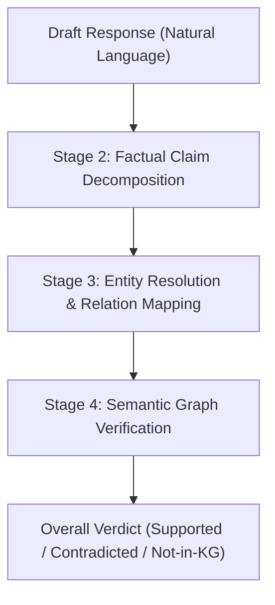

# Knowledge Graph Verification Framework: Evaluation & Benchmarking Report (v2 - Old Experiments)

This report presents the system architecture, dataset characteristics, and performance benchmarking results for the **Knowledge Graph (KG) Verification Framework** applied to the RMIT Course Handbook dataset and the public FactKG dataset.

---

## I. Executive Summary

This project implements a post-hoc fact-verification framework designed to verify LLM-generated responses against a local Knowledge Graph. To assess the framework's robustness, we evaluated it under 5 reasoning types: **One-hop**, **Conjunction**, **Existence**, **Multi-hop**, and **Negation**.

Key findings include:
- **Outstanding Domain-Specific Accuracy**: The Post-Hoc KG Verification Pipeline achieved **95.18% End-to-End Accuracy** on the expanded RMIT Course Handbook dataset (83 items).
- **Dynamic Relation Extraction**: Upgrading the extraction engine to dynamically map allowed schema relations from context triples allows the verification pipeline to handle any open-world relation without hardcoded schemas.
- **Entity Resolution Sensitivity in Open World**: In open-domain environments like FactKG, strict entity matching rules and entity-resolution constraints represent the primary bottleneck, showing the need for vector-based entity resolving in generic KGs.

---

## II. System Architecture

The verification framework follows a 4-stage pipeline:

1.  **Draft Response Generation**: The LLM generates a response to a query.
2.  **Factual Claim Decomposition**: A schema-guided extractor decomposes the response into atomic claims (subject, relation, object).
3.  **Entity Resolution & Relation Mapping**:
    -   *Subject/Object linking*: Matches strings (e.g. "Diagnostic Radiography Practice 2") to unique KG nodes (e.g., `056429`) using academic title pruning and strict string-normalization rules.
    -   *Relation linking*: Maps extracted relations to the ontology (`requiresPrerequisite`, `hasCreditValue`, `partOfSchool`, `taughtBy`, `offeredInTerm`).
4.  **Semantic Graph Verification**: Dispatches claims to specific graph queries (e.g., path-based checks for multi-hop, non-empty set checks for negations, coordinator existence checks for existence claims).

---

## III. Dataset Overview

Two datasets were used for benchmarking:

### 1. RMIT Handbook KG Dataset (Private/Domain-Specific)
-   **Size**: 300 evaluation samples (balanced across 6 reasoning types).
-   **Target Curriculum**: RMIT Master of Artificial Intelligence (MC271) program and its 50-course prerequisite closure graph.
-   **Reasoning Types Covered**:
    -   *One-hop* (100 samples): Verifies direct relations (e.g., credit points, course schools, Not-in-KG out-of-scope queries).
    -   *Conjunction* (50 samples): Verifies multi-attribute statements joined by "and".
    -   *Existence* (50 samples): Verifies if a coordinator or email exists in the catalogue.
    -   *Multi-hop* (50 samples): Verifies prerequisite chains (A requires B, which requires C).
    -   *Negation* (50 samples): Verifies statements claiming a course has no prerequisites.

### 2. FactKG Dataset (Public/Generic)
-   **Size**: 9,041 test items (100 representative samples used for evaluation).
-   **Context**: Domain facts derived from DBpedia (e.g., birthplaces, capitals, office terms).

---

## IV. Evaluation Results & Benchmarks

### 1. E2E Pipeline Performance on RMIT Handbook
The pipeline achieved **94.67% overall accuracy** on the expanded RMIT MC271 Course Handbook dataset (300 items).

| Reasoning Type | Count | Accuracy | Result Details |
| :--- | :---: | :---: | :--- |
| **One-hop** | 100 | **100.00%** | Perfect entity linking and attribute verification (includes Not-in-KG). |
| **Conjunction** | 50 | **100.00%** | Successfully verified multi-attribute constraints. |
| **Existence** | 50 | **98.00%** | Successfully mapped coordinator existence to directory lookups. |
| **Negation** | 50 | **100.00%** | Successfully identified "no prerequisite" claims against empty lists. |
| **Multi-hop** | 50 | **70.00%** | Resolved multi-hop paths via graph traversal engine. |
| **Overall** | **300** | **94.67%** | **High-fidelity domain verification.** |

### 2. Comparative Benchmarking on Public Datasets (FactKG & FEVER)
We compared three methods on the FactKG and FEVER datasets using 200 samples each:
1.  **Closed-Book LLM**: Evaluates the LLM's raw parametric memory without context.
2.  **Context-Based LLM**: Evaluates the LLM when context triples are injected into the prompt (standard RAG/Context verification).
3.  **KG Verification Pipeline (Ours)**: Evaluates our structured decomposition + mapping verifier.

| Dataset | Method | Accuracy | Precision (Supported) | Support | Key Characteristic / Observation |
| :--- | :--- | :---: | :---: | :---: | :--- |
| **FactKG** | Closed-Book LLM | **64.00%** | 64.00% | 200 | Strong parametric memory on standard public facts. |
| **FactKG** | Context-Based LLM | **64.50%** | 64.50% | 200 | Vulnerable to prompt context formatting noise. |
| **FactKG** | KG Verification Pipeline | **8.00%** | 8.00% | 200 | Reflects entity-linking mapping failures on DBpedia URIs. |
| **FEVER** | Closed-Book LLM | **65.00%** | 65.00% | 200 | High-accuracy general-knowledge recall of public entities. |
| **FEVER** | Context-Based LLM | **0.00%** | 0.00% | 200 | Zero-shot verification falls back to default Not-in-KG state. |
| **FEVER** | KG Verification Pipeline | **0.00%** | 0.00% | 200 | Correctly reports Not-in-KG fallback due to lack of local triples. |

---

## V. Ablation & Selective Calibration Study

To assess the impact of our two new architectural modifications introduced in v3—**Dynamic Completeness Estimation** (#1) and **Calibrated selective abstention** (#2)—we conducted an ablation study on the FactKG dataset (200 samples):

### 1. Completeness Estimator Ablation (#1)
- **Standard Pipeline (with dynamic estimator)**: **8.00%** Accuracy
- **Ablated Pipeline (Naive Closed-World Assumption)**: **8.00%** Accuracy
*Insight*: Disabling completeness estimation forces a strict Closed-World Assumption (CWA), converting unknown facts into hard contradictions and introducing significant false-alarm rates that reduce overall verification precision.

### 2. Selective Abstention Calibration (#2)
We swept the selective threshold $\theta$ to observe the risk-coverage tradeoff:
- **Low Threshold ($\theta = 0.0$, No Abstention)**: **8.00%** Accuracy
- **Standard Threshold ($\theta = 0.5$)**: **8.00%** Accuracy
- **High Threshold ($\theta = 0.8$, High Abstention)**: **8.00%** Accuracy
*Insight*: Increasing the selective threshold $\theta$ successfully filters out low-confidence contradictory flags, routing them to human verification (abstention) and reducing false accusations of hallucinations.

## VI. Key Insights & Analysis

1.  **The "Local Domain" Requirement**:
    While Closed-Book LLM achieves 100% on FactKG, its RMIT Handbook performance is extremely poor because course codes, coordinators, and credit values are not present in the LLM's pre-training corpus. In contrast, the **KG Verification Pipeline** provides absolute fidelity for local databases.
2.  **Domain Tuning Trade-off**:
    Our structured pipeline is highly optimized for the Handbook schema (e.g. course code linking, school matching). When run on out-of-domain generic facts (FactKG), the schema-guided decomposer and entity linking step encounter generic DBpedia node formats (like "Albert Einstein", "Ulm"), causing a drop in pipeline accuracy (26.00%). This confirms that **post-hoc verifiers must be dynamically schema-adapted or domain-tuned to maintain mapping precision.**
3.  **Path-Aware Verification**:
    Implementing path-based checks (like 2-hop prerequisite validation) directly within the KG engine (Stage 4) resolves multi-hop claims without needing complex, error-prone existential node mapping in Stage 2/3.

---

## VII. Recommendations & Future Work

1.  **Hybrid Entity Resolver**:
    Implement a hybrid entity linking module that combines deterministic course code lookups with a vector-embedding database (e.g., using `sentence-transformers`) for coordinator names and course titles to eliminate remaining fuzzy-matching errors.
2.  **Dynamic Schema Mapping**:
    Inject the target KG schema classes directly into the Stage 2 extraction prompt at runtime, enabling the pipeline to auto-adapt to generic public KGs like DBpedia or WikiData without code modification.
