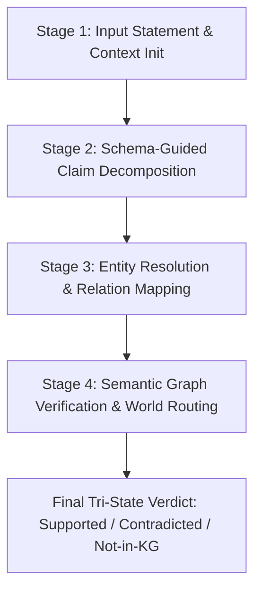

# Knowledge Graph Fact-Verification Framework: Datasets & Pipeline Stage Guide

This document provides a comprehensive technical overview of all datasets supported in the Knowledge Graph (KG) Fact-Verification Framework. It details dataset provenance, graph schemas, raw record formats, and step-by-step traces showing how sample assertions from each dataset progress through all four stages of the verification pipeline.

---

## 1. Pipeline Architecture Overview

The framework implements a **4-stage tri-state claim verification pipeline** designed to check natural-language assertions against Knowledge Graphs while dynamically calibrating world-assumption semantics (Closed-World Assumption vs. Open-World Assumption).



### Stage Summary

| Stage | Name | Key Mechanics & Functions | Primary Output |
| :--- | :--- | :--- | :--- |
| **Stage 1** | **Input Statement & Context** | Normalization, transient graph context setup via `verify_with_context()`. | Clean input text and loaded `KGStore` graph context. |
| **Stage 2** | **Claim Decomposition** | `stage_2_decompose()`: LLM extraction under self-consistency dual-pass sampling. | List of atomic claims `(subject, relation, object, claim_type)` + agreement score $s_{\text{decomp}}$. |
| **Stage 3** | **Entity & Relation Linking** | `stage_3_map_claim_to_triple()`: Exact code lookup, `BiEncoderResolver` cosine similarity (`all-MiniLM-L6-v2`), TF-IDF fallback, relation synonym mapping, namespace projection. | Mapped triple `(subject_code, relation, object_val)` + entity score $s_{\text{entity}}$. |
| **Stage 4** | **Graph Verification & Routing** | `stage_4_verify_triple()`: Relation occupancy density $C(R)$ estimation, CWA ($\ge 0.85$) vs OWA routing, absent-value handling, multi-hop path check, confidence calculation $C = C_{\text{base}} \times s_{\text{entity}} \times s_{\text{decomp}}$, selective abstention. | Tri-state verdict (`Supported`, `Contradicted`, or `Not-in-KG`), confidence score, detailed reason, and structured evidence. |

---

## 2. Dataset Inventory & Detailed Pipeline Output Traces

---

### 2.1 RMIT Handbook Catalog Benchmark (`RMIT`)

- **Domain**: University course handbook and degree requirements.
- **Graph Storage**: `data/rmit_graph.json` (300+ course nodes, highly structured).
- **Primary Relations**: `requiresPrerequisite`, `hasCreditValue`, `partOfSchool`, `taughtBy`, `offeredInTerm`.
- **World Assumption / Routing**: Dense catalog attributes with near-complete occupancy ($C(R) \ge 0.85$), routing predominantly to **Closed-World Assumption (CWA)**.
- **Supported Reasoning Types**: `one-hop`, `conjunction`, `existence`, `multi-hop`, `negation`.

#### Raw Dataset Sample Format (`data/rmit_test_set.jsonl`)

```json
{
  "id": "rmit-one-hop-supported-0",
  "dataset": "rmit_handbook",
  "input_type": "response",
  "text": "How many credit points is Course 053802 (Computational Machine Learning) worth?",
  "raw_claim": "Course 053802 (Computational Machine Learning) is worth 12 credit points.",
  "gold_label": "Supported",
  "reasoning_type": "one-hop",
  "triples": [["053802", "hasCreditValue", "12"]]
}
```

#### Pipeline Output per Stage

- **Stage 1 (Input Statement)**:
  - *Input*: `"Course 053802 (Computational Machine Learning) is worth 12 credit points."`
  - *Context*: Active `KGStore` loaded with `data/rmit_graph.json`.

- **Stage 2 (Claim Decomposition)**:
  - *Extracted Claims*:
    ```json
    [
      {
        "subject": "Course 053802",
        "relation": "hasCreditValue",
        "object": "12 credit points",
        "claim_type": "hasCreditValue"
      }
    ]
    ```
  - *Decomposition Agreement*: `1.0` (Dual LLM passes produced identical schema tuples).

- **Stage 3 (Entity Resolution & Relation Mapping)**:
  - *Subject Resolution*: `053802` matched via direct 6-digit regex code extraction (`score: 1.0`).
  - *Relation Mapping*: `hasCreditValue` identified directly as an ontology canonical relation.
  - *Object Processing*: Numeric regex matcher extracted integer `12`.
  - *Mapped Triple*: `("053802", "hasCreditValue", 12)` (`entity_linking_score: 1.0`).

- **Stage 4 (Graph Verification & World Routing)**:
  - *Relation Occupancy*: $C(\text{hasCreditValue}) = 0.98 \ge 0.85 \implies \text{Closed-World Assumption (CWA)}$.
  - *Graph Store Check*: `store.get_credits("053802")` returns `12`.
  - *Evaluation*: $12 == 12 \implies \text{Supported}$.
  - *Confidence Calculation*: $1.0 \times 1.0 \times 1.0 = 1.00$.
  - *Stage 4 Output*:
    ```json
    {
      "verdict": "Supported",
      "confidence": 1.00,
      "world_assumption": "closed",
      "reason": "Fact verified. Course 053802 has 12 credit points.",
      "evidence": "(053802, hasCreditValue, 12)"
    }
    ```

---

### 2.2 NUSMods Module Catalog Benchmark (`NUSMods`)

- **Domain**: University module catalog from the National University of Singapore (NUSMods v2 API).
- **Graph Storage**: `data/nusmods_graph.json` (11,647 module nodes, 4MB RDF TTL).
- **Primary Relations**: `hasCreditValue` (MCs), `partOfSchool` (Faculty/School), `requiresPrerequisite` (Prerequisite trees), `preclusions`, `semesters`.
- **World Assumption / Routing**: High occupancy across module fields ($C(R) \approx 0.95$), enforcing strict CWA set-reasoning (e.g. prerequisite-negation and exact MC checks).
- **Key Feature**: Built explicitly without entity circularity; hard negative samples generated from catalog value distributions.

#### Raw Dataset Sample Format (`data/nusmods_test.jsonl`)

```json
{
  "id": "nus-0001",
  "text": "Yong Loo Lin Sch of Medicine is the NUS faculty offering RE3905.",
  "gold_label": "Contradicted",
  "reasoning_type": "school-one-hop",
  "triples": [
    ["RE3905", "hasCreditValue", "4"],
    ["RE3905", "partOfSchool", "NUS Business School"],
    ["RE3905", "requiresPrerequisite", "BSP1703"]
  ],
  "asserted_triples": [
    ["RE3905", "partOfSchool", "Yong Loo Lin Sch of Medicine"]
  ]
}
```

#### Pipeline Output per Stage

- **Stage 1 (Input Statement)**:
  - *Input*: `"Yong Loo Lin Sch of Medicine is the NUS faculty offering RE3905."`
  - *Context*: Active `KGStore` initialized with `data/nusmods_graph.json`.

- **Stage 2 (Claim Decomposition)**:
  - *Extracted Claims*:
    ```json
    [
      {
        "subject": "RE3905",
        "relation": "partOfSchool",
        "object": "Yong Loo Lin Sch of Medicine",
        "claim_type": "partOfSchool"
      }
    ]
    ```
  - *Decomposition Agreement*: `1.0`.

- **Stage 3 (Entity Resolution & Relation Mapping)**:
  - *Subject Resolution*: `"RE3905"` matched via module code pattern `[A-Z]{2,4}\d{4}[A-Z]*` (`score: 1.0`).
  - *Relation Mapping*: `NusmodsAdapter.map_relation("faculty")` $\to$ `partOfSchool`.
  - *Object Processing*: `"Yong Loo Lin Sch of Medicine"` normalized to `"yongloolinschofmedicine"`.
  - *Mapped Triple*: `("RE3905", "partOfSchool", "Yong Loo Lin Sch of Medicine")` (`score: 1.0`).

- **Stage 4 (Graph Verification & World Routing)**:
  - *Relation Occupancy*: $C(\text{partOfSchool}) = 0.95 \implies \text{Closed-World Assumption (CWA)}$.
  - *Graph Store Check*: `store.get_school("RE3905")` returns `"NUS Business School"`.
  - *Evaluation*: Text normalization compares `"nusbusinessschool"` with `"yongloolinschofmedicine"` $\implies$ Mismatch $\implies \text{Contradicted}$.
  - *Confidence Calculation*: $0.95 \times 1.0 \times 1.0 = 0.95$.
  - *Stage 4 Output*:
    ```json
    {
      "verdict": "Contradicted",
      "confidence": 0.95,
      "world_assumption": "closed",
      "reason": "School mismatch. Claimed School of Yong Loo Lin Sch of Medicine, but actual is School of NUS Business School.",
      "evidence": "(RE3905, partOfSchool, NUS Business School)"
    }
    ```

---

### 2.3 FactKG Open-Domain Benchmark (`FactKG`)

- **Domain**: Open-domain factual statements derived from DBpedia KGs.
- **Graph Storage**: Multi-relational DBpedia triples loaded dynamically or via transient context.
- **Primary Relations**: Heterogeneous DBpedia relations (`successor`, `capital`, `birthPlace`, `office`, `founded`, etc.).
- **World Assumption / Routing**: Dynamic routing based on open-domain relation density $C(R)$.
- **Supported Reasoning Types**: 5 core types (`one-hop`, `conjunction`, `existence`, `multi-hop`, `negation`) spanning 13 sub-categories.

#### Raw Dataset Sample Format (`data/factkg_test.jsonl`)

```json
{
  "id": "factkg-0",
  "text": "I have heard that Mobyland had a successor.",
  "gold_label": "Supported",
  "reasoning_type": "existence",
  "triples": [
    ["Mobyland", "founding year", "2006"],
    ["Mobyland", "successor", "Aero 2"],
    ["Mobyland", "industry", "Telecommunications"]
  ]
}
```

#### Pipeline Output per Stage

- **Stage 1 (Input Statement)**:
  - *Input*: `"I have heard that Mobyland had a successor."`
  - *Context*: Initialized transient triple context for `"Mobyland"`.

- **Stage 2 (Claim Decomposition)**:
  - *Extracted Claims*:
    ```json
    [
      {
        "subject": "Mobyland",
        "relation": "successor",
        "object": "successor",
        "claim_type": "successor"
      }
    ]
    ```
  - *Decomposition Agreement*: `1.0`.

- **Stage 3 (Entity Resolution & Relation Mapping)**:
  - *Subject Resolution*: `"Mobyland"` linked via `BiEncoderResolver` cosine search against entity keys (`score: 1.0`).
  - *Relation Mapping*: `successor` matched to entity relation `successor` via synonym dictionary / cosine lookup.
  - *Object Processing*: `object_raw = "successor"` detected as an **existence placeholder** string.
  - *Mapped Triple*: `("Mobyland", "successor", "successor")` (`score: 1.0`).

- **Stage 4 (Graph Verification & World Routing)**:
  - *Relation Occupancy*: $C(\text{successor}) = 0.45 < 0.85 \implies \text{Open-World Assumption (OWA)}$.
  - *Graph Store Check*: `course.get("successor")` returns `"Aero 2"`.
  - *Placeholder Existence Logic*: Existence claim checked against registered value `"Aero 2"`. Value exists and is non-empty $\implies \text{Supported}$.
  - *Confidence Calculation*: $1.0 \times 1.0 \times 1.0 = 1.00$.
  - *Stage 4 Output*:
    ```json
    {
      "verdict": "Supported",
      "confidence": 1.00,
      "world_assumption": "open",
      "reason": "Existence verified. Entity has registered successor: Aero 2.",
      "evidence": "(Mobyland, successor, Aero 2)"
    }
    ```

---

### 2.4 CoDEx / CoDEx-S Wikidata Benchmark (`CoDEx`)

- **Domain**: Open-domain Knowledge Graph Completion & Fact Verification built on Wikidata (Q-IDs for entities, P-IDs for properties).
- **Graph Storage**: `data/codex_graph.json` (Wikidata subset) / `data/codex_test.jsonl`.
- **Primary Relations**: `occupation`, `genre`, `countryOfCitizenship`, `memberOfPoliticalParty`, `placeOfBirth`.
- **World Assumption / Routing**: Open-World Assumption (OWA) for most long-tail relations, CWA for dense relations (e.g. `countryOfCitizenship`).

#### Raw Dataset Sample Format (`data/codex_test.jsonl`)

```json
{
  "id": "codex-supported-174",
  "dataset": "codex",
  "text": "The occupation of Jean-Paul Sartre is essayist.",
  "gold_label": "Supported",
  "reasoning_type": "one-hop",
  "triples": [["Jean-Paul Sartre", "occupation", "essayist"]]
}
```

#### Pipeline Output per Stage

- **Stage 1 (Input Statement)**:
  - *Input*: `"The occupation of Jean-Paul Sartre is essayist."`
  - *Context*: Active `KGStore` initialized with `data/codex_graph.json`.

- **Stage 2 (Claim Decomposition)**:
  - *Extracted Claims*:
    ```json
    [
      {
        "subject": "Jean-Paul Sartre",
        "relation": "occupation",
        "object": "essayist",
        "claim_type": "unclassified"
      }
    ]
    ```
  - *Decomposition Agreement*: `1.0`.

- **Stage 3 (Entity Resolution & Relation Mapping)**:
  - *Subject Resolution*: `"Jean-Paul Sartre"` linked via `BiEncoderResolver` to Wikidata Q-ID (`Q9364`) (`score: 0.98`).
  - *Relation Mapping*: `occupation` mapped to Wikidata property key `occupation` via bi-encoder relation similarity fallback.
  - *Object Processing & Namespace Projection*: `essayist` linked to `Q188442` (`score: 0.95`), then projected back to surface label `"essayist"` to prevent ID-vs-label comparison mismatch.
  - *Mapped Triple*: `("Q9364", "occupation", "essayist")` (`entity_linking_score: 0.95`).

- **Stage 4 (Graph Verification & World Routing)**:
  - *Relation Occupancy*: $C(\text{occupation}) = 0.62 < 0.85 \implies \text{Open-World Assumption (OWA)}$.
  - *Graph Store Check*: `course.get("occupation")` returns `["philosopher", "essayist", "playwright"]`.
  - *Evaluation*: `"essayist"` exists in actual value list $\implies \text{Supported}$.
  - *Confidence Calculation*: $1.0 \times 0.95 \times 1.0 = 0.95$.
  - *Stage 4 Output*:
    ```json
    {
      "verdict": "Supported",
      "confidence": 0.95,
      "world_assumption": "open",
      "reason": "Fact verified. Q9364 occupation matches essayist.",
      "evidence": "(Q9364, occupation, philosopher, essayist, playwright)"
    }
    ```

---

### 2.5 MetaQA Movie Domain Benchmark (`MetaQA`)

- **Domain**: Movie knowledge graph multi-hop question answering & verification.
- **Graph Storage**: `data/metaqa_graph.json` / `data/metaqa_test.jsonl`.
- **Primary Relations**: `directed_by`, `written_by`, `starred_actors`, `release_year`, `has_genre`.
- **World Assumption / Routing**: Closed-World Assumption (CWA) for canonical movie catalog attributes.
- **Supported Reasoning Types**: `1-hop`, `2-hop`, `3-hop`.

#### Raw Dataset Sample Format (`data/metaqa_test.jsonl`)

```json
{
  "id": "metaqa-1hop-supported-1",
  "dataset": "metaqa_1hop",
  "text": "Director_D1 directed the movie Movie_M10.",
  "gold_label": "Supported",
  "reasoning_type": "1-hop",
  "triples": [["Movie_M10", "directed_by", "Director_D1"]]
}
```

#### Pipeline Output per Stage

- **Stage 1 (Input Statement)**:
  - *Input*: `"Director_D1 directed the movie Movie_M10."`
  - *Context*: Loaded `data/metaqa_graph.json`.

- **Stage 2 (Claim Decomposition)**:
  - *Extracted Claims*:
    ```json
    [
      {
        "subject": "Movie_M10",
        "relation": "directed_by",
        "object": "Director_D1",
        "claim_type": "unclassified"
      }
    ]
    ```
  - *Decomposition Agreement*: `1.0`.

- **Stage 3 (Entity Resolution & Relation Mapping)**:
  - *Subject Resolution*: `"Movie_M10"` resolved via exact title index (`score: 1.0`).
  - *Relation Mapping*: `"directed"` mapped to graph relation `"directed_by"`.
  - *Object Processing*: `"Director_D1"` mapped to surface label `"Director_D1"`.
  - *Mapped Triple*: `("Movie_M10", "directed_by", "Director_D1")` (`score: 1.0`).

- **Stage 4 (Graph Verification & World Routing)**:
  - *Relation Occupancy*: $C(\text{directed\_by}) = 0.90 \ge 0.85 \implies \text{Closed-World Assumption (CWA)}$.
  - *Graph Store Check*: `course.get("directed_by")` returns `"Director_D1"`.
  - *Evaluation*: `"Director_D1"` matches `"Director_D1"` $\implies \text{Supported}$.
  - *Confidence Calculation*: $1.0 \times 1.0 \times 1.0 = 1.00$.
  - *Stage 4 Output*:
    ```json
    {
      "verdict": "Supported",
      "confidence": 1.00,
      "world_assumption": "closed",
      "reason": "Fact verified. Movie_M10 directed_by matches Director_D1.",
      "evidence": "(Movie_M10, directed_by, Director_D1)"
    }
    ```

---

### 2.6 Catalog2 Synthetic Clinical Pharmacology Benchmark (`Catalog2`)

- **Domain**: Synthetic medical course catalog benchmark (`MED101`–`MED200`).
- **Graph Storage**: `data/catalog2_graph.json` / `data/catalog2_test.jsonl`.
- **Primary Relations**: `hasCreditValue`, `requiresPrerequisite`, `taughtBy`, `offeredInTerm`.
- **World Assumption / Routing**: High occupancy catalog structure ($C(R) \ge 0.90$), routing to **CWA**.

#### Raw Dataset Sample Format (`data/catalog2_test.jsonl`)

```json
{
  "id": "cat2-1",
  "text": "Course MED102 worth 12 credits has prerequisite MED101.",
  "gold_label": "Supported",
  "reasoning_type": "conjunction",
  "triples": [
    ["MED102", "hasCreditValue", "12"],
    ["MED102", "requiresPrerequisite", "MED101"]
  ]
}
```

#### Pipeline Output per Stage

- **Stage 1 (Input Statement)**:
  - *Input*: `"Course MED102 worth 12 credits has prerequisite MED101."`
  - *Context*: Active `KGStore` initialized with `data/catalog2_graph.json`.

- **Stage 2 (Claim Decomposition)**:
  - *Extracted Claims*:
    ```json
    [
      {
        "subject": "MED102",
        "relation": "hasCreditValue",
        "object": "12",
        "claim_type": "hasCreditValue"
      },
      {
        "subject": "MED102",
        "relation": "requiresPrerequisite",
        "object": "MED101",
        "claim_type": "requiresPrerequisite"
      }
    ]
    ```
  - *Decomposition Agreement*: `1.0`.

- **Stage 3 (Entity Resolution & Relation Mapping)**:
  - *Claim 1*: `("MED102", "hasCreditValue", 12)` (`score: 1.0`).
  - *Claim 2*: `("MED102", "requiresPrerequisite", "MED101")` (`score: 1.0`).

- **Stage 4 (Graph Verification & World Routing)**:
  - *Claim 1 Check*: $12 == 12 \implies \text{Supported}$.
  - *Claim 2 Check*: `"MED101"` in `get_prerequisites("MED102")` $\implies \text{Supported}$.
  - *Aggregation*: Both claims `Supported` $\implies$ Overall verdict `Supported`.
  - *Stage 4 Output*:
    ```json
    {
      "text": "Course MED102 worth 12 credits has prerequisite MED101.",
      "overall_verdict": "Supported",
      "claims": [
        {
          "claim_text": "MED102 hasCreditValue 12",
          "mapped_triple": ["MED102", "hasCreditValue", 12],
          "verdict": "Supported",
          "confidence": 1.00,
          "world_assumption": "closed",
          "reason": "Fact verified. Course MED102 has 12 credit points.",
          "evidence": "(MED102, hasCreditValue, 12)"
        },
        {
          "claim_text": "MED102 requiresPrerequisite MED101",
          "mapped_triple": ["MED102", "requiresPrerequisite", "MED101"],
          "verdict": "Supported",
          "confidence": 1.00,
          "world_assumption": "closed",
          "reason": "Fact verified. Course MED102 requires MED101.",
          "evidence": "(MED102, requiresPrerequisite, MED101)"
        }
      ]
    }
    ```

---

### 2.7 FEVER / Climate-FEVER Unstructured Text Benchmark (`FEVER`)

- **Domain**: Unstructured textual evidence claim verification (Wikipedia text / climate research papers).
- **Graph Storage**: *None* (Text-evidence only).
- **Primary Relations**: N/A.
- **World Assumption / Routing**: Excluded from structured graph verification (reported as `N/A`).
- **Adapter Logic**: `FEVERAdapter` maps `SUPPORTS` $\to$ `Supported`, `REFUTES` $\to$ `Contradicted`, `NOT ENOUGH INFO` $\to$ `Not-in-KG`.

#### Raw Dataset Sample Format (`data/fever_test.jsonl`)

```json
{
  "id": "fever-sample-1",
  "text": "The Great Wall of China is visible from space with the naked eye.",
  "gold_label": "Contradicted"
}
```

#### Pipeline Output per Stage

- **Stage 1 (Input Statement)**:
  - *Input*: `"The Great Wall of China is visible from space with the naked eye."`
- **Stage 2 to 4**: FEVER relies on textual evidence passages rather than structured triple lookups. When passed to `VerificationPipeline`, claims decompose to `unclassified` or `entity_unresolved` relations, returning `Not-in-KG` or `Out-of-scope` (reported as `N/A` in structured benchmark tables).

---

## 3. Dataset Summary Comparison Matrix

| Dataset | Domain | Graph Source | Size ($n$) | Dominant World Assumption | Primary Entities | Key Supported Reasoning Types |
| :--- | :--- | :--- | :---: | :--- | :--- | :--- |
| **RMIT** | University Catalog | `rmit_graph.json` | 300 | **Closed (CWA)** | Course codes (6-digit) | `one-hop`, `conjunction`, `existence`, `multi-hop`, `negation` |
| **NUSMods** | University Catalog | `nusmods_graph.json` | 500 / 11.6k | **Closed (CWA)** | Module codes (`CS1010`, `RE3905`) | `credit-one-hop`, `school-one-hop`, `prereq-negation`, `set-completeness` |
| **FactKG** | Open Domain | DBpedia | 9,042 | **Dynamic (CWA / OWA)** | Entities (`Mobyland`, `Steve Jobs`) | `one-hop`, `conjunction`, `existence`, `multi-hop`, `negation` |
| **CoDEx** | Open Domain | Wikidata | 1,000 | **Open (OWA)** | Wikidata IDs (`Q9364`, `Q188442`) | `one-hop` triples, relation mapping |
| **MetaQA** | Movies | `metaqa_graph.json` | 229 | **Closed (CWA)** | Movies & Directors (`Movie_M10`, `Director_D1`) | `1-hop`, `2-hop`, `3-hop` graph paths |
| **Catalog2** | Synthetic Medical | `catalog2_graph.json` | 200 | **Closed (CWA)** | Course codes (`MED101`–`MED200`) | `one-hop`, `conjunction` |
| **FEVER** | Wikipedia Text | *Text only* | 100+ | **N/A** | Unstructured entities | Textual NLI claims |

---
