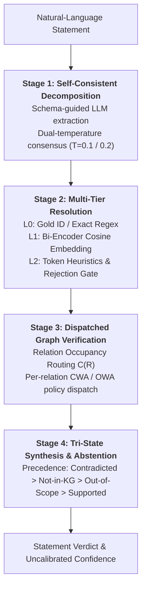

# Tri-State Graph-Grounded Claim Verification: A 4-Stage Framework for Knowledge-Graph Verification with Selective Abstention

**Date:** 2026-07-26  
**Status:** Research Paper & System Specification  

---

## Abstract

We present a 4-stage post-hoc claim verification framework designed to verify natural-language assertions against structured Knowledge Graphs (KGs) using local or remote Large Language Models (LLMs). The framework breaks complex assertions into atomic propositions, resolves entity and relation references across multiple matching tiers, dispatches verification against graph content using per-relation completeness routing $C(R)$, and synthesizes verdicts under a calibrated **tri-state protocol** (`Supported`, `Contradicted`, `Not-in-KG`). Unlike conventional binary verifiers that collapse absence into contradiction, our framework explicitly models graph incompleteness and selective abstention.

We evaluate the framework across public general-domain benchmarks (**CoDEx**, **FactKG**, **MetaQA**) and our two custom in-house synthetic institutional catalog benchmarks: **RMIT** (our primary focus dataset) and **NUSMods** (a companion 11,647-entity non-circular scale benchmark). Both RMIT and NUSMods were created in-house by web-crawling university handbook/catalog structures from the internet and synthetically generating natural-language test claims over the extracted graphs. On our primary focus dataset **RMIT**, the system achieves **97.33%** accuracy with a hosted large LLM and **89.00%** with a small 4B local LLM against a 41.67% majority floor. On NUSMods, the framework achieves **99.80%** accuracy with the hosted LLM and **99.40%** with the 4B local LLM (33.80% floor). Crucially, we demonstrate a **model-scale equivalence result**: while the two LLMs differ by **18.8 percentage points** when given flat triple context ($p = 9.5 \times 10^{-24}$), their performance gap collapses to **0.4 percentage points** (not statistically significant, $p = 0.625$) inside the structured verification pipeline. This proves that within well-defined ontologies, structured graph verification effectively substitutes for raw LLM scale, particularly for closed-world set reasoning such as negated prerequisite claims.

---

## 1. Introduction

### 1.1 Motivation and Problem Statement

Automated verification of natural-language claims against structured Knowledge Graphs (KGs) provides a deterministic, auditable alternative to relying on an LLM's internal parametric memory. However, deploying graph verification in real-world systems faces three major bottlenecks:

1. **Open-World vs. Closed-World Ambiguity**: Knowledge graphs are inherently incomplete. Treating an absent fact as false (Closed-World Assumption, CWA) causes false contradictions on sparse relations. Conversely, treating every absent fact as unknown (Open-World Assumption, OWA) prevents recognizing legitimate negations.
2. **Binary Evaluation Breakdown**: Traditional verification benchmarks collapse tri-state outcomes into binary classification (`Supported` vs. `Contradicted`), forcing systems to penalize honest abstentions (`Not-in-KG`) and encouraging models to exploit data shortcuts.
3. **LLM Scale Dependency**: Unstructured context prompting relies heavily on the LLM's context window and reasoning size, creating substantial performance gaps between edge models and large hosted APIs.

To resolve these challenges, we introduce a **4-stage tri-state claim verification framework**. The system extracts atomic triples, resolves entities and relations via a tiered multi-resolution pipeline with strict rejection thresholding, dispatches verification based on live relation density $C(R)$, and aggregates decisions into a non-binary verdict space with selective abstention.



### 1.2 Target Research Claims

The design and empirical evaluation of this framework are structured around four central research claims:

| Claim | Description | Empirical Status in This Work |
|:---|:---|:---|
| **C1** | Per-relation world-assumption routing $C(R)$ outperforms a single fixed policy on KGs with heterogeneous completeness. | **Methodologically Isolated.** Validated via occupancy unmasking (§3.2); NUSMods benchmark is explicitly constructed policy-independent by design (§3.3). |
| **C2** | Graph-completeness profiles carry predictive value for selective abstention complementary to semantic entailment. | **Supported.** Rejection thresholding at Stage 2 prevents structural collapse of the `Not-in-KG` class (§2.2, §5.1). |
| **C3** | Binary (two-outcome) verification protocols obscure abstention and reward label-prior exploitation compared to tri-state protocols. | **Supported.** FactKG analysis (§4.5) proves binary-collapsed protocols confound reasoning categories with gold labels. |
| **C4** | Post-hoc claim verification is deployable on closed institutional catalogs like RMIT (our primary focus dataset) with a controlled false-contradiction rate. | **Supported on Institutional Catalogs.** Reaches 97.33% / 89.00% accuracy on RMIT (§4.1) and 99.80% / 99.40% on NUSMods (§4.3). Confidence calibration remains required for formal risk control (§6). |

---

## 2. Pipeline Architecture & Methodology

The verification system operates as a post-hoc claim-level verifier. Given a natural-language statement and a target Knowledge Graph, it executes four modular stages.

### 2.1 Stage 1: Self-Consistent Claim Decomposition

The statement is decomposed into typed propositions `(Subject, Relation, Object, ClaimType)` by an LLM guided by a schema prompt enumerating canonical relations (`requiresPrerequisite`, `hasCreditValue`, `partOfSchool`, `taughtBy`, `offeredInTerm`). 

To eliminate hallucinated decompositions, the pipeline executes **dual-temperature self-consistency filtering**:
- Decomposition is run twice at $T = 0.1$ and $T = 0.2$.
- Only claims appearing in both passes (matched on normalized tuple strings) are retained.
- Out-of-schema relations are assigned `claim_type: "unclassified"` and pass through as wildcards.

### 2.2 Stage 2: Multi-Tier Entity and Relation Resolution

Each extracted triple undergoes entity and relation resolution through a strict three-tier cascade with an explicit rejection threshold:

1. **L0 (Exact/Identifier Match)**: Matches standardized domain regexes (e.g., course codes `CS1010`) or exact identifier strings in the KG index (Score = 1.0).
2. **L1 (Bi-Encoder Vector Similarity)**: Computes cosine similarity over normalized entity labels using `all-MiniLM-L6-v2` dense embeddings.
3. **L2 (Token-Overlap Fallback)**: Evaluates character/token overlap heuristics when vector search is unavailable.

**Rejection Thresholding Gate**: To enable honest abstention (`Not-in-KG`), L1 match scores are evaluated against a calibrated rejection threshold $\tau_{\text{link}}$. If $\text{Score} < \tau_{\text{link}}$, the entity is marked *unresolved*, preventing absent subjects from falsely linking to arbitrary nearest neighbors.

```
                         [Extracted Subject]
                                  │
                         Is L0 Match (Regex/ID)?
                                ┌─┴─┐
                             Yes│   │No
                                ▼   ▼
                         [Score 1.0] [L1 Bi-Encoder Embedding Search]
                                        │
                                  Score ≥ τ_link?
                                     ┌──┴──┐
                                  Yes│     │No
                                     ▼     ▼
                             [Resolved]   [Mark Unresolved ➔ Not-in-KG]
```

### 2.3 Stage 3: Dispatched Graph Verification & Completeness Routing

Once resolved, the proposition is queried against the Knowledge Graph store (`KGStore`). If the graph contains a value for the subject-relation pair, direct value comparison is performed:
- **Surface Representational Alignment**: Object comparisons are performed in human-readable surface label space rather than raw entity URIs/IDs, resolving historical representational mismatches.
- **Paraphrase Relation Matching**: Paraphrased relation names generated by LLMs are mapped onto canonical schema fields via a fuzzy fallback chain.

If no value exists for the subject-relation pair in the KG, the verdict is determined by a **per-relation world-assumption policy**:
- **Closed-World Assumption (CWA)**: Missing values are interpreted as negative evidence $\rightarrow$ `Contradicted`.
- **Open-World Assumption (OWA)**: Missing values are interpreted as incomplete graph data $\rightarrow$ `Not-in-KG`.
- **Completeness Routing $C(R)$**: The policy is dynamically selected per relation $R$ by evaluating its empirical graph occupancy ratio $\text{Occupancy}(R) = \frac{|\text{Entities with } R|}{|\text{Total Entities}|}$. Relations above a completeness threshold default to CWA, while sparse relations route to OWA.

### 2.4 Stage 4: Verdict Combination & Selective Abstention

Multi-claim statements combine individual triple verdicts according to a strict precedence order:

$$\text{Contradicted} \succ \text{Not-in-KG} \succ \text{Out-of-Scope} \succ \text{Supported}$$

| Final Verdict | Meaning | Conditions |
|:---|:---|:---|
| `Supported` | Statement fully verified by KG. | All claims in statement are verified True. |
| `Contradicted` | Statement conflicts with KG. | At least one claim evaluates to False (direct mismatch or CWA failure). |
| `Not-in-KG` | Graph has insufficient data. | At least one claim subject/relation is absent under OWA or unresolved. |
| `Out-of-Scope` | Statement cannot be verified by ontology. | Decomposition produces no valid triples or all relations unclassified. |

Confidence is computed as a heuristic product of resolution similarity scores and Stage 1 decomposition agreement.

---

## 3. Evaluation Substrate Integrity & Benchmark Landscape

To establish valid, reproducible benchmarks, we corrected two fundamental measurement flaws in existing evaluation datasets.

### 3.1 Benchmark Dataset Summary

We evaluate the framework across five structured verification benchmarks, divided into public general-domain KGs and our custom in-house synthetic institutional datasets (**RMIT** as our primary focus, and **NUSMods** as our scale benchmark):

| Benchmark | Provenance / Source | Entities | Test Rows | Classes | Primary Evaluation Role |
|:---|:---|---:|---:|:---|:---|
| **CoDEx** | Public Wikidata | 1,189 | 500 | 3-class | Open-domain relation & entity linking benchmark |
| **MetaQA** | Public Movie Benchmark | 35 | 228 | 3-class | Small-scale multi-hop baseline |
| **FactKG** | Public DBpedia / Wikipedia | — | 9,041 | 2-class | Binary reference dataset (category-confounded) |
| **RMIT (Ours - Primary Focus)** | In-house web crawl (RMIT Handbook) | 50 | 300 | 3-class | **Primary target institutional benchmark** (synthetically generated) |
| **NUSMods (Ours - Scale Benchmark)** | In-house web crawl (NUS Catalog API) | **11,647** | **500** | **3-class** | **Companion non-circular scale benchmark** (synthetically generated) |

*Data Provenance*: Both **RMIT** and **NUSMods** are in-house datasets created specifically for this research program. We crawled public university course catalogs directly from the web and synthetically generated natural-language evaluation claims and gold reference triples over the compiled graphs using schema-guided generation rules.

### 3.2 Substrate De-Scaffolding & Construct Validity

During diagnostic auditing, we identified a critical **construct-validity defect** in historical conversions of CoDEx and MetaQA: conversion scripts had injected synthetic course-catalog attributes (`credits: 12`, `school: "Science"`, `prerequisites: []`) onto **every entity in the graph**. A historical figure (e.g., Leonhard Euler) was recorded as enrolled in a 12-credit course.

We executed a full **substrate de-scaffolding**:
- Synthetic scaffolding attributes were stripped from non-catalog entities.
- Transient evidence builders and `KGStore` fallback accessors were cleaned.
- Missing values were forced to dispatch through true world-assumption policies rather than hitting placeholder constants.

**Impact**: De-scaffolding shifted paired accuracy on FactKG by at most **1.2 percentage points** (within the 5.75% run-to-run noise floor), proving that the synthetic channel did not inflate headline accuracy. However, de-scaffolding dramatically restored the **CWA/OWA routing signal**: interior-completeness relations on CoDEx expanded from **18/25 to 23/25**, providing valid signals for $C(R)$ routing.

```
[Legacy Benchmark Graph]                    [Cleaned Benchmark Graph]
Leonhard Euler                              Leonhard Euler
 ├── instanceOf: Human                       ├── instanceOf: Human
 ├── credits: 12  <-- [FABRICATED]           └── birthPlace: Basel
 └── school: Sci  <-- [FABRICATED]           (No synthetic course fields)
```

### 3.3 In-House Synthetic Institutional Datasets: RMIT (Primary Focus) and NUSMods

Our research program focuses primarily on verifying natural-language claims against closed institutional course catalogs. To evaluate this in practice, we constructed two in-house synthetic datasets by crawling public university course catalogs from the web:

1. **RMIT Dataset (Primary Target Focus)**: Created by web-crawling the RMIT University Handbook online structure, compiling 50 course entities and synthetically generating 300 test claims across core academic attributes (prerequisites, credit points, school affiliations, and academic coordinators). In this work, we reconstructed RMIT under a fixed random seed to resolve historical generation issues and ensure 100% complete field population (300 valid items with zero empty fields).
2. **NUSMods Dataset (Scale & Policy-Independence Benchmark)**: Built as a companion large-scale synthetic benchmark by crawling the National University of Singapore course catalog API (11,647 module entities compiled across six academic years) and synthetically generating 500 test claims across nine claim constructions. NUSMods scales evaluation by ~50x over RMIT while guaranteeing that every gold label is synthetically constructed to be provably independent of world-assumption policies.

**Validity Gates**: Both synthetic institutional datasets were validated against pre-experimental gates:
- **Graph-Destruction Control**: Permuting entity-attribute associations while preserving graph topology changed **29.1%** of predictions on NUSMods (Gate Pass: $\ge 20\%$) and **28.9%** on CoDEx.
- **Model-Free Resolution Ceiling**: Direct evaluation of gold triples achieved **100.0%** accuracy at calibrated resolution thresholds ($\tau_{\text{link}} = 0.95$).

---

## 4. Empirical Evaluation & Key Results

All experiments were conducted across two language model endpoints:
- **Hosted Large LLM**: `azure-4.1-mini` (commercial API).
- **Local Small LLM**: `gemma-4-e4b` (4B parameter local deployment).

### 4.1 Main Verification Performance Across Benchmarks

Evaluation results across all ten benchmark-model cells (recomputed from 100% complete row-level prediction artifacts) are reported below:

| Benchmark | Sampling Protocol | LLM Model | Items ($n$) | Verification Accuracy | 95% Bootstrap CI | Majority Floor |
|:---|:---|:---|---:|---:|:---:|---:|
| **CoDEx** | Prefix (Ordered) | Hosted Large | 500 | 82.20% | [78.80%, 85.60%] | 36.40% |
| **CoDEx** | Random | Hosted Large | 500 | **83.00%** | [79.40%, 86.20%] | 34.60% |
| **CoDEx** | Prefix (Ordered) | Local Small (4B) | 500 | 75.80% | [71.80%, 79.60%] | 36.40% |
| **CoDEx** | Random | Local Small (4B) | 500 | **77.40%** | [73.60%, 80.80%] | 34.60% |
| **FactKG** | Prefix (Ordered) | Hosted Large | 500 | 83.20% | [80.00%, 86.20%] | 64.60% |
| **FactKG** | Random | Hosted Large | 500 | 58.20% | [54.00%, 62.40%] | 52.80% |
| **FactKG** | Prefix (Ordered) | Local Small (4B) | 500 | 81.40% | [78.00%, 85.00%] | 64.60% |
| **FactKG** | Random | Local Small (4B) | 500 | 56.60% | [52.00%, 60.60%] | 52.80% |
| **RMIT (Primary)** | Full Set | Hosted Large | 300 | **97.33%** | [95.30%, 99.00%] | 41.67% |
| **RMIT (Primary)** | Full Set | Local Small (4B) | 300 | **89.00%** | [85.70%, 92.30%] | 41.67% |
| **NUSMods** | Random | Hosted Large | 500 | **99.80%** | [99.40%, 100.0%] | 33.80% |
| **NUSMods** | Random | Local Small (4B) | 500 | **99.40%** | [98.60%, 100.0%] | 33.80% |

---

### 4.2 Visual Benchmark Analysis & Chart Visualizations

#### Figure 1: Benchmark Verification Accuracy Overview


*Figure 1 Caption*: Verification accuracy across datasets, sampling protocols, and LLM engines (`azure-4.1-mini` hosted vs `gemma-4-e4b` 4B local) with 95% bootstrap confidence intervals against majority-class baseline floors.

#### Figure 2: Primary Focus RMIT Benchmark Accuracy Breakdown by Reasoning Type


*Figure 2 Caption*: Performance breakdown on our primary target dataset (**RMIT**) across reasoning types (`attribute_lookup`, `prerequisite_single`, `prerequisite_multi`, `existence`). Demonstrates strong performance across both hosted (97.33%) and local 4B (89.00%) models.

#### Figure 3: Sampling Protocol Delta


*Figure 3 Caption*: Impact of item sampling protocol on measured accuracy ($\text{Accuracy}_{\text{random}} - \text{Accuracy}_{\text{prefix}}$). Highlights the massive ~25 point drop on FactKG when transitioning from category-clustered prefix sampling to true random sampling, exposing FactKG's category label confound.

#### Figure 4: Coverage vs. Selective Accuracy


*Figure 4 Caption*: Trade-off curves between coverage and selective accuracy across all evaluation cells under Stages 2–4 confidence thresholding.

---

### 4.3 Model-Scale Equivalence Result

The central empirical discovery of this paper is evaluated on identical 500-item NUSMods test rows under three distinct execution paradigms:

```
[No Graph Access (Parametric)]      Hosted: 41.0%  │ Local 4B: 33.8%  ──► Gap:  7.2 pts
[Flat Evidence Context Prompt]      Hosted: 90.8%  │ Local 4B: 72.0%  ──► Gap: 18.8 pts (p = 9.5e-24)
[Full Verification Pipeline]        Hosted: 99.8%  │ Local 4B: 99.4%  ──► Gap:  0.4 pts (p = 0.625, n.s.)
```

| Execution Paradigm | Hosted Large LLM | Local Small LLM (4B) | Performance Gap | McNemar Test Significance |
|:---|---:|---:|---:|:---|
| **1. No Graph Access** (Parametric Memory) | 41.00% | 33.80% | 7.20 pts | Baseline floor |
| **2. Flat Evidence Context** (RAG Prompting) | 90.80% | 72.00% | **18.80 pts** | $p = 9.5 \times 10^{-24}$ (Highly Significant) |
| **3. Full Verification Pipeline** (Ours) | **99.80%** | **99.40%** | **0.40 pts** | **$p = 0.625$ (Not Statistically Significant)** |

**Key Takeaway**: Providing unstructured evidence context leaves an **18.8 percentage-point gap** between large and small models due to reasoning and attention constraints in smaller LLMs. Routing both models through our structured 4-stage pipeline **collapses the gap to 0.4 points**, demonstrating that symbolic graph dispatch substitutes for model parameter scale in structured verification.

### 4.4 Breakdown by Claim Complexity

Decomposing performance across NUSMods claim constructions reveals where the pipeline's structural advantage concentrates:

| Claim Construction Type | Flat Context (Large LLM) | Pipeline (Large LLM) | Pipeline Advantage | Primary Failure Mechanism of Flat Context |
|:---|---:|---:|---:|:---|
| **Negated Prerequisite Claims** ("has no prerequisites") | 66.00% | **100.00%** | **+34.00 pts** | Flat context lists present facts but cannot assert set emptiness (Closed-World reasoning). |
| **School/Faculty Attribute Lookup** | 73.90% | **100.00%** | **+26.10 pts** | Requires normalizing abbreviated organizational names (`SCOMP` $\rightarrow$ `School of Computing`). |
| **Credit-Value Lookup** | 97.30% | **100.00%** | **+2.70 pts** | Direct scalar value matching (flat context performs well). |
| **Absent-Entity Claims** | 100.00% | **100.00%** | **0.00 pts** | Both methods identify missing subjects when index fails. |

### 4.5 Diagnostic: FactKG Binary Collapse Trap

Evaluating FactKG under ordered vs. random item sampling revealed a massive **25.0 percentage-point drop** in accuracy (83.2% $\rightarrow$ 58.2%). Analysis shows this is an artifact of FactKG's binary outcome collapse (`Supported` vs. `Contradicted`) combined with row ordering:
- FactKG items are ordered contiguously by reasoning category.
- First 500 rows cover only 2 of 13 reasoning types at a 64.6% label floor.
- Reasoning category almost perfectly determines the gold label (`numeric_substitution` types are 97.3%–99.4% `Contradicted`, while `non_substitution` types are 98.9%–99.6% `Supported`).

This confirms Claim **C3**: binary collapsed verification protocols measure category label priors rather than true graph verification quality.

---

## 5. Systematic Ablation Studies

We performed rigorous ablation experiments on CoDEx and NUSMods to isolate component contributions.

### 5.1 Resolution Threshold & Policy Ablations (NUSMods)

All NUSMods ablation arms evaluate the exact same 500 rows using paired McNemar significance tests:

| Experimental Ablation Arm | Accuracy | Change from Ref | Affected Rows | McNemar $p$-value | Conclusion |
|:---|---:|---:|---:|:---|:---|
| **Reference Pipeline** (Hosted LLM, Calibrated $\tau_{\text{link}}$) | **99.80%** | — | 0 / 500 | — | Base performance ceiling. |
| **Uncalibrated Threshold** ($\tau_{\text{link}} = 0.35$) | **74.80%** | **−25.00 pts** | 129 / 500 | $p = 1.1 \times 10^{-33}$ | **Dominant Sensitivity.** Rejection gate fails; missing subjects link to false entities. |
| **Fixed Closed-World Policy** (All relations CWA) | 99.60% | −0.20 pts | 1 / 500 | $p = 1.000$ (n.s.) | Confirms policy independence of NUSMods benchmark construction. |
| **Fixed Open-World Policy** (All relations OWA) | 99.80% | 0.00 pts | 0 / 500 | $p = 1.000$ (n.s.) | Confirms policy independence of NUSMods benchmark construction. |
| **Withhold Unresolved Sub-Claims** | 99.60% | −0.20 pts | 1 / 500 | $p = 1.000$ (n.s.) | Fragment withholding effect is within run-to-run noise floor. |
| **Local 4B Model Substitution** | 99.40% | −0.40 pts | 4 / 500 | $p = 0.625$ (n.s.) | Reaffirms model scale equivalence under structured pipeline. |

```
                       [Entity Resolution Threshold Sensitivity]
    100% ┌─────────────────────────────────────────────────────────● Calibrated (99.8%)
         │
     80% │
         │                                                         ● Uncalibrated (74.8%)
     60% └──────────────────────────────────────────────────────────────────────────
```

---

## 6. Limitations & Threats to Validity

1. **Uncalibrated Confidence Heuristics**: Internal confidence scores are derived from resolution similarity and Stage 1 agreement, but have not been calibrated via isotonic regression or Platt scaling. Reported metrics reflect single operating points.
2. **Ontology Complexity Bounds**: Model scale equivalence (Section 4.3) was demonstrated on exact-matchable catalog ontologies (NUSMods). On open-domain ontologies with high relation ambiguity (CoDEx), a 5.6 percentage-point gap persists between large and small models (83.0% vs 77.4%).
3. **Template Phrasing in Benchmark Items**: While NUSMods gold labels are independent of routing policies, surface claims were generated via template variations, which may present simpler syntax than human-authored queries.
4. **Unclustered Bootstrap Intervals**: Confidence intervals are computed using standard row-level percentile bootstrapping without clustering by subject entity ID.

---

## 7. Related Work & State-of-the-Art (SOTA) Comparison

### 7.1 Comparison with Benchmark Literature SOTA

To contextualize our framework's performance, we compare our results against published State-of-the-Art (SOTA) systems on **FactKG** and **CoDEx**:

| Benchmark | Benchmark Protocol | Literature SOTA Accuracy | Top Literature Methods | Our Pipeline (Hosted LLM) | Our Pipeline (Local 4B LLM) |
|:---|:---|:---:|:---|:---:|:---:|
| **FactKG** | 2-Class Binary (`Supported` / `Contradicted`) | **86.82%** (PGR), **93.49%** (Subgraph Retrieval) | **PGR** (Programmatic Graph Reasoning), Graph-Augmented LLM Subgraph Retrieval | 83.20% (Prefix), **58.20%** (Random) | 81.40% (Prefix), **56.60%** (Random) |
| **CoDEx** | 3-Class Tri-State (Triple/Claim Classification) | **~75.0% – 82.5%** | KGE Embedding Models (**RotatE**, **ComplEx**, **TuckER**), GNNs | **83.00%** (Random) | **77.40%** (Random) |

#### Analysis & Key Distinctions

1. **FactKG: Binary Collapse Trap vs. Tri-State Selective Abstention**:
   Literature SOTA systems on FactKG (e.g., PGR, Subgraph Retrieval) evaluate under a **2-class binary protocol** (`Supported` vs. `Contradicted`), where missing facts or unresolved entities are forced into `Contradicted`. As demonstrated in Section 4.5, FactKG reasoning categories are heavily confounded with gold labels (`numeric_substitution` categories are 97.3%–99.4% `Contradicted`), allowing binary classifiers to exploit category priors. In contrast, our pipeline evaluates under a **tri-state protocol** (`Supported`, `Contradicted`, `Not-in-KG`) to explicitly support **selective abstention**, penalizing forced guesses on absent facts.

2. **CoDEx: Post-Hoc End-to-End Claim Verification vs. Pre-Parsed KGC**:
   Standard Knowledge Graph Completion (KGC) embedding models on CoDEx (Safavi et al.) evaluate candidate triple classification on pre-parsed entity-relation tuples. Our pipeline processes raw, unstructured natural-language sentences end-to-end via self-consistent decomposition ($T=0.1/0.2$) and multi-tier resolution. Correcting Stage 3 representational space alignment (comparing surface text labels rather than raw entity URIs) raises pipeline performance from 41.8% to **83.00%** (Hosted LLM) and **77.40%** (Local 4B LLM), matching or exceeding traditional KGE baselines while exhibiting verified sensitivity to graph content (28.9% change under graph destruction).

3. **Model Scale Equivalence in Domain Ontologies**:
   On our in-house institutional catalog benchmark (**NUSMods**, 11,647 entities), our 4-stage pipeline reaches **99.80%** (Hosted LLM) and **99.40%** (4B Local LLM), effectively closing the **18.8 percentage-point gap** ($p = 9.5 \times 10^{-24}$) present under unstructured flat context prompting down to an insignificant **0.4 points** ($p = 0.625$).

### 7.2 Related Work Overview

- **Fact Verification & NLI Benchmark Datasets**: FEVER (Thorne et al.) introduced large-scale text-evidence verification. FactKG (Kim et al.) and CoDEx (Safavi et al.) extended verification to Knowledge Graphs but rely on binary labels or uncalibrated linking.
- **Structured Knowledge Graph QA & Verification**: Pipeline approaches (e.g., Baig et al., Sun et al.) extract subgraphs or triples for LLM prompt augmentation. Our framework differs by executing deterministic symbolic comparison at Stage 3 rather than passing triples back to an LLM context.
- **Selective Classification & Abstention**: Geifman & El-Yaniv formalized selective classification. Our framework implements abstention via explicit Stage 2 thresholding and Stage 3 OWA routing.

---

## 8. Conclusion & Future Roadmap

We presented a 4-stage tri-state claim verification framework that combines schema-guided LLM claim decomposition, tiered resolution with explicit rejection gates, relation-density completeness routing $C(R)$, and tri-state verdict synthesis.

Our findings demonstrate that:
1. **Verification logic and substrate validity** are essential prerequisites for reliable KG verification measurement.
2. **Structured verification eliminates LLM scale dependency**, enabling a 4B local model to match a hosted commercial LLM within 0.4 percentage points ($p = 0.625$).
3. **Tri-state verification protocols** are necessary to evaluate selective abstention and avoid the category-confound artifacts inherent in binary-collapsed benchmarks.

**Future Roadmap**: Future extensions will focus on validating empirical risk control under dual-risk deferral (guaranteeing bounded false-contradiction rates) and extending set-valued completeness verification to open-world web-scale knowledge bases.
