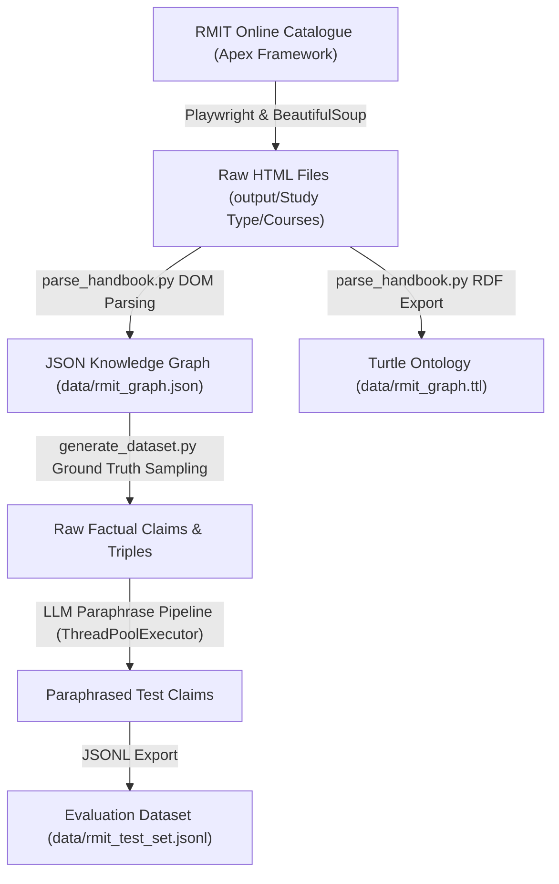
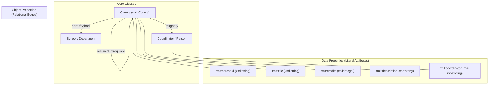

# RMIT Course Handbook Dataset Creation Process

This document provides a comprehensive end-to-end technical guide to the construction of the **RMIT Course Handbook Dataset** (`data/rmit_test_set.jsonl`). The dataset is designed to evaluate tri-state factual verification systems (`Supported`, `Contradicted`, `Not-in-KG`), selective abstention calibration, and semantic graph reasoning over structured university catalog data.

---

## 1. Overview & Dataset Architecture

The RMIT dataset generation process transforms raw web handbook pages into structured Knowledge Graphs (JSON and RDF Turtle) and subsequently synthesizes natural language test samples spanning **6 distinct reasoning categories**.



### Key Dataset Statistics
- **Total Test Samples**: 300 instances (100 one-hop, 50 conjunction, 50 existence, 50 multi-hop, 50 negation).
- **Reasoning Categories**: `one-hop` (100), `conjunction` (50), `existence` (50), `multi-hop` (50), `negation` (50).
- **Target Label Distribution**: 
  - `Supported`: 125 samples
  - `Contradicted`: 125 samples
  - `Not-in-KG`: 50 samples
- **Underlying Graph**: 50 fully parsed course nodes (`data/rmit_graph.json`, MC271 curriculum and 50-course prerequisite closure graph).

---

## 2. Knowledge Graph Ontology

The RMIT Knowledge Graph models course metadata, school organizational structures, personnel contacts, and prerequisite dependencies.

### Ontology Schema & Relationships Diagram



### RDF Predicates Reference Table

| Predicate | Type | Domain | Range | Description |
| :--- | :--- | :--- | :--- | :--- |
| `rmit:courseId` | Datatype Property | `rmit:Course` | `xsd:string` | Unique 6-digit course identifier code (e.g. `"004065"`). |
| `rmit:title` | Datatype Property | `rmit:Course` | `xsd:string` | Official course name title. |
| `rmit:credits` | Datatype Property | `rmit:Course` | `xsd:integer` | Unit credit points value (typically `12` or `24`). |
| `rmit:school` / `partOfSchool` | Object Property / Attribute | `rmit:Course` | `xsd:string` | Academic department offering the course. |
| `rmit:coordinator` / `taughtBy` | Object Property / Attribute | `rmit:Course` | `xsd:string` | Name of the primary course coordinator. |
| `rmit:coordinatorEmail` / `email` | Datatype Property | `Person` | `xsd:string` | Official institutional email contact for the coordinator. |
| `rmit:requiresPrerequisite` | Object Property | `rmit:Course` | `rmit:Course` | Prerequisite course required prior to enrollment. |
| `rmit:description` | Datatype Property | `rmit:Course` | `xsd:string` | Full textual course overview. |

---

## 3. Phase 1: Web Crawling & Data Acquisition

The first phase scrapes course handbook pages from the RMIT University course directory using [crawler.py](../crawler.py).

### Crawling Pipeline (`crawler.py`)
1. **Browser Automation**: Uses `playwright` (`async_playwright`) to execute headless browser sessions capable of handling JavaScript-rendered Oracle APEX pages.
2. **Category Traversal**: Discovers study categories ("Study Type" / "Courses") and paginates through tables to locate course URLs.
3. **State Checkpointing**: Implements a robust `save_checkpoint` / `load_checkpoint` system writing to `output/checkpoint.json` to enable zero-data-loss resume on timeouts or network drops.
4. **Output Structure**: HTML source pages for each course code are cleaned using BeautifulSoup and saved locally under `output/Study Type/Courses/<course_code>_<title>.html`.

---

## 4. Phase 2: HTML Parsing & Knowledge Graph Construction

The raw HTML pages are parsed by [parse_handbook.py](../parse_handbook.py) to extract entities, literal attributes, and relational edges into a structured graph.

### Extraction Logic
DOM elements with standard RMIT APEX element IDs are queried using `BeautifulSoup`:

| Entity / Attribute | Target DOM Element ID / Regex | Example Extracted Value |
| :--- | :--- | :--- |
| **Course Code** | `#P6_COURSE_CODE` (Fallback: filename regex `^(\d+)`) | `"004065"` |
| **Course Title** | `#P6_TITLE` | `"Programming 1"` |
| **Credit Points** | `#P6_HE_UNITS` (Fallback default: 12) | `12` |
| **School / Dept** | `#P6_HE_DEPARTMENT` | `"Computing Technologies"` |
| **Coordinator** | `#P6_WD_PERSON_FULL_NAME` | `"Andy Song"` |
| **Coordinator Email** | `#P6_WD_PERSON_EMAIL_CONTACTS` | `"andy.song@rmit.edu.au"` |
| **Course Description** | `#P6_HE_COURSE_CRSE_DESCR` / `#P6_VE_COURSE_CRSE_DESCR` | Clean unescaped text description |
| **Prerequisites** | `#P6_HE_COURSE_PRIOR_KNOWLEDGE` (Extracted via link URL `p6_code` query param & regex `Course ID \d+`) | `[{"course_id": "054079", "title": "COSC2801..."}]` |

### Knowledge Graph Storage Formats

1. **JSON Knowledge Graph**: [data/rmit_graph.json](../data/rmit_graph.json) (Keyed by 6-digit Course ID):
   ```json
   {
     "004065": {
       "course_id": "004065",
       "title": "Programming 1",
       "credits": 12,
       "school": "Computing Technologies",
       "coordinator": "Andy Song",
       "coordinator_email": "andy.song@rmit.edu.au",
       "prerequisites": [
         {"course_id": "054079", "title": "Programming Bootcamp 1"}
       ]
     }
   }
   ```

2. **RDF Turtle Ontology**: [data/rmit_graph.ttl](../data/rmit_graph.ttl) (Standard Semantic Web graph with custom prefix `@prefix rmit: <http://rmit.edu.au/handbook/>`):
   ```turtle
   rmit:C004065 a rmit:Course ;
       rmit:courseId "004065" ;
       rmit:title "Programming 1" ;
       rmit:credits 12 ;
       rmit:school "Computing Technologies" ;
       rmit:coordinator "Andy Song" ;
       rmit:coordinatorEmail "andy.song@rmit.edu.au" ;
       rmit:requiresPrerequisite rmit:C054079 .
   ```

---

## 5. Phase 3: Synthetic Dataset Generation & Paraphrasing

The dataset generation script [generate_dataset.py](../generate_dataset.py) loads the parsed Knowledge Graph via [kg_store.py](../kg_store.py) and generates factual claims across 6 reasoning categories.

### 1. The 6 Reasoning Categories & Perturbation Rules

> [!NOTE]
> Every sample contains ground-truth RDF-style triples `[Subject, Predicate, Object]` to support automatic claim decomposition matching during evaluation.

1. **One-Hop (`one-hop`)**
   - **Supported**: Claims asserting the exact course credit value (`hasCreditValue`).
   - **Contradicted**: Flips credit points value (e.g. changes 12 to 24, or 24 to 12).
2. **Conjunction (`conjunction`)**
   - **Supported**: Asserts both a prerequisite course (`requiresPrerequisite`) and school affiliation (`partOfSchool`).
   - **Contradicted**: Keeps valid prerequisite but alters school name (e.g., changes "Computing Technologies" to "Business").
3. **Existence (`existence`)**
   - **Supported**: Asserts existence of course coordinator (`taughtBy`) and correct email address (`email`).
   - **Contradicted**: Keeps coordinator name but injects a fake email (`fake_address@rmit.edu.au`).
4. **Multi-Hop (`multi-hop`)**
   - **Supported**: Queries a 2-hop prerequisite dependency path ($A \xrightarrow{\text{prereq}} B \xrightarrow{\text{prereq}} C$).
   - **Contradicted**: Replaces the second-hop target $C$ with an incorrect course code.
5. **Negation (`negation`)**
   - **Supported**: Samples courses with no prerequisites and explicitly asserts they have no prerequisites.
   - **Contradicted**: Samples courses *with* prerequisites and falsely claims they require no prerequisites.
6. **Out-of-Scope / Not-in-KG (`one-hop` / `Not-in-KG`)**
   - **Not-in-KG**: Generates synthetic 6-digit course IDs ($900000+$) with topics outside the catalogue (e.g. "Quantum Machine Learning"). Triples list is left empty `[]`.

### 2. Natural Language LLM Paraphrasing

To prevent models from relying on simple template-matching, raw synthetic claims are paraphrased using [llm_client.py](../llm_client.py):

- **System Prompt**:
  > *"You are an administrative assistant. Paraphrase the provided factual statement into a natural-sounding query, question, or statement that a university student or administrator might write. Do not change the core facts, names, or codes. Respond with the paraphrased sentence ONLY."*
- **Execution**: Run concurrently using `concurrent.futures.ThreadPoolExecutor(max_workers=10)` to efficiently process 300 claims.

---

## 6. Dataset Schema Definition

The generated dataset is exported to JSON Lines format: [data/rmit_test_set.jsonl](../data/rmit_test_set.jsonl). Each line represents a JSON object conforming to the standard schema:

```typescript
interface RMITTestSample {
  id: string;              // Format: "rmit-{reasoning_type}-{gold_label}-{index}"
  dataset: string;         // Always "rmit_handbook"
  input_type: string;      // Always "response"
  text: string;            // Paraphrased natural language claim/query
  raw_claim: string;       // Unparaphrased template factual claim
  gold_label: string;      // Target verdict: "Supported" | "Contradicted" | "Not-in-KG"
  reasoning_type: string;  // "one-hop" | "conjunction" | "existence" | "multi-hop" | "negation"
  triples: string[][];     // Ground-truth triples array [[subject, predicate, object], ...]
}
```

---

## 7. Concrete Dataset Examples

Below are actual sample entries extracted directly from [data/rmit_test_set.jsonl](../data/rmit_test_set.jsonl):

### Example 1: One-Hop (Supported)
```json
{
  "id": "rmit-one-hop-supported-0",
  "dataset": "rmit_handbook",
  "input_type": "response",
  "text": "How many credit points is Course 038974 (Programming A) worth?",
  "raw_claim": "Course 038974 (Programming A) is worth 12 credit points.",
  "gold_label": "Supported",
  "reasoning_type": "one-hop",
  "triples": [
    ["038974", "hasCreditValue", "12"]
  ]
}
```

### Example 2: Conjunction (Contradicted)
```json
{
  "id": "rmit-conjunction-contradicted-95",
  "dataset": "rmit_handbook",
  "input_type": "response",
  "text": "Is course 045682 required for course 004068 (Advanced Programming Techniques), and is it offered by the School of Business?",
  "raw_claim": "Course 004068 requires 045682 (Programming Fundamentals) and is offered by the School of Business.",
  "gold_label": "Contradicted",
  "reasoning_type": "conjunction",
  "triples": [
    ["004068", "requiresPrerequisite", "045682"],
    ["004068", "partOfSchool", "Computing Technologies"]
  ]
}
```

### Example 3: Existence (Contradicted)
```json
{
  "id": "rmit-existence-contradicted-140",
  "dataset": "rmit_handbook",
  "input_type": "response",
  "text": "Is Ziqi Xu listed as a coordinator in the RMIT catalogue with the email fake_address@rmit.edu.au?",
  "raw_claim": "There exists a coordinator named Ziqi Xu with email fake_address@rmit.edu.au in the RMIT catalogue.",
  "gold_label": "Contradicted",
  "reasoning_type": "existence",
  "triples": [
    ["052878", "taughtBy", "Ziqi Xu"],
    ["Ziqi Xu", "email", "ziqi.xu@rmit.edu.au"]
  ]
}
```

### Example 4: Multi-Hop (Supported)
```json
{
  "id": "rmit-multi-hop-supported-151",
  "dataset": "rmit_handbook",
  "input_type": "response",
  "text": "Is course 053543 required as a prerequisite before I can enroll in 056577 (Artificial Intelligence)?",
  "raw_claim": "The prerequisite course of 056577 (Artificial Intelligence) requires course 053543 as a prerequisite.",
  "gold_label": "Supported",
  "reasoning_type": "multi-hop",
  "triples": [
    ["056577", "requiresPrerequisite", "004302"],
    ["004302", "requiresPrerequisite", "053543"]
  ]
}
```

### Example 5: Negation (Supported)
```json
{
  "id": "rmit-negation-supported-201",
  "dataset": "rmit_handbook",
  "input_type": "response",
  "text": "Does Course 054079 (Java Programming Bootcamp) have any prerequisite courses?",
  "raw_claim": "Course 054079 (Java Programming Bootcamp) does not require any prerequisite courses.",
  "gold_label": "Supported",
  "reasoning_type": "negation",
  "triples": []
}
```

### Example 6: Out-of-Scope / Not-in-KG
```json
{
  "id": "rmit-one-hop-not-in-kg-251",
  "dataset": "rmit_handbook",
  "input_type": "response",
  "text": "Is Course 984102 (Quantum Machine Learning) offered during Semester 3?",
  "raw_claim": "Course 984102 (Quantum Machine Learning) is offered in Semester 3.",
  "gold_label": "Not-in-KG",
  "reasoning_type": "one-hop",
  "triples": []
}
```

---

## 8. Evaluation Protocol & Repository Guidelines

When running verification evaluations using [eval_rmit.py](../eval_rmit.py) or [eval_harness.py](../eval_harness.py), the following mandatory workspace guidelines apply:

> [!IMPORTANT]
> **Workspace Behavioral Guidelines**:
> 1. **Forced-Decision Label Normalization**: When evaluating binary classification datasets, map pipeline uncertainty outcomes (`Not-in-KG`, `Out-of-scope`) to `Contradicted`.
> 2. **Confidence Interval Reporting**: Only claim accuracy deltas as valid findings if they exceed the 95% Confidence Interval noise band (calculated via 1,000 bootstrap iterations).
> 3. **Separation of Coverage & Selective Accuracy**: Report pipeline results split into **Coverage** (fraction of resolved, in-scope claims) and **Selective Accuracy** (accuracy computed strictly on the covered subset).
> 4. **Virtual Environment Execution**: Execute evaluation scripts using the local virtual environment Python binary:
>    ```powershell
>    & .venv\Scripts\python.exe generate_dataset.py --num-per-type 50
>    & .venv\Scripts\python.exe eval_rmit.py
>    ```

---

## 9. Summary of How to Reproduce

To regenerate the RMIT Knowledge Graph and Dataset from scratch:

1. **Step 1: Scrape Catalogue Pages** (Optional if local HTML pages exist):
   ```powershell
   & .venv\Scripts\python.exe crawler.py --output-dir "output"
   ```
2. **Step 2: Parse HTML to KG Formats**:
   ```powershell
   & .venv\Scripts\python.exe parse_handbook.py
   ```
   *Generates `data/rmit_graph.json` and `data/rmit_graph.ttl`.*

3. **Step 3: Synthesize & Paraphrase Test Set**:
   ```powershell
   & .venv\Scripts\python.exe generate_dataset.py --num-per-type 50
   ```
   *Generates `data/rmit_test_set.jsonl` with 300 test samples.*

4. **Step 4: Run Verification Evaluation**:
   ```powershell
   & .venv\Scripts\python.exe eval_rmit.py
   ```
