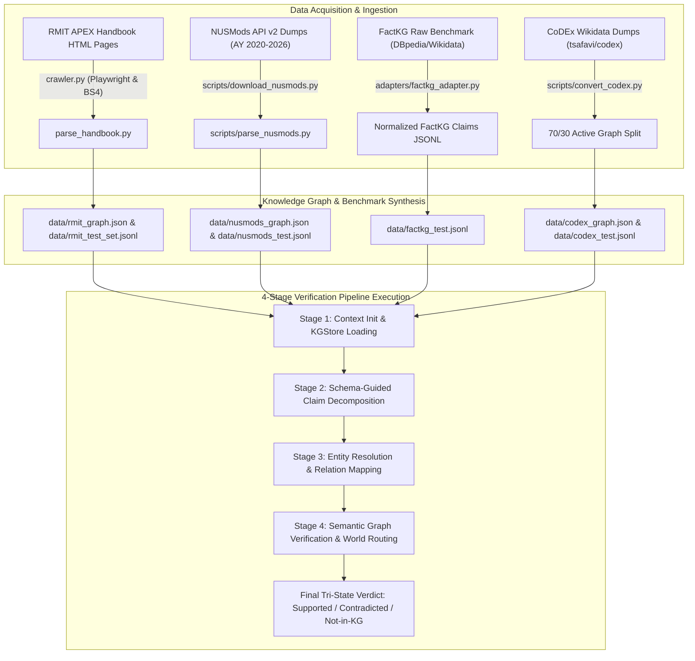
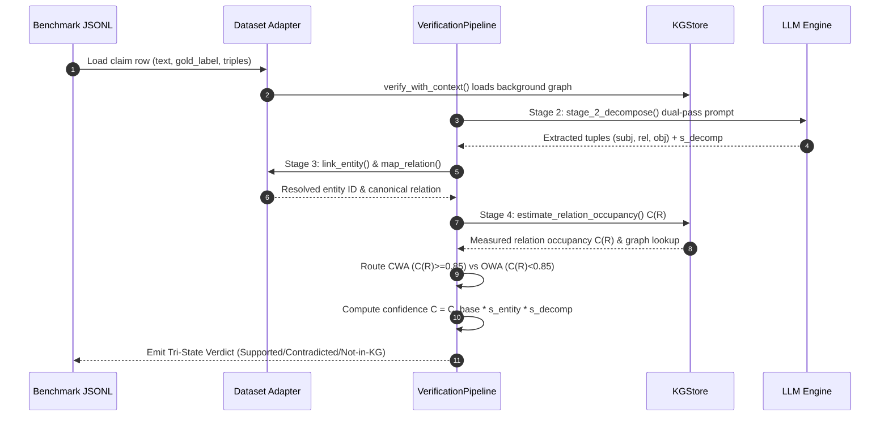

# Synthetic Data & Benchmark Construction Guide: Comprehensive Technical Manual

This manual provides an end-to-end, exhaustive technical specification of how synthetic factual claim datasets are generated from institutional university catalogs (**RMIT Handbook** and **NUSMods**), how open Knowledge Graph (KG) benchmarks (**FactKG** and **CoDEx-S**) are constructed and adapted into tri-state evaluation suites, and how all datasets interface with our 4-stage Knowledge Graph Fact-Verification Pipeline.

---

## 1. Overview & Data Pipeline Architecture

Our framework evaluates natural-language assertion verification against structured Knowledge Graphs under dynamic world-assumption semantics (Closed-World Assumption vs. Open-World Assumption). To evaluate tri-state factual verification (`Supported`, `Contradicted`, `Not-in-KG`) and selective abstention calibration, datasets must provide:

1. **Structured Knowledge Graph Storage**: A queryable background store ([`kg_store.py`](file:///c:/Users/Admin/Desktop/crawler/kg_store.py)) holding entities, relational edges, and literal attributes.
2. **Tri-State Test Claims**: Natural language assertions paired with gold labels (`Supported`, `Contradicted`, `Not-in-KG`), reasoning categories, and ground-truth triples.
3. **Relation Completeness Profiles**: Background occupancy measurements $C(R) \in [0, 1]$ per relation to drive Stage-4 world-assumption routing.



### Dataset Taxonomy Matrix

| Dataset | Domain / Provenance | Primary Graph File | Test Benchmark File | Target Label Schema | Primary Ontology Relations |
| :--- | :--- | :--- | :--- | :--- | :--- |
| **RMIT** | RMIT Handbook (APEX Crawl) | [`data/rmit_graph.json`](file:///c:/Users/Admin/Desktop/crawler/data/rmit_graph.json) | [`data/rmit_test_set.jsonl`](file:///c:/Users/Admin/Desktop/crawler/data/rmit_test_set.jsonl) | Tri-State (`Supported`, `Contradicted`, `Not-in-KG`) | `hasCreditValue`, `partOfSchool`, `requiresPrerequisite`, `taughtBy`, `offeredInTerm` |
| **NUS / Catalog2** | NUSMods API v2 (11,600+ modules) | [`data/nusmods_graph.json`](file:///c:/Users/Admin/Desktop/crawler/data/nusmods_graph.json) | [`data/nusmods_test.jsonl`](file:///c:/Users/Admin/Desktop/crawler/data/nusmods_test.jsonl) | Tri-State (`Supported`, `Contradicted`, `Not-in-KG`) | `hasCreditValue`, `partOfSchool`, `requiresPrerequisite`, `department`, `preclusions`, `semesters` |
| **FactKG** | DBpedia / Wikidata Fact Triples | Grounding KG Store | [`data/factkg_test.jsonl`](file:///c:/Users/Admin/Desktop/crawler/data/factkg_test.jsonl) | Tri-State / Binary (`Supported`, `Contradicted`) | Open DBpedia Relations (`birthPlace`, `successor`, `spouse`, `founded`, etc.) |
| **CoDEx-S** | Wikidata Open KG Subset | [`data/codex_graph.json`](file:///c:/Users/Admin/Desktop/crawler/data/codex_graph.json) | [`data/codex_test.jsonl`](file:///c:/Users/Admin/Desktop/crawler/data/codex_test.jsonl) | Tri-State (`Supported`, `Contradicted`, `Not-in-KG`) | Wikidata Properties (`P17` country, `P36` capital, `P19` birth place, `P26` spouse, etc.) |

---

## 2. Institutional Catalog Synthetic Data Generation

Institutional course catalogs feature high attribute density, structured codes, and explicit prerequisite rules. We synthesize natural language benchmarks from two major universities: **RMIT University** (Australia) and the **National University of Singapore (NUS)**.

---

### 2.1 RMIT Handbook Dataset Creation (`RMIT`)

- **Primary Pipeline Scripts**: [`crawler.py`](file:///c:/Users/Admin/Desktop/crawler/crawler.py), [`parse_handbook.py`](file:///c:/Users/Admin/Desktop/crawler/parse_handbook.py), [`generate_dataset.py`](file:///c:/Users/Admin/Desktop/crawler/generate_dataset.py)
- **Output Files**: [`data/rmit_graph.json`](file:///c:/Users/Admin/Desktop/crawler/data/rmit_graph.json), [`data/rmit_graph.ttl`](file:///c:/Users/Admin/Desktop/crawler/data/rmit_graph.ttl), [`data/rmit_test_set.jsonl`](file:///c:/Users/Admin/Desktop/crawler/data/rmit_test_set.jsonl)

#### Step 1: Web Crawling (`crawler.py`)
1. **Playwright Automation**: Launches a headless browser (`async_playwright`) to traverse Oracle APEX dynamic web tables across RMIT study categories ("Study Type / Courses").
2. **HTML Extraction**: Scrapes individual course handbook pages and cleans DOM trees using `BeautifulSoup`.
3. **Local Storage & Checkpointing**: Writes raw course HTML files to `output/Study Type/Courses/<course_code>_<title>.html` with progress saved in `output/checkpoint.json`.

#### Step 2: HTML Parsing & Knowledge Graph Compilation (`parse_handbook.py`)
1. DOM element queries extract structured course attributes:
   - **Course Code**: `#P6_COURSE_CODE` (e.g., `"053802"`)
   - **Course Title**: `#P6_TITLE` (e.g., `"Computational Machine Learning"`)
   - **Credit Points**: `#P6_HE_UNITS` (e.g., `12`)
   - **School**: `#P6_HE_DEPARTMENT` (e.g., `"Computing Technologies"`)
   - **Prerequisites**: Text normalization of `#P6_PREREQUISITE` using 6-digit regex pattern `\b\d{6}\b`.
2. Emits dual graph representations:
   - JSON Graph ([`data/rmit_graph.json`](file:///c:/Users/Admin/Desktop/crawler/data/rmit_graph.json)) for fast runtime lookup in [`kg_store.py`](file:///c:/Users/Admin/Desktop/crawler/kg_store.py).
   - Turtle RDF ([`data/rmit_graph.ttl`](file:///c:/Users/Admin/Desktop/crawler/data/rmit_graph.ttl)) adhering to the `rmit:` namespace ontology.

#### Step 3: Synthetic Claim Generation & LLM Paraphrasing (`generate_dataset.py`)
Command to execute:
```bash
python generate_dataset.py --num-per-type 50 --seed 42 --provider azure --model gpt-4o
```

The generator samples ground-truth triples from [`data/rmit_graph.json`](file:///c:/Users/Admin/Desktop/crawler/data/rmit_graph.json) and generates 50 samples for each of the 6 reasoning categories (300 total samples):

```python
# 1. ONE-HOP GENERATION (50 samples: 25 Supported, 25 Contradicted)
# Supported: Course C is worth C['credits'] credit points.
# Contradicted: Swaps 12 credits to 24 (or 24 to 12).

# 2. CONJUNCTION GENERATION (50 samples: 25 Supported, 25 Contradicted)
# Supported: Course C requires Prereq P AND is offered by School S.
# Contradicted: Keeps Prereq P, but mutates School S to "Business" or "Science".

# 3. EXISTENCE GENERATION (50 samples: 25 Supported, 25 Contradicted)
# Supported: There exists a coordinator C with email E.
# Contradicted: Keeps coordinator C, but mutates email to "fake_address@rmit.edu.au".

# 4. MULTI-HOP GENERATION (50 samples: 25 Supported, 25 Contradicted)
# Supported: Prerequisite course of A (which is B) requires C as prerequisite.
# Contradicted: Mutates second-hop prerequisite ID C to a wrong course code.

# 5. NEGATION GENERATION (50 samples: 25 Supported, 25 Contradicted)
# Supported: Course with no prerequisites asserts "does not require any prerequisite courses."
# Contradicted: Course WITH prerequisites asserts "does not require any prerequisite courses."

# 6. NOT-IN-KG VERDICTS (50 samples)
# Asserts claims for synthetic non-existent 6-digit course IDs in range 900000..999999.
```

##### LLM Paraphrasing Pipeline
Raw template strings are paraphrased concurrently into student queries via `ThreadPoolExecutor(max_workers=10)` using the following system prompt:
```text
System Prompt: You are an administrative assistant. Paraphrase the provided factual statement into a natural-sounding query, question, or statement that a university student or administrator might write. Do not change the core facts, names, or codes. Respond with the paraphrased sentence ONLY.
```
If the LLM returns an empty completion, the function retries once and falls back to `raw_claim` to ensure no row carries an empty surface form.

---

### 2.2 NUSMods Catalog Benchmark (`NUS / Catalog2`)

- **Primary Pipeline Scripts**: [`scripts/download_nusmods.py`](file:///c:/Users/Admin/Desktop/crawler/scripts/download_nusmods.py), [`scripts/parse_nusmods.py`](file:///c:/Users/Admin/Desktop/crawler/scripts/parse_nusmods.py), [`scripts/build_nusmods_benchmark.py`](file:///c:/Users/Admin/Desktop/crawler/scripts/build_nusmods_benchmark.py)
- **Output Files**: [`data/nusmods_graph.json`](file:///c:/Users/Admin/Desktop/crawler/data/nusmods_graph.json), [`data/completeness_profiles/nusmods.json`](file:///c:/Users/Admin/Desktop/crawler/data/completeness_profiles/nusmods.json), [`data/nusmods_test.jsonl`](file:///c:/Users/Admin/Desktop/crawler/data/nusmods_test.jsonl)

#### Step 1: Raw API Ingestion (`scripts/download_nusmods.py`)
Downloads API dumps across 6 academic years (`2020-2021` through `2025-2026`) from `https://api.nusmods.com/v2/{AY}/moduleInformation.json`. Saves raw files to `data/nusmods/<AY>_moduleInformation.json`.

#### Step 2: Pipeline Graph Compilation (`scripts/parse_nusmods.py`)
Compiles over 11,600 module records into `data/nusmods_graph.json`:

```json
{
  "CS2040": {
    "course_id": "CS2040",
    "title": "Data Structures and Algorithms",
    "credits": 4,
    "school": "Computing",
    "department": "Computer Science",
    "prerequisites": [{"course_id": "CS1010"}, {"course_id": "CS1010E"}, {"course_id": "CS1101S"}],
    "preclusions": "CS2040C, CS2040S",
    "semesters": [1, 2]
  }
}
```

> [!IMPORTANT]
> **Two Critical Architectural Conventions in NUSMods Parsing**:
> 1. **Absent fields are omitted, never defaulted**: `KGStore.estimate_relation_occupancy` checks whether a relation key exists and is non-empty. Writing `"prerequisites": []` for modules without prerequisites would incorrectly inflate prerequisite occupancy to 1.00, forcing Closed-World routing on sparse fields.
> 2. **Regex extraction of prerequisite lists**: Free-text requirement rules ("must have completed 1 of CS1010/CS1010E/CS1101S") are parsed using `MODULE_CODE_REGEX = re.compile(r"\b([A-Z]{2,4}\d{4}[A-Z]*)\b")` to extract candidate module codes.

#### Step 3: Measured Relation Occupancy Profile
`scripts/parse_nusmods.py` measures relation completeness $C(R) = \frac{|\{e \in E \mid R(e) \neq \emptyset\}|}{|E|}$ and writes [`data/completeness_profiles/nusmods.json`](file:///c:/Users/Admin/Desktop/crawler/data/completeness_profiles/nusmods.json):
- `hasCreditValue`: $1.00$ ($\ge 0.85 \implies$ **Closed-World Assumption**)
- `partOfSchool`: $1.00$ ($\ge 0.85 \implies$ **Closed-World Assumption**)
- `requiresPrerequisite`: $0.31$ ($< 0.85 \implies$ **Open-World Assumption**)

#### Step 4: Tri-State Synthetic Benchmark Construction (`scripts/build_nusmods_benchmark.py`)
Generates [`data/nusmods_test.jsonl`](file:///c:/Users/Admin/Desktop/crawler/data/nusmods_test.jsonl) with balanced tri-state distributions (34% `Supported`, 33% `Contradicted`, 33% `Not-in-KG`):

```bash
python scripts/build_nusmods_benchmark.py --limit 1000 --seed 7
```

##### Benchmark Key Features:
1. **World-Assumption-Independent Gold Labels**:
   - `Supported`: Catalog explicitly states the claimed value.
   - `Contradicted`: Catalog states a conflicting single-valued attribute, or asserts "no prerequisites" for a module with prerequisites.
   - `Not-in-KG`: Subject module does not exist in the catalog.
2. **Hard Distractor Distribution Sampling**:
   - Distractors for `Contradicted` claims are drawn from the catalog's own credit/faculty distribution using `weighted_choice_excluding(rng, counter, exclude)`. This prevents trivial shortcuts (e.g. `true_credits + 50`).
3. **Collision-Safe Absent Module Code Minting (`absent_module_codes`)**:
   - Uses real department prefixes (`CS`, `MA`, `ST`, `EC`), but enforces that the candidate 4-digit number differs by at least 2 digits from every real module with that prefix. This prevents the bi-encoder linking threshold from falsely mapping the absent code to a neighbor.
4. **Explicit Ground Truth Separation**:
   - Each benchmark item separates `triples` (true background context given to context-LLM baselines) from `asserted_triples` (the facts stated by the sentence).

```json
{
  "id": "nus-0042",
  "text": "Module CS2040 (Data Structures and Algorithms) is worth 12 Modular Credits.",
  "gold_label": "Contradicted",
  "reasoning_type": "credit-one-hop",
  "triples": [["CS2040", "hasCreditValue", "4"]],
  "asserted_triples": [["CS2040", "hasCreditValue", "12"]]
}
```

---

## 3. Open Knowledge Graph Benchmark Construction & Adaptation

Standard open-domain benchmarks (**FactKG** and **CoDEx-S**) are loaded and formatted via custom adapters into standardized schema objects required by [`verification_pipeline.py`](file:///c:/Users/Admin/Desktop/crawler/verification_pipeline.py).

---

### 3.1 FactKG Adaptation (`FactKG`)

- **Primary Pipeline Adapter**: [`adapters/factkg_adapter.py`](file:///c:/Users/Admin/Desktop/crawler/adapters/factkg_adapter.py)
- **Data File**: [`data/factkg_test.jsonl`](file:///c:/Users/Admin/Desktop/crawler/data/factkg_test.jsonl)

#### Adapter Mechanics (`FactKGAdapter`)
1. **Loader Protocol**: Reads raw JSONL or pickle files containing DBpedia/Wikidata claim sentences across 5 reasoning types (`one-hop`, `conjunction`, `existence`, `multi-hop`, `negation`).
2. **Label Normalization**: Normalizes binary/text labels (`"refuted"`, `"0"`, `"false"`) to `"Contradicted"`, and (`"supported"`, `"1"`, `"true"`) to `"Supported"`.
3. **Representative Fallback Generator**: If raw benchmark files are absent, `_generate_samples()` returns representative benchmark claims covering all 5 reasoning types to allow immediate pipeline testing.

---

### 3.2 CoDEx-S Tri-State Benchmark Construction (`CoDEx`)

- **Primary Pipeline Scripts**: [`scripts/convert_codex.py`](file:///c:/Users/Admin/Desktop/crawler/scripts/convert_codex.py), [`scripts/generate_tristate_benchmarks.py`](file:///c:/Users/Admin/Desktop/crawler/scripts/generate_tristate_benchmarks.py)
- **Primary Pipeline Adapter**: [`adapters/codex_adapter.py`](file:///c:/Users/Admin/Desktop/crawler/adapters/codex_adapter.py)
- **Output Files**: [`data/codex_graph.json`](file:///c:/Users/Admin/Desktop/crawler/data/codex_graph.json), [`data/codex_test.jsonl`](file:///c:/Users/Admin/Desktop/crawler/data/codex_test.jsonl), [`data/codex_s_tri.jsonl`](file:///c:/Users/Admin/Desktop/crawler/data/codex_s_tri.jsonl)

#### Step 1: Active vs. Held-out Entity Split (`scripts/convert_codex.py`)
1. Downloads entity metadata (`entities.json`), relation metadata (`relations.json`), and triple files (`train.txt`, `valid.txt`, `test.txt`) from `tsafavi/codex`.
2. Deterministically sorts unique entities and splits them:
   - **70% Active Entities**: Embedded into background graph [`data/codex_graph.json`](file:///c:/Users/Admin/Desktop/crawler/data/codex_graph.json).
   - **30% Held-Out Entities**: Reserved exclusively for `Not-in-KG` claim synthesis.

#### Step 2: Surface Verbalization & Tri-State Mutation
1. **Verbalization**: `verbalize_triple(subj_label, rel_label, obj_label)` converts raw RDF tuples into text using relation-specific templates (e.g. `"The capital of {subj} is {obj}."`).
2. **Contradiction Generation**: Swaps the true object entity with an alternative object sampled from other entities taking the same relation across the active graph.
3. **Not-in-KG Generation**: Verbalizes triples referencing held-out entities or edges deleted from the active graph.

---

## 4. Detailed Pipeline Stage Construction & Adapter Integration

All datasets run through the 4-stage pipeline in [`verification_pipeline.py`](file:///c:/Users/Admin/Desktop/crawler/verification_pipeline.py):



### Stage-by-Stage Technical Specifications

#### Stage 1: Input Statement & Context Init
- Entrypoint: `verify_with_context(statement, context_triples)`
- Binds `KGStore` to the dataset's target JSON graph and loads the dataset completeness profile.

#### Stage 2: Schema-Guided Claim Decomposition (`stage_2_decompose`)
- Prompts the LLM under dual-pass self-consistency sampling to extract atomic tuples:
  $$\{(s_i, r_i, o_i, \text{type}_i)\}_{i=1}^k$$
- Computes decomposition agreement score $s_{\text{decomp}} \in [0.5, 1.0]$ based on tuple overlap between passes.

#### Stage 3: Entity Resolution & Relation Mapping (`stage_3_map_claim_to_triple`)
- **Entity Linking**: Handled via `Adapter.link_entity()`:
  - **Catalog Codes (RMIT/NUS)**: Regex extractors (`\b\d{6}\b` or `\b[A-Z]{2,4}\d{4}[A-Z]*\b`).
  - **Open KGs (FactKG/CoDEx)**: `BiEncoderResolver` using `sentence-transformers/all-MiniLM-L6-v2` with `entity_link_threshold = 0.35`. Returns entity score $s_{\text{entity}}$.
- **Relation Mapping**: `ONTOLOGY_RELATIONS` bypasses open-domain normalization for canonical catalog relations (`hasCreditValue`, `partOfSchool`, `requiresPrerequisite`, `taughtBy`).

#### Stage 4: Semantic Graph Verification & World Routing (`stage_4_verify_triple`)
1. **Occupancy Lookup**: Retrieves relation completeness $C(R)$ from `KGStore`.
2. **Routing Decision**:
   - If $C(R) \ge 0.85 \implies$ **Closed-World Assumption (CWA)**. Missing edges immediately return `Contradicted`.
   - If $C(R) < 0.85 \implies$ **Open-World Assumption (OWA)**. Missing edges pass through an NLI tie-breaker margin to distinguish `Contradicted` from `Not-in-KG`.
3. **Calibrated Confidence**:
   $$C = C_{\text{base}} \times s_{\text{entity}} \times s_{\text{decomp}}$$
4. **Selective Abstention**:
   If $C < \theta_{\text{abstain}}$, the pipeline abstains rather than returning an uncalibrated verdict.

---

## 5. Quick-Start Execution Runbook

### Build All Knowledge Graphs & Benchmarks
```bash
# 1. Parse RMIT Handbook
python parse_handbook.py

# 2. Build RMIT Synthetic Benchmark (300 samples)
python generate_dataset.py --num-per-type 50 --seed 42

# 3. Download & Parse NUSMods Catalog
python scripts/download_nusmods.py
python scripts/parse_nusmods.py

# 4. Build NUSMods Synthetic Benchmark (1,000 samples)
python scripts/build_nusmods_benchmark.py --limit 1000 --seed 7

# 5. Convert CoDEx-S Wikidata Benchmark
python scripts/convert_codex.py
```

### Run Evaluation Harness Across Benchmarks
```bash
# Evaluate RMIT Benchmark
python eval_rmit.py --dataset rmit --limit 300

# Evaluate NUSMods Benchmark
python scripts/evaluate_direct_benchmarks.py --dataset nusmods

# Evaluate CoDEx Benchmark
python scripts/evaluate_direct_benchmarks.py --dataset codex
```
